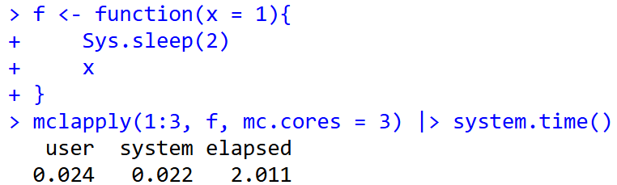

# Tips：並列演算 {.unnumbered}

```{r, echo=FALSE, message=FALSE}
library(tidyverse)
```

我々が算数のテストを解くとき、普通は一番初めの問題から一つづつ、順番に解いていきます。Rも同じで、スクリプトとして書いたコードを上から1行ずつ評価し、演算します。`for`文などの繰り返し演算でも同じで、繰り返し回数分だけ順番に演算を行います。しかし、繰り返し演算に時間のかかる処理が含まれると、演算にはとても時間がかかります。

1人で計算せずに2人で計算すればテストは速く解けます。同様に、Rでも1つのRで演算せずに、2つ以上のRで演算すれば速く演算が終わります。`for`文であれば、以下のように2つに分けて、2つのRで計算すれば演算時間を半分ぐらいにできます。

```{r, eval=FALSE, filename="for文を分割する"}
# 通常のfor文
for(i in 1:10){sqrt(i)}

# 上記のfor文を2つに分ける
for(i in 1:5){sqrt(i)}
for(i in 6:10){sqrt(i)}
```

時間のかかる演算を少しでも速くするため、繰り返しのある演算を分割し、分割した演算を複数立ち上げたR（セッション）で演算することで計算速度を速める手法のことを**並列演算**と呼びます

## セッション

Rの**セッション**とは、Rが起動して演算できる状態であることを示す言葉です。R GUIを起動するとRのセッションが1つ立ち上がります。同時にR GUIをもう一つ開くこともでき、1つ目のRと2つ目のRで別の演算を行うことができます。

並列演算では、Rをたくさん立ち上げる、つまりセッションをたくさん準備して、そのそれぞれのセッションに演算を分割することで演算速度を速めます。この立ち上げたセッションのことをクラスターとも呼びます。

重い演算を用いる統計のライブラリではライブラリの機能自体に並列演算が組み込まれている場合があります。一方で、自分で書いたスクリプトで並列演算を行いたい場合、自分で演算を分割して複数のセッションに投げる、というのは大変ですので、ライブラリを利用してRに並列演算を任せることになります。

## 並列演算の手法

並列演算には大きく分けて、**Socket**と**Fork**と呼ばれる2つの方法があります。

- Socket：Rのセッションを新規に立ち上げ、それぞれのセッションで演算を行う手法
- Fork：Rの現在のセッションをコピーし、複数のセッションでそれぞれ演算を行う手法

あまり変わらないように見えますが、Socketでは現在のセッションの情報を別のセッションでは持ち越せない、つまりライブラリの読み込みや変数は別のセッションには存在しないのに対し、Forkではライブラリの読み込みや変数の状態も持ち越せます。

Socketでは各セッションでライブラリの読み込みや変数の設定を行う必要があり、時間が取られます。一方でForkはライブラリの読み込みや変数の設定がなく、ライブラリの読み込みや変数に関するメモリをセッション間で共有します。

何より違うのは、**Windowsでは基本的にForkを使えない**、ということです。ですので、LinuxやMacOSではSocketもForkも使えるのに対し、WindowsではSocketしか使えません。また、RStudioはForkと相性があまりよくありません。自分のPCでForkが利用可能かどうかは、以下の`parallelly::supportsMulticore`関数で確認することができます[@parallelly_bib]。利用可能であれば`TRUE`が、利用できなければ`FALSE`が返ってきます。

```{r, filename="parallelly::supportsMulticore関数でForkが使えるか確認する"}
pacman::p_load(parallelly)
supportsMulticore()
```

## 並列演算のライブラリ

[CRAN: Task Views](https://CRAN.R-project.org/view=HighPerformanceComputing)には`Rmpi`と`snow`がRの並列演算のコアパッケージであるとされています。これらは基本のライブラリで、他のライブラリの開発に用いることが想定されており、Rのユーザーが自分のスクリプトで利用するのは難しいです。

ユーザー向けの並列演算のライブラリとして、現在では主に以下の3つが利用されています。

- `parallel`パッケージ[@parallel_bib]
- `foreach` + `doParallel`パッケージ[@foreach_bib; @doParallel_bib]
- `future`パッケージ[@RJ-2021-048]

`parallel`が最も昔から用いられているパッケージで、長年よく利用されていたのが`foreach`と`doParallel`パッケージです。`future`は2017年頃から開発が始まり、2021年にver.1.0となった新しいパッケージです。`future`には[futureverse](https://www.futureverse.org/)というパッケージ群があり、`parallel`・`foreach`よりも簡単で安全なパッケージとなっています。また、2026年には`futurize`[@futurize_bib]という`future`の特徴をより簡単に利用できるライブラリが発表されており、さらに簡単に並列演算ができるようになっています。

ここではまず`parallel`、`foreach`から説明しますが、とりあえず並列演算を試してみたい、という場合には右のメニューから`future`パッケージの記事を選んで読んでいただければと思います。

## parallelパッケージ

まずは`parallel`パッケージから説明します。`parallel`はSocket・Forkの両方に対応し、[19章](chapter19.qmd)で説明した`apply`関数に相当する演算を並列化することができるライブラリです。

まずは`parallel`パッケージをインストールし、読み込みます。[21章](chapter21.qmd#演算時間の計測)で紹介した演算時間計測のためのパッケージである`tictoc`も同時に読み込んでおきます。

```{r, filename="parallelパッケージの読み込み"}
pacman::p_load(parallel, tictoc)
```

次に、自分のPCの**CPUのコア**の数を`detectCores`関数で調べます。現代のPCに搭載されているCPUでは、通常6個以上のコアを持ちます。このコアはPCでマルチタスクを行うために用いられているPCの演算の基本単位で、並列演算の場合には複数のコアを利用して演算を行います。私の使っているPCではコアは20個ですので、並列演算は最大で20まで設定できます。

ただし、すべてのコアをRに捧げてしまうと他のことがPCでできなくなってしまいますので、利用するコアは最大でも`detectCores`の返り値から1を引いた数、私のPCであれば19、で設定するのがよいでしょう。

```{r, filename="CPUのコアの数を調べる"}
detectCores()
```

次に、まずは通常の演算（上から順番に計算するので**sequential**と呼ばれます）で重めの計算をしてみます。以下の関数は2秒待った後で引数`x`をそのまま返す関数です。

```{r, filename="2秒待つ関数"}
f <- function(x = 1){
  Sys.sleep(2)
  x
}
```

次に、[19章](chapter19.qmd)で説明した`lapply`関数で`f`関数の演算を3回行います。この演算にかかる時間を`system.time`関数で調べると、6秒程度かかっていることがわかります。2秒かかる関数の演算を3回繰り返しているので当然の結果です。

```{r, filename="lapply関数で演算時間を計測"}
lapply(1:3, f) |> system.time()
```

次に、`parallel`パッケージでForkを利用した`lapply`の計算を行う`mclappply`関数を使ってみます。`mc.cores`は利用するコアの数を指定するための引数です。ForkはWindows PCでは利用できないため、エラーが出て演算が行われません。

```{r, error=TRUE, filename="ForkはWindowsでは利用できない"}
mclapply(1:3, f, mc.cores = 3) |> system.time()
```

`mclapply`をDockerの[rocker/rstudio](https://hub.docker.com/r/rocker/rstudio)で実行すると2秒で計算が終わります。2秒かかる`f`関数を3回行う演算が`f`関数1回分で終わっていることになります。ですので、LinuxやMacOSでは`mclapply`を用いることでForkでの並列演算を行うことができます。

{width=500}

WindowsではSocketを用いる関数である`parLapply`関数を用いて並列演算を行います。ただし、`parLapply`関数はそのままでは並列演算を行うことができず、エラーが出ます。

```{r, error=TRUE, filename="parLapply関数のエラー"}
parLapply(1:3, f) |> system.time()
```

エラーメッセージに示された通り、`parLapply`関数を用いる場合にはまずクラスターを設定する必要があります。クラスターは`makeCluster`関数で設定できます。`makeCluster`関数の引数は数値で、`detectCores`関数で調べたコアの数より小さい数値を入力します。以下の例では3つのクラスターを設定しています。

`makeCluster`関数は`cl`という変数に代入しておき、後ほど`parLapply`関数の引数として用います。

```{r, filename="クラスターの設定：makeCluster関数"}
cl <- makeCluster(3)
```

`makeCluster`関数を実行後、リソースモニターで確認すると、RstudioのRセッション（rsession-utf8.exe）以外に3つのRセッション（Rscript.exe）が実行されていることがわかります。


この状態で`parLapply`関数に`cl`を引数として設定し実行すると、エラーが出ずに演算が2秒程度で完了します。`parLapply`関数でも並列演算によって、2秒かかる`f`関数を3回実行した時、1回分の演算時間で計算が完了していることが分かります。

```{r, filename="parLapply関数での並列演算"}
parLapply(cl, 1:3, f) |> system.time()
```

`makeCluster`関数で起動したRのセッションはRを閉じても起動したままになってしまいます。並列演算が終わった後には、`stopCluster`関数で起動したRのセッションを閉じます。

```{r, filename="stopCluster関数でセッションを閉じる"}
stopCluster(cl)
```

ここまでが`parallel`パッケージの基本的な使い方です。以下に`mclapply`、`parLapply`以外の並列演算用の関数を示します。

```{r, echo=FALSE}
pacman::p_load(readxl)
d <- read_excel("./data/parallelcomputing.xlsx", sheet=1)
knitr::kable(d, caption="parallelパッケージの関数群")
```

### ライブラリの利用と変数の設定

次に、ライブラリを利用する関数について、Socketで利用する場合を見ていきます。以下の関数`f2`は`stringr`を読み込んだ後で定義されており、`stringr`で提供されている関数`str_c`を用いています。

```{r, filename="ライブラリを用いる関数"}
library(stringr)
f2 <- function(x){
  str_c(x, ", ", Sys.time())
}
```

`lapply`関数で`f2`関数を利用した場合には、特に問題なく演算できます。また、Forkを用いる`mclapply`でも問題なく並列演算を行うことができます。

```{r, filename="lapply関数でf2関数を用いる"}
lapply(1:3, f2)
```

一方で、Socketの並列演算を行う`parLapply`関数で`f2`関数を呼び出すと、エラーが出ます。これは、Socketでは現在のセッションで呼び出したライブラリや定義した変数は別のセッションにはコピーされないため、ライブラリで設定されている関数が利用できないためです。

```{r, error=TRUE, filename="Socketではライブラリの状態はコピーされない"}
cl <- makeCluster(3)
parLapply(cl, 1:3, f2)
```

各セッションでライブラリをロードする場合には、`clusterEvalQ`関数を用います。`clusterEvalQ`関数は第一引数に`makeCluster`で作成したクラスター（`cl`）、第2引数に各セッションで読み込むコードを表記します。あらかじめ`clusterEvalQ`でライブラリを読み込んでおくことで、各セッションでライブラリを読み込み、ライブラリを用いた演算を行うことができます。

```{r, filename="clusterEvalQ関数でライブラリを用いる"}
clusterEvalQ(cl, library(stringr))
parLapply(cl, 1:3, f2)
```

同様に、現在のセッションで変数yを定義し、この`y`を用いた関数を並列演算で使ってみます。

```{r, filename="関数外の変数を利用する関数"}
y <- 2

f3 <- function(x){
  x + y
}
```

この場合もやはり`parLapply`関数では`y`を読みだせず、エラーとなります。Socketではライブラリだけでなく、変数の設定も別途指示する必要があります。

```{r, error=TRUE, filename="変数yが各セッションで設定されていないためエラー"}
parLapply(cl, 1:3, f3)
```

上記のライブラリの設定の場合と同じく、`clusterEvalQ`関数でy変数を設定しておくと、`parLapply`の演算が実行されます。

```{r, filename="clusterEvalQ関数で変数を指定する"}
clusterEvalQ(cl, y <- 2)
parLapply(cl, 1:3, f3)
```

現在のセッションからSocketのセッションへと変数を持ち出す場合、`clusterExport`関数を利用することもできます。`clusterExport`関数はクラスターの変数`cl`と文字列の変数名を引数に取ることで、現在のセッションで設定されている変数を各セッションに持ち出すことができます。

```{r, filename="clusterExport関数で設定を持ち出す"}
clusterExport(cl, "y")
parLapply(cl, 1:3, f3)
```

とは言え、たくさんの変数やライブラリをSocketのセッションに持ち込むのは大変です。利用するライブラリや変数は関数内で指定する方がよいでしょう。

```{r, echo=FALSE}
stopCluster(cl)
```

## foreach + doParallelパッケージ

`foreach`は`apply`関数群に近い演算を行う`foreach`関数を提供しているパッケージです。`foreach`は`for`文っぽい構文で利用します。ただし、[`foreach`は`for`文というわけではない](https://henrikbengtsson.github.io/futureverse-tutorial-raukr2025/#/foreach-is-not-a-for-loop)ので、やや分かりにくいところのある関数ではあります。

`foreach`はそれだけでは並列演算に用いることはできませんが、`doParallel`と組み合わせることで並列演算を行うことができます。`doParallel`は`foreach`に並列演算を持ち込むためだけのライブラリで、`foreach`と`doParallel`はほぼ常にセットで利用されます。

```{r, filename="ライブラリの読み込み"}
pacman::p_load(foreach, doParallel)
```

### foreach関数の構文

`foreach`関数は以下のような式で利用します。`for`文と同じように、`foreach`の後ろのカッコにはイテレーターのベクターを設定します。`for`文でのカッコと中カッコ（`{}`）の間には`%do%`という演算子を用います。

```{r, eval=FALSE, filename="foreachの式"}
# for(i in vec){eval}と同じ
foreach(i = vec) %do% {eval}
```

`for`と`foreach`の違いは式の形だけでなく、返り値にもあります。`for`文はそれ自体は何も返しませんが、`foreach`は返り値があります。返り値のデフォルトはリストで、`{eval}`で演算したものをリストの要素として返します。

```{r, filename="foreachの返り値"}
foreach(i = 1:3) %do% {f(i)}
```

ですので、上記の`foreach`関数は下の`lapply`と同じ演算を行うことになります。

```{r, filename="foreachと同じ演算のlapply"}
lapply(1:3, f)
```

また、`for`文をネストする場合と同じく、`foreach`もネストすることができます。以下の`foreach`文では`i`と`j`を繰り返す演算を行っています。この`foreach`と`foreach`を繋いでネストする場合には、`%:%`という演算子を用います。

```{r, filename="%:%でネストする"}
# for(i in 1:2) for(j in 1:2){paste("i=", i, "j=", j, "i+J=", i + j)}とほぼ同じだが、
# 返り値がリストであるところが異なる
foreach(i = 1:2) %:% foreach(j = 1:2) %do% {paste("i=", i, "j=", j, "i+J=", i + j)}
```

`foreach`文はそのままでは並列演算ではないため、2秒かかる関数である`f`関数を用いると、繰り返した分だけ時間がかかります。

```{r, filename="並列演算ではないforeach"}
tic()
a <- foreach(i = 1:3) %do% {f(i)}
toc()
```

`foreach`の引数`.combine`に演算結果を結合する方法を指定することもできます。`.combine=c`とすると返り値はベクター、`.combine=cbind`とすると返り値は行列になります。

```{r, filename=".combine引数を指定する"}
foreach(i = 1:3, .combine = c) %do% {f(i)} # 返り値はベクター

foreach(i = 1:3, .combine = cbind) %do% {f(i)} # 返り値は行列
```

### 並列演算：%dopar%

`foreach`関数のカッコの間の演算子である`%do%`を`%dopar%`に変更すると、並列演算型の`foreach`の記法になります。ただし、`%do%`を`%dopar%`に変更するだけでは並列演算を行うことはできません。`parallel`の場合と同様に、`foreach`でもあらかじめクラスターを設定する必要があります。

```{r, filename="%dopar%演算子"}
tic()
a <- foreach(i = 1:3) %dopar% {f(1)}
toc()
```

### クラスターの設定

クラスターの設定は`parallel`パッケージとほぼ同じで、`makeCluster`関数で設定します。`makeCluster`関数の返り値は`registerDoParallel`関数の引数とします。

```{r, filename="doParallel：クラスターの設定"}
cores <- detectCores() - 1

cl <- makeCluster(cores)

registerDoParallel(cl)
```

クラスターを設定した上で`foreach`関数を`%dopar%`演算子で実行すると、並列演算を行うことができます。

```{r, filename="foreachで並列演算"}
tic()
a <- foreach(i=1:19) %dopar% {f(i)}
toc()
```

`%dopar%`を用いた演算はSocketですので、演算にライブラリを用いる場合にはエラーが出ます。

```{r, error=TRUE, filename="foreachでのライブラリの取り扱い"}
a <- foreach(i=1:19) %dopar% {f2(1)}
```

`foreach`では`.packages`引数にライブラリ名を文字列で指定することで、Rの各セッションでライブラリを読み込ませることができます。`parallel`と同様に、関数の中でライブラリの呼び出しや変数の定義を行った方が演算しやすいでしょう。

```{r, filename=".packages引数"}
a <- foreach(i=1:7, .packages = "stringr") %dopar% {f2(1)}
```


`parallel`の場合と同様に、並列演算のためのRのセッションを閉じる時には`stopCluster`関数を用います。

```{r, filename="セッションの終了"}
stopCluster(cl)
```

### Forkの演算：doMCパッケージ（unavailable）

`foreach`でForkを用いた並列演算を行う場合には[`doMC`パッケージ](https://cran.r-project.org/web/packages/doMC/index.html)を用いる、はずなんですが、`doMC`パッケージの機能を支えていた[`multicore`パッケージ](https://cran.r-project.org/web/packages/multicore/index.html)がCRANから削除されており、`doMC`もインストールできなくなっています。現状`foreach`を用いた場合のForkは次に説明する`future`パッケージ（`doFuture`）でのみ利用可能なようです。

```{r, eval=FALSE, filename="doMCによる並列演算"}
pacman::p_load(doMC) # インストール・演算できない
resisterDoMC(4)
foreach(i = 1:3) %dopar% {f(i)}
```

## futureパッケージ

`future`パッケージは最後発の、よりモダンな並列演算のためのライブラリです。`future`は基礎的な並列演算の関数を提供するためのパッケージで、この`future`を使ったライブラリ群（`future.apply`、`furrr`、`doFuture`、`futurize`）と共に[futureverse](https://www.futureverse.org/)というパッケージ群が整備されています。ただし、futureverseには`tidyverse`のように一度にライブラリをインストール・ロードできるような仕組みはありません。

```{r, filename="ライブラリの読み込み"}
pacman::p_load(future)
```

### 演算方法の指定

`future`では、演算の方法を`plan`関数で指定します。`plan(sequential)`は通常のRと同じ演算、`plan(multisession)`はSocketでの並列演算、`plan(multicore)`はForkでの並列演算をそれぞれ指定します。

```{r, filename="plan関数でモードの選択"}
plan(sequential)
```

この他にも`plan`関数の引数があり、それぞれ異なる設定で並列演算を組むことができます。`plan`関数の引数の一覧を以下の表に示します。

```{r, echo = FALSE}
pacman::p_load(readxl)
d <- read_excel("./data/parallelcomputing.xlsx", sheet=2)
knitr::kable(d, caption="future：plan関数の引数と並列演算のモード")
```

`future`では、並列演算を行う部分を`future`関数で表現します。ただし、この`future`関数の返り値はそのまま呼び出すことはできません。`future`関数の返り値は`value`関数の引数に取り、`value`関数の返り値として`future`関数での演算結果が返ってきます。

以下の例では`plan(sequential)`を指定しているため、`future`関数の部分は並列ではなく、順番に評価されています。

```{r, filename="future関数とvalue関数"}
tic()

# 以下の3つが並列演算される部分
a <- future(f(1))
b <- future(f(2))
d <- future(f(3))

value(a)
value(b)
value(d)

toc()
```

`plan(multisession)`を指定すると並列演算となり、全体の演算が2秒程度で完了します。

```{r, warning=FALSE, filename="multisession：並列演算"}
plan(multisession)

tic()

a <- future(f(1))
b <- future(f(2))
d <- future(f(3))

x <- value(a)
y <- value(b)
z <- value(d)

toc()
```

ただし、`plan(multisession)`を指定すると利用できる最大数のセッションが準備されてしまいます。`plan`関数では`workers`引数を指定することで準備するセッションの数を指定することができます。

```{r, filename="workersを指定する", eval=FALSE}
plan(multisession, workers = 3)
```


`future`関数は`()`の中に中カッコ（`{}`）を設定し、複数行のスクリプトを記述することもできます。

```{r, filename="future関数の引数に複数の要素を設定する"}
a <- future({x <- 1; x * 10})
```

`future`と`value`で呼び出す方法はやや迂遠です。`future`では、`%<-%`という形の演算子で`future`と`value`関数を合わせた演算を行うことができます。

```{r, filename="%<-%演算子"}
a %<-% {f(1)}
b %<-% {f(2)}
d %<-% {f(3)}
```

`future`では現在のセッションで読み込んでいるライブラリを自動的にクラスターで読み込んだ上で演算してくれる場合もあります。以下の例では`stringr`の関数を用いていますが、問題なく演算が行われています。また、読み込むライブラリを指定する場合には`future`関数の`packages`引数として文字列で指定することもできます。

```{r, filename="futureでのライブラリの読み込み"}
a %<-% {f2(1)}
b %<-% {f2(2)}
d %<-% {f2(3)}

c(a, b, d)
```

ただし、変数を指定する場合にはクラスターで変数を指定してくれない場合もあります。

```{r, error=TRUE, filename="変数の指定がうまくいかない場合"}
reset <- FALSE
x <- 1
y %<-% {if (reset) x <- 0; x + 1 }
y
```

このような場合には、`future`に与える式の中で一度変数を宣言してやるとうまくいくようになります。

```{r}
reset <- FALSE
x <- 1
y %<-% { x; if (reset) x <- 0; x + 1 }
y
```

`future`では`parallel`や`foreach` + `doParallel`のようにクラスターを止める関数はありません。Rが閉じればクラスターも止まりますが、明示的にクラスターを止める場合には`plan(sequential)`を実行するとよいでしょう。

## futureverse

上記の通り`future`では簡単に並列演算を実装することができます。しかし、並列演算するそれぞれのコードはいちいち記述しないといけませんし、`apply`関数などで利用するにはやや不便です。

この問題に対応するため、futureverseでは`apply`関数、`purrr`の関数（[44章](chapter44.qmd)参照）、`foreach`での並列演算を行うための以下の3つのライブラリ群を備えています。

- `future.apply`：`apply`関数の並列化[@RJ-2021-048]
- `furrr`：`purrr`の並列化[@furrr_bib]
- `doFuture`：`foreach`の並列化[@RJ-2021-048]

3つのライブラリをロードすることで、簡単に`future`を用いた並列化の演算を行うことができます。`future.apply`では`future_apply`などの関数（`apply`関数の並列化）、`furrr`では`future_map`などの関数（`purrr::map`の並列化）、`doFuture`では`%dofuture%`演算子を使うことでそれぞれfutureでの並列演算を行うことができます。

```{r, filename="future.apply"}
pacman::p_load(future.apply, furrr, doFuture)

future_apply(iris[, 1:4], 2, mean)
```

```{r, filename="furrr"}
future_map(1:5, sqrt)
```

```{r, filename="doFuture"}
foreach(i = 1:3) %dofuture% {f(1)}
```

## 並列演算：futurizeパッケージ

とは言っても、それぞれのパッケージにはたくさんの関数が設定されており、覚えるのも大変です。昔から用いていた`apply`や`purrr`、`foreach`の関数をそのまま並列化できたほうが便利です。

そこで、futureverseでは今まで用いていた関数をそのまま`future`の手法で並列化するためのライブラリである`futurize`パッケージを提供しています。

この`futurize`パッケージの`futurize`関数を用いるだけで今まで使っていた関数を並列化することができます。

`futurize`を利用する際には`future.apply`、`furrr`、`doFuture`も読み込む必要があります。

```{r, filename="futurizeパッケージの呼び出し"}
pacman::p_load(futurize, future.apply, furrr, doFuture)
```

`futurize`関数の使い方は簡単で、`plan`で並列化の方法を指定した後、`apply`や`map`、`foreach`関数の後に`futurize`関数をパイプで繋ぐだけです。`futurize`関数をパイプで繋ぐだけでそれぞれの関数を`future`式の並列演算に変換（`futurize`）することができます。

```{r, filename="futurize関数"}
apply(iris[, 1:4], 2, mean) |> futurize() # future_applyと同じ

map(1:5, f) |> futurize() # future_mapと同じ

foreach(i = 1:3) %do% {f(1)} |> futurize() # %doFuture%を用いるのと同じ
```
