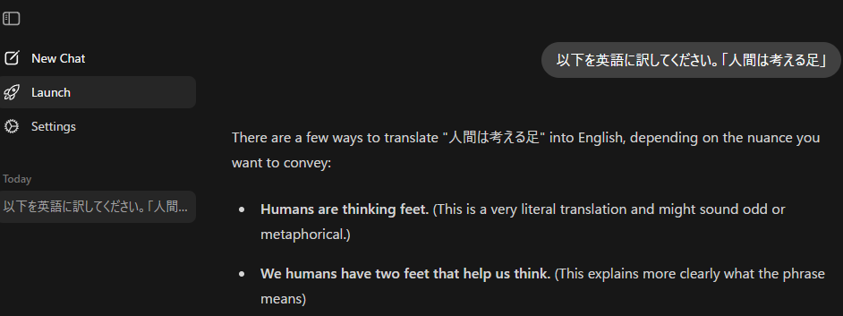

# LLMとmallパッケージ

RからLLM（大規模言語モデル、Large Language Model）を利用する場合、リモートLLM（Web上で提供されているLLMのAPIに接続して利用する）と、ローカルLLM（自分のPCでLLMの演算を行う）の2つを利用することができます。RでのLLMの利用についてはQiitaに詳しい記事（[「R言語とLLMの連携」](https://qiita.com/bob3bob3/items/b5b242c3f9466d140a64)がありますが、ココでも簡単に紹介しようと思います。

### リモートLLMとローカルLLM

リモートLLMを利用する場合、Rでは`ellmer`パッケージを利用します。`ellmer`パッケージではいろいろなLLMモデルのAPI（Anthropic、OpenAI、Geminiなど）を用いてLLMによる推論を行います。

リモートLLMの利点はそのスピードと性能です。リモートLLMはその提供元のサーバーで演算を行うため、サーバーの演算能力に従いその演算速度が決まります。AIの提供元で利用しているサーバーは大抵超高性能で、お金を払わないプランを用いても回答がすぐに返ってきます。一方で、リモートLLMの利用には大抵お金がかかり、チャットを投げる量（トークン）も制限される場合があります。

ローカルLLMを利用する場合には、`ollamar`パッケージを用います。`ollamar`はLLMを動かすためのローカルサーバーを簡単に管理できるソフトウェアである、Ollamaを利用したパッケージです。`ollamar`パッケージを用いることで、自分のPCにLLMのモデルをダウンロードし、チャットを投げて回答を得ることができます。

ローカルLLMを用いるとお金を使わず、トークンの制限もありません。一方で演算速度は自分のPCのスペック（特にGPU）に依存し、高性能なGPUを備えていないPCでは演算にとてつもなく時間がかかります。

## RでのLLM利用：mall

この2つのパッケージ（`ellmer`と`ollamar`）を用いれはLLMを利用することはできますが、いずれも常にチャットの内容を即時にLLMに投げて、返答を返す形で機能します。また、同じ質問をする場合には、いずれもLLMにすぐにチャットを投げてしまうため、同じ回答を得るのにもう一度演算を行う場合があります。これではトークンや時間を無駄遣いしてしまいます。

そこで、`ellmer`と`ollamar`の機能を補いつつ、問い合わせの内容を絞り、データフレームの列をチャットに投げ、一度問い合わせた内容をキャッシュ（cache）に残すことでLLMへの問い合わせ回数を減らすことができるように設計されたライブラリが`mall`です。`mall`を用いれば、LLMにかかるコストを調節し、一度回答を得たチャットに対してはキャッシュを利用して速やかに返り値を得ることができます。

この章では、まず`ellmer`、`ollamar`の簡単な使い方を説明し、その後`mall`を使ってデータフレームに記載した文字列をLLMに投げて回答を得るところまで説明します。

まずは`ellmer`、`ollamar`、`mall`をそれぞれインストールします。またデータフレームの取り扱いのために`tidyverse`をロードします。

```{r, filename="パッケージのインストール・ロード"}
pacman::p_load(tidyverse, ellmer, ollamar, mall)
```

## ellmerパッケージ

`ellmer`では、まずはどのリモートLLM、AIモデルを用いるのかをまず選択します。例えばOpenAIのLLMであるGPTを用いるのか、AnthropicのClaudeを用いるのか、GoogleのGeminiを使うのかでそれぞれ利用する関数が異なります。

AIモデルを選択したら、次にそのLLMのAPIキーを取得する必要があります。[GPT](https://help.openai.com/ja-jp/articles/4936850-where-do-i-find-my-openai-api-key)、[Claude](https://platform.claude.com/docs/ja/get-started)、[Gemini](https://ai.google.dev/gemini-api/docs/api-key?hl=ja)のAPIキーの取得方法についてはそれぞれのページで確認してください。

APIキーを取得したら、APIキーを環境変数に設定します。GPTではOPENAI_API_KEY、ClaudeではANTHROPIC_API_KEY、GeminiではGEMINI_API_KEYをそれぞれ設定します。環境変数の設定にはRでは`Sys.setenv`関数を用います。WindowsではGUIやコマンドプロンプトを用いて設定することもできます。

```{r, eval=FALSE, filename="環境変数を設定する"}
Sys.setenv(OPENAI_API_KEY = "XXXXXXXXXXXXXXXXXX")
```

もう一つの方法は、Rの環境（`.Renviron`）にAPIキーをセットする方法です。`usethis::edit_r_environ`関数を用いることで、環境変数をRで設定することができます。`usethis::edit_r_environ`を実行すると環境のファイルの中身が表示されるので、その中身に環境変数を追記し、保存します。

```{r, eval=FALSE, filename=".Renvironを編集する"}
usethis::edit_r_environ()
```

APIキーを設定すると、`ellmer`からそれぞれのLLMに直接アクセスできるようになります。LLMにアクセスする場合には、まず接続用のオブジェクトを作成します。このオブジェクト作成の関数は利用するLLMによって異なり、GPTでは`chat_openai`関数、Claudeでは`chat_anthropic`関数、Geminiでは`chat_google_gemini`関数を引数なしで用います。これらの関数は[R6オブジェクト](Tips_R6class.qmd)を作成するための関数で、この関数の返り値を`chat`などの名前の変数に代入します。

```{r, eval=FALSE, filename="LLM接続のためのR6オブジェクトを作成する"}
# 引数にモデル名（例えば"gpt-4.1"）を指定すると、用いるモデルを指定できる
# 利用できるモデルはmodels_openai()で確認できる（"gpt-4.1"はデフォルト）
chat <- chat_openai()
```

LLMにチャットを投げる場合には、`chat$chat`メソッドを用います。`chat$chat`メソッドの引数として、チャットの内容（文字列）を取ることで、Markdown形式でLLMから返答を受け取ることができます。また、`chat$chat`メソッドを実行すると、`chat`オブジェクト内に会話の内容が記録され、次のチャットの問い合わせ時にはこの記録が文脈として利用されます。

```{r, eval=FALSE, filename="LLMへのチャットを送信し、返答を受信する"}
chat$chat("Who created R?")
```

リモートのLLMを利用すると、トークンを消費します。トークンはLLMに投げるチャットのワード数（文字数）を反映するもので、利用したトークンが増えるほど支払いが増えていきます。`chat`オブジェクトを用いたチャットでどの程度トークンを利用したのかを確認するには、`token_usage`関数を用います。

```{r, eval=FALSE, filename="トークンの利用を表示する"}
token_usage()
```

## ollamarパッケージ

ココまではリモートLLMを利用する方法を説明しましたが、ココからは`ollamar`パッケージを用いて、自分のPCでLLMを動かす方法について説明します。

`ollamar`パッケージは、[Ollama](https://ollama.com/)というローカル環境でLLMを動かすためのツールを利用して、RでLLMを用いる仕組みになっています。

`ollamar`を使う場合、まずは[Ollamaのアプリケーションをダウンロード](https://ollama.com/download/windows)し、インストールする必要があります。Ollamaをインストールすると、OllamaのローカルサーバーでLLMが動くようになります。


このOllamaのアプリケーションを用いることで、LLMを利用することができます。



ただし、Ollamaをインストールするだけでは、LLMをGPUで演算してくれない場合があります。Qiitaに[OllamaにGPUを利用させる方法](https://qiita.com/buson0903/items/6b4160c869ab8f3ac871)についての記事がありますので、参考にして設定するとよいでしょう。

簡単に説明すると、NIVDIAのGPUであれば

- [cuDNN（CUDA Deep Neural Network library）](https://developer.nvidia.com/cudnn)
- [CUDA Toolkit](https://developer.nvidia.com/cuda/toolkit)
- [NVIDIA Studio ドライバ](https://www.nvidia.com/ja-jp/drivers/)

をあらかじめインストールしておくとよいようです。


また、[Redditの記事](https://www.reddit.com/r/ollama/comments/1dh54cz/how_do_i_enable_my_gpu_for_ollama_llms_on_windows/?tl=ja)に記載されている通り、

``` bash
nvidia-smi -L
```

で表示されるUUIDを調べて、`CUDA_VISIBLE_DEVICES="UUID"`という環境変数を設定しておくとGPUを使ってくれるようになる場合もあるようです。

### ollamarでRからOllamaを用いる

OllamaをRから動かすためのパッケージが`ollamar`です。Ollamaが起動している状態で、`test_connection`を実行すると、Ollamaのローカルサーバーが利用できる状態であるかを確認することができます。

```{r, filename="ollamar：Ollamaの起動の確認"}
# Ollama appが起動していると、ローカルサーバーが立ち上がっていることが確認できる
test_connection()
```

Ollamaでも`ollamar`でも、まずはLLMのモデルをダウンロードする必要があります。Ollamaではターミナルで`ollama pull モデル名`を実行することでLLMのモデルをダウンロードすることができます。

``` bash
ollama pull qwen3.6
```

ダウンロードするモデルは[OllamaのModelに関するページ](https://ollama.com/search)から選択することができます。LLMのモデルはパラメータ数（4bとか、8bといった数値で示されているもの）と、モデルの最適化の程度（コーディング用、論理思考用、翻訳用など）で選択します。普通は新しいものほど最適化されていて、少なめのパラメータ数でもそれなりの答えを返してくれるようになっています。

`ollamar`では、`pull`関数でLLMのモデルをダウンロードすることができます。この関数は上の`ollama pull`を実行するだけの関数です。

```{r, eval=FALSE, filename="LLMモデルのダウンロード"}
# 汎用のモデル、日本語に強い
pull("qwen3.6")

# 翻訳専用のモデル（Google Deepmind）
pull("translategemma:12b")
```

上の`pull`では、Alibabaの高性能LLMである[qwen3.6](https://ollama.com/library/qwen3.6)とGoogle Deepmindの[translategemma](https://ollama.com/library/translategemma)をダウンロードしています。qwen3.6は汎用のLLMで、パラメータ数は27b（270億）です。translategemmaは翻訳を専門とするLLMで、パラメータ数は12bのものをダウンロードしています。正直、qwen3.6は私のPC（GeForce RTX3070、VRAMが8GB）には重すぎるので、演算にとてつもなく時間がかかります。実用的ではありませんが、モデルの比較のためにダウンロードしています。

### ollamarでLLMを用いる

`ollamar`でLLMを利用する場合には、`generate`関数を用います。この`generate`関数は第一引数にLLMのモデル名、第ニ引数にLLMに投げるチャットを引数に取ります。LLMのモデル名はダウンロード済みのモデル（`list_models`で確認できます）から選択します。この`generate`の返り値をそのまま呼び出すとOllamaのローカルサーバーのレスポンスとBodyというものを含むものが返ってきます。

```{r, filename="LLMにチャットを投げる"}
# 使えるモデルのリスト
list_models()

# モデルにレスポンスを求める（時間がかかる）
resp <- generate("qwen3.6", "tell me a 5-word story")
resp
```

LLMの出力を確認するには、`resp_process`関数を用います。第二引数（`output`）には返り値のデータ型を文字列で指定します。

```{r, filename="LLMの出力を確認する"}
# 出力を確認
ollamar::resp_process(resp, "text")
```

出力をデータフレームの形とするには、`output`引数に`"df"`を指定します。

```{r, filename="LLMの出力をデータフレームで返す"}
# データフレームで出力
ollamar::resp_process(resp, output = "df")
```

ココまでが`ollamar`の基本的な利用方法です。不要なモデルは`delete`関数で削除することもできます。

```{r, eval=FALSE, filename="OllamaのLLMモデルを削除する"}
# モデルを削除する
ollamar::delete("qwen3.5:4b")
ollamar::delete("translategemma:4b")
```

## mall

ではココからは、上記の`ellmer`と`ollamar`を利用し、決められたタスクをこなすためのパッケージである、`mall`について説明していきます。

### 用いるデータの準備

`mall`は、データフレームの列に記録した文（文字列）をLLMに投げることで、その文の感情の評価（sentiment）、翻訳（translate）、要約（summarize）、分類（classify）、抽出（extract）、適合性（verify）の6つのタスクを実行し、データフレームの列として結果を返してくれます。

`mall`に文字列のデータフレームを投げるためのサンプルとして、[Publilius Syrus](https://en.wikipedia.org/wiki/Publilius_Syrus)の[名言集](https://www.thelatinlibrary.com/syrus.html)を`rvest`で入手し、データフレームとして利用することにします。

:::{.callout-tip collapse="true"}
## ラテン語のソース

[このthelatinlibraryのページ](https://www.thelatinlibrary.com/)にはラテン語の名文がたくさん収集されています。興味があれば覗いてみて下さい。

ご存知の通り、ラテン語はヨーロッパでは19世紀ぐらいまで学術語として用いられていましたが（ヨーロッパでは最近までラテン語を博士論文に使う人もいたようです）、話者は（趣味で使う人以外には）おらず、学術語としても英語やドイツ語にとって変わられています。LLMの学習に用いることのできるウェブ上のラテン語の情報は限られているため、LLMには難しめのタスクかもしれません。
:::

利用するPublilius Syrusの名言のデータフレームを以下に示します。一度にたくさんの行をLLMに投げたいところですが、上記の通り、私のPCではローカルLLMに大きなタスクは投げられません。ですので、はじめの3行だけ利用することにします。

```{r, filename="LLMに演算させるためのデータフレーム"}
# LLMに使う文を準備
d <- read.csv("./data/PVBLILIVS_SYRVS_SENTENTIAE.csv", header=F) |> _[-1, 2]
head(d)

# tibbleを準備
d_d <- as_tibble(d)
d_3 <- d_d[1:3, ]
```

### mallでリモートLLMを用いる

ではまずは、`ellmer`の機能を用いてリモートLLMを用いる方法について説明します。リモートLLMを用いる場合には、`ellmer::chat`関数（chatGPTなら`chat_openai`関数）を`llm_use`関数の引数に取ります。

```{r, eval=FALSE, filename="ellmerの機能を用いてリモートLLMを利用する"}
chat <- chat_openai()
llm_use(chat)
```

### mallでローカルLLMを用いる

リモートとローカルLLMの違いは、この`llm_use`関数の引数だけです。`ollamar`の機能を用いてローカルLLMを用いる場合には、`llm_use`関数に`"ollama"`とLLMのモデル名を指定します。

ただし、LLMは同じ質問に対して、ほんの少しずつ異なる回答を返すようにできています。Rではできれば同じ回答を得られる方がよい場合もありますので、乱数を用いる場合に`set.seed`を用いるのと同様に、`llm_use`関数では`seed`と`temperature`を引数として設定することができます。この`seed`と`temperature`はいずれもLLMの回答のランダム性を調整するための引数で、`seed`は固定、`temperature`は`0`に設定することで、LLMからの回答を固定することができます。

また、LLMの回答が同じとなるようにしておくのであれば、以前LLMから得た回答と同じものを何度もLLMに演算させる必要はありません。ですので、`mall`では`.cache`変数に回答を保持しておくキャッシュファイルを設定することができます。

以下の例では、qwen3.6を用いて、回答は固定し、キャッシュとして`PVBLILIVS_SYRVS_qwen_cache`というファイルを準備するように指定しています。

```{r,  filename="ollamarの機能を用いてローカルLLMを利用する"}
llm_use("ollama", "qwen3.6", seed = 100, temperature = 0, .cache = "./cache_llm/PVBLILIVS_SYRVS_qwen_cache")
```

### データフレームを用いてLLMの演算を行う

上で述べた通り、`mall`で実行可能なタスクは以下の6つです。それぞれに対応する関数が`mall`には備わっています。

- 感情の評価（sentiment）：`llm_sentiment`、`llm_vec_sentiment`
- 翻訳（translate）：`llm_translate`、`llm_vec_translate`
- 要約（summarize）：`llm_summarize`、`llm_vec_summarize`
- 分類（classify）：`llm_classify`、`llm_vec_classify`
- 抽出（extract）：`llm_extract`、`llm_vec_extract`
- 適合性（verify）：`llm_verify`、`llm_vec_verify`

それぞれのタスクに対応した2種類の関数があり、左がデータフレーム、右がベクターを引数に取る関数です。

#### 感情の評価（sentiment）

感情の評価（sentiment）は分類問題として昔から取り組まれてきたものです。文面を評価し、ポジティブな文であるか、ネガティブな文であるか、どちらでもないかを評価します。mallでは`llm_sentiment`か`llm_vec_sentiment`で文字列のsentimentを評価することができます。

`llm_sentiment`の引数はデータフレームと評価する文字列の列名です。返り値は`"positive"`、`"negative"`、`"neutral"`の3つで、結果は.sentimentという名前の列に追加されます。`pred_name`引数に文字列を指定すると、結果の列名を指定することもできます。

```{r, filename="sentimentの評価"}
# positive, negative, neutralを評価する
d_3 <- llm_sentiment(d_3, value) # データフレームと列名を指定
```

#### 翻訳（translate）

翻訳はそのままで、文字列を翻訳するためのものです。翻訳は`llm_translate`、`llm_vec_translate`で評価することができます。`llm_translate`には、データフレームと列名の他に、翻訳先の言語を指定する`language`を引数に指定します。

```{r, filename="翻訳"}
# 翻訳する
d_3 <- llm_translate(d_3, value, language = "Japanese", pred_name="translation_jp")
```

#### 要約（summarize）

AIに文の要約を任せたことがある方は多いでしょう。`llm_summarize`、`llm_vec_summarize`を用いることで、文字列を要約することができます。`llm_summarize`はデータフレームと列名に加えて、要約文の最大の文字数（`max_words`）を引数に指定します。LLMに与えているのは日本語ですが、要約文はなぜか英語になります。

```{r, filename="要約"}
# 要約する
d_3 <- llm_summarize(d_3, translation_jp, max_words = 10, pred_name="summary")
```

#### 分類（classify）

分類は[31章](chapter31.qmd)で説明した分類の手法を、LLMを分類器として用いて行うものです。`llm_classify`は`labels`引数に分類したいカテゴリをベクターで指定し、文章にその`labels`を付与して、分類します。

```{r, filename="分類"}
# 分類する
d_3 <- llm_classify(d_3, translation_jp, labels = c("positive", "negative"), pred_name="classify")
```

#### 抽出（extract）

抽出は、文章から指定した要素を取り出すものです。`llm_extract`は`labels`引数に指定したものに適合する要素を文章から抽出します。

```{r, filename="抽出"}
# 文中から抽出する
d_3 <- llm_extract(d_3, value, labels = "verb", pred_name="extract")
```

#### 適合性の評価（verify）

適合性の評価は、その文が指定した条件に適合するかどうかを評価するものです。`llm_verify`はwhat引数に指定した条件に文が適合するかどうかを評価します。返り値は適合していたら1、そうでなければ0が返ってきます。返り値は`yes_no`引数に要素が2個のfactorで指定することもできます。

```{r, filename="適合性の評価"}
# 文への適合性を評価する（1ならTRUE、0ならFALSE）
d_3 <- llm_verify(d_3, value, what = "Is this a famous Latin quotation?", pred_name="verify")
```

ここまで`mall`の関数でqwan3.6を用いてきましたが、この5つの演算に900秒以上かかっています。qwan3.6ではラテン語であってもそこそこ正確な訳文や分類が返ってきているのが分かります。1度目の演算はとても時間がかかりますが、mallは結果をキャッシュしてくれるため、2回目以降に同じ文を与えると瞬時に結果が返ってきます。

```{r, filename="演算結果"}
# 906.23秒で完了（2回目以降はキャッシュから返すため、瞬時に結果が返ってくる）
d_3 |> knitr::kable()
```

では、次にtranslategemma:12bで同じ演算をしてみます。こちらは40秒ぐらいで演算が終わります。ただし、見ての通り翻訳以外のタスクでは`NA`が返ってきています。

```{r, filename="translategemma:12bを用いる"}
llm_use("ollama", "translategemma:12b", seed = 100, temperature = 0, .cache = "./cache_llm/PVBLILIVS_SYRVS_gemma_cache", .silent = TRUE)

# positive, negative, neutralを評価する
d_3 <- llm_sentiment(d_3, value) # データフレームと列名を指定
# 翻訳する
d_3 <- llm_translate(d_3, value, language = "Japanese", pred_name="translation_jp")
# 要約する
d_3 <- llm_summarize(d_3, translation_jp, max_words = 10, pred_name="summary")
# 分類する
d_3 <- llm_classify(d_3, translation_jp, c("positive", "negative"), pred_name="classify")
# 文中から抽出する
d_3 <- llm_extract(d_3, value, "verb", pred_name="extract")
# 文への適合性を評価する（1ならTRUE、0ならFALSE）
d_3 <- llm_verify(d_3, value, "Is this a famous Latin quotation?", pred_name="verify")
```

実際に結果を見てみると、文体がqwen3.6とは少し異なります。qwen3.6は箴言っぽい文調で返ってきて、translategemmaは現代文っぽいものが返ってきます。どちらかというとqwen3.6の方が正確な訳に近いように思います。また、英文も随分異なります。分類などはtranslategemmaではできません。

やはり高性能かつ新しいqwen3.6の方が回答も優れているように見えます。ただし、演算コストが桁違いなので、簡単な問題であれば小さいモデルであるtranslategemma:12bを選ぶことにも利点はあるでしょう（translategemmaには27bのモデルもあるので、こちらを使えばもう少し翻訳はうまくなるかもしれません）。

```{r, filename="translategemma:12bの演算結果"}
# 42.63秒で完了
d_3 |> knitr::kable()
```

では、最後にラテン語と英語をqwen3.6とtranslategemmaで演算し、回答を比較してみます。以下では、`llm_vec_`の関数でベクターを用いて演算を行っています。ベクターを引数に取ると、返り値もベクターで返ってきます。文を比較すれば、どの程度正確に回答が返ってきているか、イメージしやすいのではないでしょうか。

```{r, filename="ベクターを返す関数"}
# 英文はGeminiに作成してもらったもの（日本語もGeminiが生成）
comp_sentences <- read.csv("./data/llm_comparison_sentences.csv")

llm_use("ollama", "qwen3.6", seed = 100, temperature = 0, .cache = "./cache_llm/PVBLILIVS_SYRVS_qwen_cache", .silent = TRUE)

# 400.7秒
qwen_translate <- llm_vec_translate(d[11:15], language = "Japanese") # Latin

# 538.36秒
qwen_Eng <- llm_vec_translate(comp_sentences[, 1], language = "Japanese") # English

llm_use("ollama", "translategemma:12b", seed = 100, temperature = 0, .cache = "./cache_llm/PVBLILIVS_SYRVS_gemma_cache", .silent = TRUE)

# 11.57秒
gemma_translate <- llm_vec_translate(d[11:15], language = "Japanese") # Latin

# 46.61秒
gemma_Eng <- llm_vec_translate(comp_sentences[, 1], language = "Japanese") # English
```

```{r, echo=FALSE}
tibble(
  latin = d[11:15],
  qwen =qwen_translate,
  gemma =gemma_translate
) |> 
  knitr::kable(caption="ラテン語の翻訳")
```

```{r, echo=FALSE}
tibble(
  English = comp_sentences[, 1],
  Japanese =comp_sentences[, 2],
  qwen = qwen_Eng,
  gemma = gemma_Eng
) |> 
  knitr::kable(caption="英語の翻訳")
```

