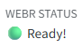
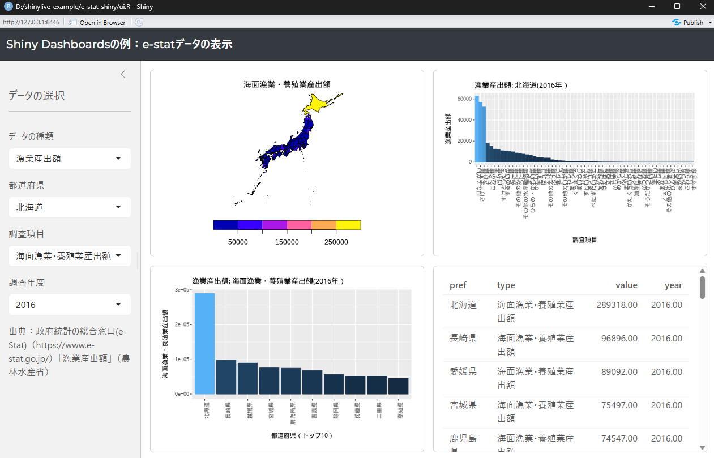

---
filters:
  - webr
engine: knitr
webr: 
  show-startup-message: false
---

```{r, echo=FALSE, eval=FALSE}

```


# webRとshinylive {.unnumbered}

`shinylive`[@shinylive_bib]は、[47章](chapter47.qmd)で説明したShiny[@shiny_bib]をサーバー上ではなく、Webブラウザ上で実行する方法を提供しているパッケージです。

`shinylive`でのShinyの実行には、Webブラウザ上でRを実行する環境である、[WebR](https://docs.r-wasm.org/webr/latest/)の技術が使われています。このWebRには[WebAssembly](https://webassembly.org/)というツールが用いられています。

このページでは、WebR・`shinylive`の説明と`shinylive`の使用例について簡単に紹介していきます。

:::{.callout-tip collapse="true"}
## Shinyアプリをサーバレスで共有する

[47章](chapter47.qmd#shiny-server)で少し説明した通り、Shinyを動かすためにはサーバでRの演算を行う必要があります。しかし、サーバを用いるとお金がかかりますし、たくさんの人が一度にアプリにアクセスすると動かなくなってしまいます。そこで、Shinyの先人たちはShinyをサーバを使わず（サーバレスで）、他の人と共有できる方法を試していました。

そのような試みの一つが「RとブラウザをShinyアプリと一緒にユーザーに渡してしまう」方法です。Rとして[R Portable](https://sourceforge.net/projects/rportable/)という、ファイルサイズが小さめでストレージに入れて使えるものを用い、[Google Chrome Portable](https://portableapps.com/apps/internet/google_chrome_portable)というブラウザも付けて、ユーザーにShinyを渡して使ってもらうわけです。英語では[R-bloggersの記事](https://www.r-bloggers.com/2014/04/deploying-desktop-apps-with-r/)に、日本語では[こちらのはてなブログの記事](https://stkdev.hatenablog.com/entry/2017/02/12/204631)に詳細な方法が記載されています。

しかし、R PortableはR 4.2.0からアップデートされておらず、ファイルサイズもかなり大きめです。ファイルの受け渡しも大変で、アプリのユーザーにもRの知識が少し必要です。私も何度かこの方法でShinyアプリの受け渡しを試してみましたが、まともにアプリを使ってもらったことはありません。

`shinylive`はこのような複雑な手順を踏むことなく、静的なWebページで比較的簡単にShinyを動かすことができるツールです。

:::

## WebR

以下では`shinylive`の基盤となっている、WebRについて簡単に紹介します。

WebRはブラウザ内でRを実行できる環境を作るためのツールです。ブラウザでの演算、つまりユーザーのPCの演算能力を用いてRを実行できるため、サーバーで演算する必要がなくなります。したがって、静的なウェブサイトでもRが実行できるようになります。

Javascriptで行われる普通のブラウザ内での演算では、Javascriptのコード解析に時間がかかりすぎるため、Rをブラウザ内で実行するのは現実的ではありません。このコード解析にかかる演算能力を減らすため、WebRではWebAssemblyという技術を用いています。

:::{.callout-tip collapse="true"}
## WebAssambly

WebAssemblyはアセンブラと呼ばれるプログラミング言語に近い仕様を持つ技術で、CやC++のプログラムを16進数の数値で表現したものです。

アセンブラはその昔テレビゲーム（FCやSFCの時代）などによく用いられていた言語です。アセンブラについて学びたい方は[AsmWalker](https://asm-walker.vercel.app/)とその[解説文](https://asm-walker.vercel.app/guide/machine-code.html)を触ってみるとよいと思います。WebAssemblyはアセンブラとは仕様が異なりますが、アセンブラと同様に機械語に近く、Webブラウザによる演算にかかるコストを小さくすることができる技術です。
:::

### quarto-webr

WebRの取り扱いにはJavascriptやNode.jsについての知識が必要で、それほど簡単に利用することはできません。しかし、WebRを[Quarto](https://sb8001at-oss.github.io/Rnyuumon.io/chapter36.html)で用いるQuarto Extensionである`quarto-webr`はJavascriptの知識がないRユーザーでも簡単に利用することができます。

`quarto-webr`の使い方は[こちらの利用方法に関するページ](https://quarto-webr.thecoatlessprofessor.com/)、日本語のこちらのページ（[quarto-webrはいいぞ](https://statditto.com/posts/quarto_webr_is_good/)）に記載されていますが、このページでも簡単に解説したいと思います。

#### Extensionのインストール

まずは`quarto-webr`のQuarto Extensionをインストールします。ターミナルから以下の`quarto add`コマンドを用いて`quarto-webr`をインストールします。

```bash
quarto add coatless/quarto-webr
```

このコマンドを実行すると、現在のワーキングディレクトリに`_extensions/coatless/webr`というディレクトリが作成され、ファイルがダウンロードされます。

Quarto Extensionは、ライブラリのようにRの実行時に常に利用できるものではなく、プロジェクトごとにダウンロードし、利用します。

#### yamlの設定：filters

次に、`.qmd`ファイルのyamlに以下のように`filters`を設定します。

```{yaml, filename="yaml: filtersの設定"}
---
filters: 
  - webr
---
```

#### quarto-webrのチャンク

Extensionをインストールし、yamlを設定すれば準備完了です。Extensionをダウンロードしたフォルダ内に`.qmd`ファイルを作成し、以下のようなwebr-rのチャンク内にRのコードを書いていきます。

````{markdown, filename="webrのチャンク"}
```{webr-r}
rnorm(3)
```
````

上記のチャンクを含む`.qmd`をRenderすると、以下のようにRの書かれたウインドウが表示されます。

```{webr-r}
rnorm(3)
```

このウインドウの「Run Code」をクリックすると、乱数が演算されるのが分かるかと思います。また、`rnorm(3)`のコードは編集することもできます。例えば`3`を`5`に書き換えると、乱数が5つに増えます。

また、図を表示することもできます。図の右上の「Download Image」をクリックすると図をダウンロードすることもできます。

```{webr-r}
plot(cars$speed + rnorm(nrow(cars)), cars$dist + rnorm(nrow(cars)))
```

#### チャンクオプション

`quarto-webr`のチャンクでは、通常のQuartoのチャンクオプションではなく、以下の表に示す`quarto-webr`用のチャンクオプションを用います。

```{r, echo=FALSE, message=FALSE}
library(tidyverse)
library(readxl)
d <- read_excel("./data/webr_chunk_and_yaml.xlsx")
d |> knitr::kable(caption="webr-rで利用可能なチャンクオプションの一覧")
```

#### YAML

同様に、`quarto-webr`に用いる専用のYAMLも設定されています。`quarto-webr`のYAMLは以下のように、`webr:`のYAMLの下に設定します。

例えば、以下の`show-startup-message`を`true`に設定するとページのヘッダーの下に「WEBR STATUS」が表示されます。表示したくない場合には`false`を指定します。

```{yaml, filename="yaml: filtersの設定"}
---
webr: 
  show-startup-message: false
---
```



以下に`quarto-webr`のYAMLの一覧を示します。

```{r, echo=FALSE}
d <- read_excel("./data/webr_chunk_and_yaml.xlsx", sheet = 2)
d |> knitr::kable(caption="webr-rで利用可能なYAMLの一覧")
```

#### quarto-webrでのパッケージの利用

`quarto-webr`でも通常のRと同様にパッケージをインストールして利用することができます。ただし、WebRや`quarto-webr`では、パッケージはCRANからダウンロードされるわけではなく、WebRの専用のレポジトリからダウンロード・インストールすることになります。

`quarto-webr`でパッケージをインストールする場合には、`webr::install`関数を用います。

```{r, eval=FALSE, filename="webr::installでパッケージをインストールする"}
webr::install("ggplot2")
```

## shinylive

`shinylive`はここまでに説明したWebRの技術を用いて、Shinyを静的なサーバーにデプロイし、Shinyの演算部分をウェブブラウザ、つまりユーザーのPCに投げてしまうことができるようにするためのパッケージです。静的なサーバーを用いるため、無料・安価でShinyアプリをデプロイすることができます。Shiny Serverの複雑な設定やDockerの知識も不要ですので、今までよりもずっと身近にShinyアプリを作成し、他の人に使ってもらうことができます。

以下では、`shinylive`を用いたShinyアプリの作成とデプロイ、簡単なShinyアプリの例について紹介します。

### shinyliveでShinyアプリを準備する

まずは適当なShinyアプリを作成します。以下の例では、[e-stat](https://www.e-stat.go.jp/)のデータを用いて作成したShinyアプリのサンプルを用いて、`shinylive`を試してみます。Shinyアプリのサンプルは[このgithubのレポジトリ](https://github.com/sb8001at-oss/shinylive_example/tree/main/e_stat_shiny)に保存しています。



次に`shinylive`をインストールし、ロードします。

```{r, eval=FALSE, filename="shinyliveパッケージのロード"}
pacman::p_load(shinylive)
```

`shinylive`がインストール出来たら、`shinylive`のアセット（assets）をダウンロードします。このアセットは`shinylive`をWebRを用いて構成する際に用いられるファイルのことです。アセットのダウンロードは`assets_download`関数で行うことができます。

```{r, eval=FALSE, filename="アセットをダウンロードする"}
shinylive::assets_download()
```

アセットの保存場所は`assets_info`関数で調べることができます。アセットの保存場所を`assets_download`関数の`dir`引数で指定することもできます。

```{r, eval=FALSE, filename="アセットの情報を調べる"}
shinylive::assets_info()
```

アセットが準備できたら、WebRを用いたShinyアプリを作成します。この過程は非常に簡単で、`export`関数を実行するだけです。`export`関数は第一引数にShinyアプリを保存したフォルダ（ディレクトリ）名を、第二引数に出力を保存するフォルダ名を指定します。

以下の例では、`"e_stat_shiny"`フォルダに保存したShinyアプリを変換して`"site"`フォルダに保存しています。[こちらのgithubのレポジトリ](https://github.com/sb8001at-oss/shinylive_example/tree/main)を確認していただければ、どのようなフォルダの構成とするのかイメージしていただけるかと思います。

また、Shinyアプリで利用しているパッケージは自動的にWebRのレポジトリからダウンロードされます。ダウンロードする場合には、ローカルとWebRのレポジトリ上のパッケージのバージョンを比較し、バージョンが異なる場合にはその情報を表示してくれます。

```{r, eval=FALSE, filename="shinylive::export関数でShinyアプリを変換する"}
shinylive::export("e_stat_shiny", "site")
```

変換したShinyアプリはサーバー環境でしか実行できません。`httpuv::runStaticServer`関数で変換後のフォルダ（上の例では`"site/"`）を指定してローカルサーバーで実行すれば、Shinyアプリが起動します。

```{r, eval=FALSE, filename="ローカルサーバーでアプリを実行する"}
httpuv::runStaticServer("site/")
```

アセットを削除する場合には`assets_remove`関数を実行します。

```{r, eval=FALSE, filename="アセットを削除する"}
shinylive::assets_remove()
```

`export`で作成したフォルダを[43章](https://sb8001at-oss.github.io/Rnyuumon.io/chapter43.html#github-pages)に示した方法でGithub PagesやQuarto Pubにデプロイすれば、Web上で`shinylive`を用いたShinyアプリを実行することができます。

### 文字化け

ただし、`shinylive`でShinyアプリを実行すると、日本語が文字化けします。これは、`shinylive`のアセットに含まれるフォントには日本語フォントが無いからです。

文字化けする場合には、フリーのフォントをダウンロードし、以下のようにShinyアプリ内で`showtext`パッケージ[@showtext_bib]を用いて日本語フォントを適用するとよいでしょう。

```{r, eval=FALSE, filename="日本語フォントを表示できるようにする：showtext"}
pacman::p_load(showtext)

# フォントへのパスを指定
font.paths("./")

# NotoSansJPをGoogle fontsからダウンロード
font.add("noto", "NotoSansJP-VariableFont_wght.ttf") 

# showtextでのフォント設定を自動的に適用する
showtext_auto()
```

`showtext`でうまくいかない場合には、アセットのフォルダ内のfonts（`shinylive/Cache/shinylive-0.XX.X/shinylive/pyodide/fonts`）に日本語フォントを足してみるとよいかもしれません。

### shinyliveの例

上記の方法で`shinylive`を用いたShinyアプリをデプロイしたのが以下のリンクです。

<https://sb8001at-oss.github.io/shinylive_test/>

リンクからアクセスしていただくとわかるかと思いますが、大したアプリではないのに実行が激重です。上記の`export`で作成したフォルダのファイルサイズは300MBを越えており、このファイルをダウンロードしないとShinyアプリが立ち上がらないようです。

正直、単にデータを表示したいだけなら[41章](chapter41.qmd)で説明したObservableの方が軽くてよいと思います（[こちら](https://xjorv.quarto.pub/pop_japanese_dashboard_with_ojs/)にアクセスしてみて下さい）。ただし、Observableはデータ表示のためのツールであり、複雑な統計解析を行うことはできません。今後の`shinylive`の開発状況によるかもしれませんが、現状ではデータの表示だけならObservable、GLMやGLMM、時系列や生存時間解析のような統計解析を含めるなら`shinylive`を使うといった、使い分けが重要となりそうです。
