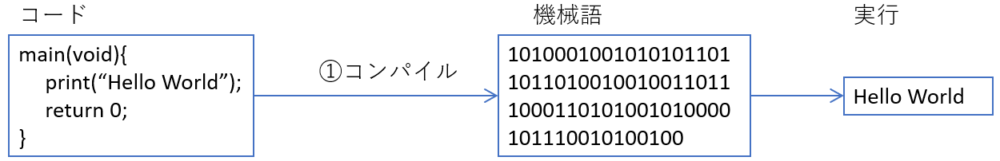

# オブジェクト

```{r, setup, include=FALSE, echo=FALSE}
knitr::opts_chunk$set(
  collapse = TRUE
)
```

## オブジェクトとは？

Rは**オブジェクト指向（Object oriented）**の言語である、とされています。

この**オブジェクト**というのは、プログラミングで取り扱う「もの」すべてを指す言葉です。プログラミングでは、**数値**や**文字**などを取り扱い、数値の演算を行ったり、文字に対して検索や置換、文字の追加などを行います。このとき、取り扱う数値や文字はオブジェクト、つまりプログラミングで用いる「もの」であるということになります。Rでは数値や文字の他に、**因子（factor）**や**論理値（booleanまたはlogical）**、**関数（function）**などを取り扱います。これらのすべてがプログラミングで取り扱う「もの」、つまりオブジェクトです。

上で述べたように、プログラミングで用いるオブジェクトには数値、文字、因子、関数など、様々な種類のものがあります。数値も文字もプログラミングで扱う「もの」であることは共通していますが、数値と文字に対して同じ演算をしたい、ということは通常ありません。数値なら掛け算や割り算を行うことがあっても、文字に対して掛け算や割り算はしません。プログラミング言語も、数値なら数値の演算、文字なら文字の演算を行う必要があります。このように、数値なら数値の、文字なら文字の処理を行うために、オブジェクトには**「型（type）」**というものがあります。

```{r, filename="型と演算の関係", error=TRUE}
1 * 1 # 数値同士を掛け算することがあっても、

1 * "dog" # 数値と文字列を掛け算できてしまうと困る（エラーが出る）
```

## 型（type）とは？

**型（type）**とは、そのオブジェクトの種類を定めるためのラベルのようなものです。例えば、Rで数値を入力すると、Rは自動的にその数値がnumericであると認識します。同様に、`"`（ダブルクオーテーション）で文字を囲うと、Rは自動的にその文字がcharacter（文字列型）であると認識します。Rはこの認識した型に従い、そのオブジェクトに対する演算を行います。

オブジェクトの型は`mode`関数で確認することができます。関数については後ほど詳しく説明します。

```{r, filename="mode関数で型を確認する"}
mode(1) # 1は数値
mode("Hello world") # "Hello world"は文字列
mode("1") # "1"は文字列
```

上記のように、「`1`」の数字を`mode()`のカッコの中に入れると、numericが返ってきます。これは、`1`というオブジェクトの型がnumeric（数値）であることを示しています。同様に、ダブルクオーテーションで囲まれた`"Hello world"`を`mode()`のカッコに入れると、characterが返ってきます。これは、`"Hello world"`の型がcharacter（文字列）であることを意味しています。では、ダブルクオーテーションで囲まれた`"1"`がどうなるかというと、これはcharacter、つまり文字列になります。

Rでは、このように「ダブルクオーテーションで囲まれている」というオブジェクトの状態を調べ、囲まれていればそのオブジェクトは文字列型であると判断します。同様に、オブジェクトが「数値でかつダブルクオーテーションに囲まれていない」場合には、そのオブジェクトが数値型であると判断します。このように、プログラム上でオブジェクトの型を特に指定していなくても、Rは自動的にそのオブジェクトの型を決定してくれます。

では、Rの代表的な型について、これから簡単に説明していきます。

### 文字列（character）

一般的なプログラミング言語で最も取り扱うことが多いオブジェクトは**文字列型（character）**です。文字列、つまり文章などを検索したり、一部を取り出したり、条件に合っているか確認したりすることはプログラミング利用の目的の一つとなります。

Rは統計学のプログラミング言語ですので、どちらかというと文字列よりは数値を取り扱うことが多いのですが、文字列を取り扱える仕組みも一通り備えています。

Rで文字列型のオブジェクトを作成するときには、`"`（ダブルクオーテーション）もしくは`'`（シングルクォーテーション）で文字を囲みます。ダブルクオーテーション・シングルクオーテーションのどちらを用いても文字列のオブジェクトを作成することはできます。クオーテーションが無い場合にはエラーとなります。

```{r, filename="文字列オブジェクトの例", error=TRUE}
"Hello world" # ダブルクオーテーションで囲った場合

'Hello R' # シングルクオーテーションで囲った場合

Hello world # エラー
```

ダブルクオーテーションとシングルクオーテーションには違いはありません。どちらを用いても問題ないのですが、Rではダブルクオーテーションを用いるのが一般的です。

Rでは、文字列を入力すればその文字列がそのまま表示されますが、文字列の表示を明示したい場合には`print`関数を用います。

```{r, filename="print関数"}
print("Hello world")
```


#### エスケープ文字（エスケープシーケンス）

プログラミング言語によっては、ダブルクオーテーションとシングルクオーテーションで**エスケープ文字（エスケープシーケンス）**の取扱いに違いがある場合があります。エスケープシーケンスとは、バックスラッシュ（\\、日本語キーボードでは¥）とアルファベットを組み合わせて、特定の意味を持たせる表現のことを指します。例えば、`\n`は改行を、`\t`はタブを示す記号です。また、文字列中にダブルクオーテーション、シングルクォーテーションを用いたい場合にも`\"`や`\'`のエスケープシーケンスが用いられます。RではC言語由来のエスケープシーケンスを利用できます。以下の表1にエスケープシーケンスの例を挙げます。

```{r, echo=FALSE}
d <- data.frame(
  escapeSequence = c('\\a', '\\b', '\\f', '\\n', '\\r', '\\t', '\\v', '\\\\', "\\\'", '\\\"'),
  represent = c("アラート", "バックスペース", "ページ分割", "改行", "キャリッジリターン", "水平タブ", "垂直タブ", "バックスラッシュ", "シングルクオーテーション", "ダブルクオーテーション")
)
colnames(d) <- c("エスケープシーケンス", "エスケープシーケンスの意味")
knitr::kable(d, "html", caption="表1：エスケープシーケンスの例")
```

Rのデータをテキストファイルなどに書き出すときには、エスケープシーケンス、特に`\n`（改行）や`\t`（タブ）を用いることがあります。データ書き出しの際のエスケープシーケンスに関しては、[17章](./chapter17.html)で詳しく説明します。

エスケープシーケンスを変換した文字列を表示する場合には、`writeLines`関数を用います。

```{r, filename="writeLines関数で文字列にエスケープシーケンスを反映"}
writeLines("Hello world")

writeLines("Hello \"world") # 文字列の中でクオーテーションを用いるときはエスケープが必要

writeLines("Hello\nworld") # \nは改行に変換

print("Hello\nworld") # print関数はエスケープシーケンスを変換しない
```

#### 文字列を結合する

Rで文字列を用いるときに、文字列Aと文字列Bをくっつけたい、ということがあります。このようなときに用いるのが、`paste`関数です。`paste`関数はカッコの中に2つ以上の文字列をコンマでつないで入れると、文字列をスペースを挟んでつなぎ合わせてくれます。文字列の間にスペースが必要ない場合には、`paste0`関数を用います。

```{r, filename="文字列をつなぐpaste関数"}
paste("Hello", "world")

paste0("Hello", "R")
```

文字列の取扱いに関しては、[13章](./chapter13.html)で詳しく説明します。

### 数値（numeric）

Rは統計の言語ですので、数値データを取り扱う機会が特に多くなります。グラフを記述したり、データを要約する場合にも主に取り扱うのは数値です。Rでは、数値は**numeric**という型を持ちます。

#### 数値型のdouble（浮動小数点）とinteger（整数）

数値には更に詳細な型があります。詳細な型は`typeof`関数で調べることができます。Rでの数値は通常doubleという型を持ちます。

数値にはdouble以外に、integer（整数）という型もあります。Rで整数型の数値を利用する時には、数字の後ろにLをつけます。また、数値であってもダブルクオーテーションで囲うと文字列 （character）になります。

```{r, filename="double型とinteger型"}
mode(1) # modeでの型はnumeric

typeof(1) # これはdouble

typeof(1L) # これはinteger

typeof("1") # これはcharacter
```

:::{.callout-tip collapse="true"}

## Rでの数値型

多くのプログラミング言語では、小数点を含む数値は、その精度（桁数）により、single（浮動小数点型）、double（倍精度浮動小数点型）などの型を持ちます。このsingleはdoubleよりオブジェクトのファイルサイズが小さい代わりに、あまり大きい桁数の数値は取り扱えないという特徴があります。Rにはsingleという型はありません。

:::

#### クラス（class）

Rではオブジェクトは型以外に、**クラス（class）**という性質を別に持っています。Rでの数値型は、numeric（数値）というクラスを持ちます。クラスの確認には`class`関数を用います。

```{r, filename="クラス、モードとtypeof関数"}
mode(1) # 型はnumeric

typeof(1) # typeofだとdouble

class(1) # クラスはnumeric
```

:::{.callout-tip collapse="true"}

## プログラミング言語としてのR

R言語は統計の計算を行うために開発されたプログラミング言語です。プログラミング言語としての仕様は[S言語](https://ja.wikipedia.org/wiki/S%E8%A8%80%E8%AA%9E)という、[ベル研究所](https://www.bell-labs.com/)によって開発された言語を参考としています。R言語は、「動的型付け、インタプリタ型、オブジェクト指向の関数型言語」というタイプのプログラミング言語です。プログラミング未体験の方にはすべての単語が意味不明だと思いますが、単語の意味については順々に紹介していきます。

まずは、**「インタプリタ」**について説明します。インタプリタとは、プログラムをコンパイルすることなく実行することができる環境のことを指します。

この、**「コンパイル」**というのは、プログラムを機械語に置き換える変換のことを指します。

**「機械語」**というのも聞き覚えがない言葉だと思います。機械語とは、コンピュータが読み取れる、1と0だけからなる数字の列のことです。コンピュータは我々の言語や画像などをそのまま処理することはできず、1ビット単位（1と0）の情報だけを取り扱うことができます。プログラミング言語のうち、例えばCやJavaでは、プログラムはまず機械語に変換、コンパイルされます。コンパイルされたプログラムだけがコンピュータ上で実行できます（下図1）。



一方、インタプリタ型の言語では、プログラミング言語をコンパイルすることなく実行することができます。インタプリタ型の言語には[Python](https://www.python.org/)や[Ruby](https://www.ruby-lang.org/ja/)、[PHP](https://www.php.net/)などがあります。コンパイルには通常時間がかかりますが、インタプリタ型言語ではコンパイルに時間をかけることなく、すぐにプログラムを実行することができるというメリットがあります。一方で、コンパイルを除いたプログラムを実行・完了するまでの時間はコンパイルを行うプログラミング言語よりも長くなるというデメリットもあります。

Rはインタプリタ型の言語ですので、記述したプログラム（スクリプトとも呼びます）はすぐに実行されます。一方で、Rでの計算速度はインタプリタ型言語の中でもかなり遅い部類に入ります。ただし、Rは主にad hocな（その場一回限りの）統計解析に用いられる言語です。1回限りであれば、それほど計算が早くなくても問題とはなりませんし、入力したプログラムがすぐに実行されるという性質も統計解析との相性がよいものです。コンピュータの性能も昔より遥かに高くなっており、R言語での計算が遅いと感じることは減ってきています。

:::

:::{.callout-tip collapse="true"}

## アトリビュート（attribute)

Rのオブジェクトは型だけでなく、アトリビュート（attribute）という性質を別に持っています。クラスはこのアトリビュートの一つです。オブジェクト指向プログラミングではクラスは非常に重要な意味を持ちますので、[22章](./chapter22.html)で詳しく説明します。

:::

#### 演算子（operator）

数値を扱う際には、四則演算等の計算を行うことがあります。この四則演算を行うための記号のことを、**演算子**と呼びます。Rでは以下の四則演算子を利用できます。

```{r, echo=FALSE}
d <- data.frame(
  operator = c("+", "-", "*", "/", "%%", "%/%", "^"),
  meaning = c("足し算", "引き算", "掛け算", "割り算", "剰余（割り算の余り）", "整数の割り算", "累乗")
)

colnames(d) <- c("演算子", "演算の種類")

knitr::kable(d, caption="表2：Rで使える演算子")
```

演算子それぞれの計算結果は以下のようになります。演算子の意味はExcelなどで用いられているものとほぼ同じです。

```{r, filename="四則演算の例"}
3 + 2 # 足し算

3 - 2 # 引き算

3 * 2 # 掛け算

3 / 2 # 割り算

3 %% 2 # 剰余（余り）

3 %/% 2 # 整数の割り算

3^2 # 累乗
```

数値については[12章](./chapter12.html)で詳しく説明します。

### 論理型（logical）

**論理型（logical）**は、**TRUE（真）**と**FALSE（偽）**からなる2値の型です。TRUEとFALSEはその名の通り、その関係が正しいか、間違っているかを意味するものです。論理型はそのまま使用することもありますが、プログラミングでは**比較演算子**と共に用いることが多い型です。

#### 比較演算子

**比較演算子**とは、演算子の右と左を比較して、その関係が正しい（`TRUE`）のか、間違っているのか（`FALSE`）を返す演算子です。比較演算子の例を以下に示します。

```{r, echo=FALSE}
d <- data.frame(
  operator = c("==", "!=", "<", "<=", ">", ">=", "&", "&&", "|", "||"),
  meaning = c("等しい", "等しくない", "小なり", "小なりイコール", "大なり", "大なりイコール", "かつ", "かつ", "または", "または")
)

colnames(d) <- c("比較演算子", "比較演算子の意味")
knitr::kable(d, caption="表3：Rで使える比較演算子")
```

`&`と`|`は比較演算子同士を結びつけるための演算子（論理演算子）です。`&`と`&&`、`|`と`||`の違いについては、[8章](./chapter8.html)で説明します。

比較演算子を用いた演算の例を以下に示します。比較演算子や論理型は主に**条件分岐**で用います。

```{r, filename="比較演算子"}
1 == 1 # 等しいのでTRUE
1 == 2 # 等しくないのでFALSE

1 != 1 # 等しいのでFALSE
1 != 2 # 等しくないのでTRUE

1 < 2 # 2は1より小さいのでTRUE
1 < 1 # 1は1より小さくないのでFALSE

1 <= 2 # 2は1より小さいのでTRUE
1 <= 1 # 1は1に等しいのでTURE

3 > 2 # 3は2より大きいのでTRUE
2 > 2 # 2は2より大きくないのでFALSE

3 >= 2 # 3は2より大きいのでTRUE
2 >= 2 # 2は2と等しいのでTRUE

1 == 1 & 2 == 2 # TRUEかつTRUEなのでTRUE
1 == 1 & 2 == 3 # TRUEかつFALSEなのでFALSE

1 == 1 | 2 == 2 # TRUEまたはTRUEなのでTRUE
1 == 1 | 2 == 3 # TRUEまたはFALSEなのでTRUE
```

#### 演算子の優先順位

数値の計算で掛け算・割り算を足し算・引き算より前に計算するように、演算子の優先順位、計算する順番は決まっています。概ね通常の計算と同じですが、以下のような順序で演算子は計算されます。

1.  カッコでくくられている計算
2.  累乗（`^`）
3.  剰余・整数の割り算（`%%`・`%/%`）
4.  掛け算・割り算（`*`・`/`）
5.  足し算・引き算（`+`・`-`）
6.  比較演算子（`==`、`!=`、`<`、`<=`、`>`、`>=`）
7.  論理演算子（`&`、`|`）

計算式は長くなることが多く、演算子の計算順を間違う場合も多いため、優先する計算は積極的にカッコで囲むとよいでしょう。

```{r, filename="演算子の計算順序"}
(2 + 1) / 3 # カッコ内は最優先

2 ^ 3 %% 5 # 累乗は剰余より先に計算(8/5の余り)

3 / 3 %% 2 # 剰余は割り算より先に計算（3/1を計算）

3 / 3 + 1 # 割り算は足し算より先に計算

3 + 3 > 5 # 比較演算子は足し算より後に計算

5 > 1 & 6 > 2 # 論理演算子は最後に計算
```

### その他の型・クラス

以上の3つ（文字列、数値、論理型）がRでの基本的な型になります。しかし、Rにはこの3つ以外の型を持つオブジェクトも存在します。

#### 欠損値など

データ分析では欠損値や、計算結果が表示できないもの、計算結果が無限大になるものなど、データとしてうまく取り扱えない値が生じることがよくあります。このような場合に対応するため、Rは欠損値、計算できない値、無限大にそれぞれ`NA`、`NaN`、`Inf`という型が設定されています。Rでは中身が何もないオブジェクト、`NULL`というものを作成することもできます。

```{r, filename="欠損値、非数、無限大"}
NA # 欠損値（Not Available）

0/0 # 非数（NaN、Not a Number）

1/0 # 無限大（Inf）

10000^1000000 # 大きすぎて取り扱えない数値もInfになる

NULL # 中身がないオブジェクト（NULL）
```

##### NAの取り扱い

Rでは、データに欠測値（`NA`）、計算できない値（`NaN`）、空の値（`NULL`）、無限大（`Inf`）が含まれることがあります。これらのうち、`NA`と`NaN`を取り除く関数が`na.omit`関数です。`na.omit`関数はベクターやデータフレームを引数に取り、`NA`と`NaN`を取り除いてくれる関数です。`NA`と異なり、`Inf`は取り除かれません。

```{r, filename="na.omit関数"}
vec <- c(1, NA, NaN, NULL, Inf) # NULLは要素として含められない
vec

na.omit(vec)
```

#### 複素数（complex）

Rでは複素数（整数+虚数）を取り扱うこともできます。複素数を表すときには、数値の後に`i`を入力します。

```{r, filename="複素数の作成と演算"}
1 + 1i # 複素数

mode(1 + 1i) # 複素数の型はcomplex

(1 + 1i) + (3 + 3i) # 複素数同士の足し算
```

#### 日時のクラス（Date、POSIXct、POSIXlt、difftime）

日付は数値や文字列とは異なる性質を持ちます。統計では日付や時間を演算に用いることもあります。Rでは日付はDateというクラスを持ちます。また、日時のデータはPOSIXctやPOSIXltというクラスに属します。

DateやPOSIXct、POSIXltは引き算などの演算に用いることができます。日時の差はdulationsというクラスを持ちます。

Date、POSIXct、POSIXlt、dulationはいずれもクラスで、データの型としてはdouble、つまり数値型のデータとして取り扱われます。

```{r, filename="日時のクラスと型"}
Sys.Date() # 現在の日付を表示する関数

class(Sys.Date()) # 日付のクラスはDate

typeof(Sys.Date()) # 日付の型はdouble


Sys.time() # 現在の日時を表示する関数

class(Sys.time()) # 日時のクラスはPOSIXctとPOSIXlt

typeof(Sys.time()) # 日時の型はdouble


Sys.Date() - as.Date("2023-01-01") # 2023/1/1から今日までの日数

class(Sys.Date() - as.Date("2023-01-01")) # 日時の差のクラスはdifftime
```

## 予約語

上の例では関数や変数に名前をつけていますが、関数名や変数名の付け方にはルールがあります。

-   名前の始めに数値（1、2など）をつけることはできない
-   名前の始めにアンダーバー（\_）を用いることはできない
-   大文字と小文字は区別される（SUMとsumは別扱い）
-   演算子や記号（`!`や`?`、`+`、`-`、`#` など）は使えない
-   **予約語**を用いることはできない

**予約語（reserved word）**とは、R言語がすでに役割を与えているために、関数名や変数名には使用できない文字列です。Rで設定されている予約語は以下の通りです。

-   if
-   else
-   repeat
-   while
-   function\
-   for
-   in
-   next
-   break
-   TRUE
-   FALSE
-   NULL
-   Inf
-   NaN
-   NA
-   NA_integer\_
-   NA_real\_
-   NA_complex\_
-   NA_character\_
-   ...
-   ..1
-   ..2

:::{.callout-tip collapse="true"}

## Rでのピリオドの取り扱い

Rでは、ピリオド（.）が予約語に含まれていないため、変数名にピリオドを利用することができます。ただし、他の言語ではこのピリオドをメソッド（method）という、関数の仲間のようなものに用いることが多く、勘違いを起こしやすい表記になります。Rでも変数名にピリオドを用いないほうがよいとされています。

:::

## ヘルプ

ヘルプを呼び出すことでRの関数の使い方を確認することができます。ヘルプは関数名の前に`?`を付けて実行することで呼び出すことができます。RStudioでは、右下のパネルにヘルプの内容が表示されます。

```{r, filename="ヘルプの呼び出し", eval=FALSE}
?mean # mean関数のヘルプを呼び出す
```
