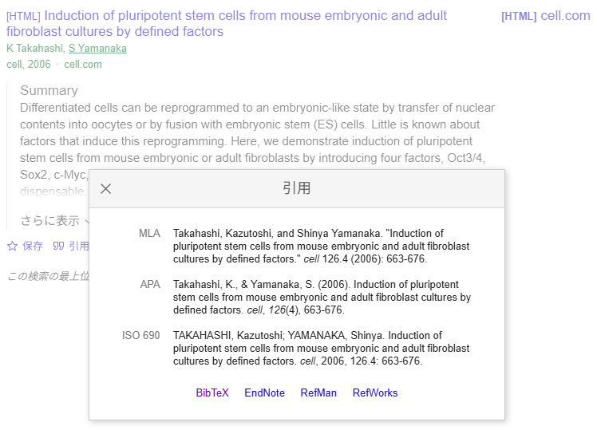

# Quarto：Markdownとレイアウト

```{r, echo = FALSE, message=FALSE}
library(tidyverse)
library(readxl)
```

## Markdown記法の一覧

Quartoでも、文章の設定はyamlとして、文章の中身はMarkdownで、コードはchunkに記載するのはR markdownと全く同じです。QuartoのMarkdownも、基本的にはRmarkdownのものとほぼ同じです。ただし、[R markdownの教科書](https://bookdown.org/yihui/rmarkdown/)に書かれているMarkdownのリストよりも、[QuartoのMarkdownガイド](https://quarto.org/docs/authoring/markdown-basics.html)にはたくさんの記法についての記載があります。以下にQuartoでのMarkdown記法についての一覧を示します。

:::{.column-page-right}

: QuartoのMarkdown記法一覧

+--------------------------------------+-------------------------------------------------------+--------------------------------------+
|Markdownの記法                        |表示                                                   |意味                                  |
+======================================+=======================================================+======================================+
|``` markdown                          |\                                                      |\                                     |
| _text_                               | _text_                                                |斜体                                  |
|```                                   |\                                                      |\                                     |
+--------------------------------------+-------------------------------------------------------+--------------------------------------+
|``` markdown                          |\                                                      |\                                     |
| *text*                               | *text*                                                |斜体                                  |
|```                                   |\                                                      |\                                     |
+--------------------------------------+-------------------------------------------------------+--------------------------------------+
|``` markdown                          |\                                                      |\                                     |
| **text**                             | **text**                                              |太字                                  |
|```                                   |\                                                      |\                                     |
+--------------------------------------+-------------------------------------------------------+--------------------------------------+
|``` markdown                          |\                                                      |\                                     |
| ***text***                           | ***text***                                            |太字斜体                              |
|```                                   |\                                                      |\                                     |
+--------------------------------------+-------------------------------------------------------+--------------------------------------+
|``` markdown                          |\                                                      |\                                     |
| ^1^O~2~                              | ^1^O~2~                                               |上付きと下付き                        |
|```                                   |\                                                      |\                                     |
+--------------------------------------+-------------------------------------------------------+--------------------------------------+
|``` markdown                          |\                                                      |\                                     |
| `code`                               | `code`                                                |スクリプト表記（インライン）          |
|```                                   |\                                                      |\                                     |
+--------------------------------------+-------------------------------------------------------+--------------------------------------+
|``` markdown                          |\                                                      |\                                     |
| ```code```                           | ```code```                                            |スクリプト表記                        |
|```                                   |\                                                      |\                                     |
+--------------------------------------+-------------------------------------------------------+--------------------------------------+
|``` markdown                          |\                                                      |\                                     |
|```` ```code``` ````                  |```` ```code``` ````                                   |コードの表示                          |
|```                                   |\                                                      |\                                     |
+--------------------------------------+-------------------------------------------------------+--------------------------------------+
|``` markdown                          |\                                                      |\                                     |
| ~~text~~                             | ~~text~~                                              |取り消し線                            |
|```                                   |\                                                      |\                                     |
+--------------------------------------+-------------------------------------------------------+--------------------------------------+
|``` markdown                          |\                                                      |\                                     |
| [Text]{.smallcaps}                   | [Text]{.smallcaps}                                    |small caps（英語のみ）                |
|```                                   |\                                                      |\                                     |
+--------------------------------------+-------------------------------------------------------+--------------------------------------+
|``` markdown                          |\                                                      |\                                     |
| [text]{.underline}                   | [text]{.underline}                                    |下線                                  |
|```                                   |\                                                      |\                                     |
+--------------------------------------+-------------------------------------------------------+--------------------------------------+
|``` markdown                          |\                                                      |\                                     |
| [text]{.mark}                        | [text]{.mark}                                         |ハイライト                            |
|```                                   |\                                                      |\                                     |
+--------------------------------------+-------------------------------------------------------+--------------------------------------+
|``` markdown                          |\                                                      |\                                     |
| > 吾輩は猫である。                   | <blockquote>吾輩は猫である。</blockquote>             |文の引用                              |
|```                                   |\                                                      |\                                     |
+--------------------------------------+-------------------------------------------------------+--------------------------------------+
|``` markdown                          |\                                                      |\                                     |
| $ log(\frac{p}{1-p})=ax+b $          | $$ log(\frac{p}{1-p})=ax+b $$                         |インラインの数式                      |
|```                                   |\                                                      |\                                     |
+--------------------------------------+-------------------------------------------------------+--------------------------------------+
|``` markdown                          |\                                                      |\                                     |
| $$ log(\frac{p}{1-p})=ax+b $$        | $$ log(\frac{p}{1-p})=ax+b $$                         |数式                                  |
|```                                   |\                                                      |\                                     |
+--------------------------------------+-------------------------------------------------------+--------------------------------------+
|``` markdown                          |                                                       |\                                     |
| # header1                            |<h1>header1</h1>                                       |ヘッダー（H1）                        |
|```                                   |                                                       |\                                     |
+--------------------------------------+-------------------------------------------------------+--------------------------------------+
|``` markdown                          |                                                       |\                                     |
| ## header2                           |<h2>header2</h2>                                       |ヘッダー（H2）                        |
|```                                   |                                                       |\                                     |
+--------------------------------------+-------------------------------------------------------+--------------------------------------+
|``` markdown                          |                                                       |\                                     |
| ### header3                          |<h3>header3</h3>                                       |ヘッダー（H3）                        |
|```                                   |                                                       |\                                     |
+--------------------------------------+-------------------------------------------------------+--------------------------------------+
|``` markdown                          |                                                       |\                                     |
| #### header4                         |<h4>header4</h4>                                       |ヘッダー（H4）                        |
|```                                   |                                                       |\                                     |
+--------------------------------------+-------------------------------------------------------+--------------------------------------+
|``` markdown                          |                                                       |\                                     |
| ###### header5                       |<h5>header5</h5>                                       |ヘッダー（H5）                        |
|```                                   |                                                       |\                                     |
+--------------------------------------+-------------------------------------------------------+--------------------------------------+
|``` markdown                          |                                                       |\                                     |
| ###### header6                       |<h6>header6</h6>                                       |ヘッダー（H6）                        |
|```                                   |                                                       |\                                     |
+--------------------------------------+-------------------------------------------------------+--------------------------------------+
|``` markdown                          |\                                                      |\                                     |
| <https://www.narahaku.go.jp/>        |<https://www.narahaku.go.jp/>                          |リンク（HTMLを表示）                  |
|```                                   |\                                                      |\                                     |
+--------------------------------------+-------------------------------------------------------+--------------------------------------+
|``` markdown                          |\                                                      |\                                     |
|[興福寺](https://www.kohfukuji.com/)  |[興福寺](https://www.kohfukuji.com/)                   |リンク（テキストを表示）              |
|```                                   |\                                                      |\                                     |
+--------------------------------------+-------------------------------------------------------+--------------------------------------+
|``` markdown                          |\                                                      |\                                     |
|                    |                                  |画像を表示                            |
|```                                   |\                                                      |\                                     |
+--------------------------------------+-------------------------------------------------------+--------------------------------------+
|``` markdown                          |\                                                      |\                                     |
|             |                            |画像を表示                            |
|```                                   |\                                                      |（マウスオーバーでtextを表示）        |
+--------------------------------------+-------------------------------------------------------+--------------------------------------+
|``` markdown                          |\                                                      |\                                     |
|[](link)            |[](https://www.todaiji.or.jp/)     |画像を表示                            |
|```                                   |\                                                      |（リンク付き）                        |
+--------------------------------------+-------------------------------------------------------+--------------------------------------+
|``` markdown                          |\                                                      |\                                     |
|text[^1]                              |text[^1]                                               |注釈（文は別途準備、ページ末に表示）  |
|                                      |                                                       |                                      |
|[^1]: 注釈の文                        |[^1]: 注釈の文                                         |                                      |
|```                                   |\                                                      |                                      |
+--------------------------------------+-------------------------------------------------------+--------------------------------------+
|``` markdown                          |\                                                      |\                                     |
| [@bibtex]                            | [@久保拓弥2012-05-19]                                 |文献の参照                            |
|```                                   |\                                                      |\                                     |
+--------------------------------------+-------------------------------------------------------+--------------------------------------+

:::

また、上記の他に、以下のようにキーボードショートカットを指定するための表記法もあります。

```{markdown, filename="キーボードショートカットのMarkdown記法"}

```



:::{.callout-tip collapse="true"}

## 表にMarkdown記法を加える

上記の表の2列目のように、Markdown記法で記述した要素はMarkdown記法に従ってHTMLに変換されます。ただし、一部変換がうまくいかない場合があります。例えば、ヘッダーやインラインコード、引用文の表記は表中ではMarkdown記法に沿ってHTMLには変換されない場合があります。変換できない場合は、HTMLの記法で書くとHTML表記に従い変換されます。ですので、上の表のソースを読むと、一部HTMLで記載されており、一列目とは記法が異なることが分かるかと思います。

インラインの数式は表中ではうまく変換できず、数式と同じ表記（`$$ $$`の表記）で表示していますが、通常の文中ではきちんと数式に変換されます。
:::

## 箇条書き

Quartoでの箇条書きの記載方法は以下の通りです。記号（`*`や`-`）と文章の間にはスペースが1つ必要で、スペースがないとうまく箇条書きにならないことがあります。

: Quartoでの箇条書き一覧

+-----------------------------------+---------------------------------+
| Markdownの記法                    | 表示                            |
+===================================+=================================+
| ``` markdown                      |                                 |
| * 順序なし箇条書き1               | * 順序なし箇条書き1             |
|     + 副箇条1                     |     + 副箇条1                   |
|     + 副箇条2                     |     + 副箇条2                   |
|         - 副々箇条1               |         - 副々箇条1             |
| ```                               |                                 |
+-----------------------------------+---------------------------------+
| ``` markdown                      |                                 |
| 1. 順序あり 箇条書き1             |1. 順序あり 箇条書き1            |
| 2. 順序あり 箇条書き2             |2. 順序あり 箇条書き2            |
|     i) 副箇条1                    |    i) 副箇条1                   |
|     ii) 副箇条2                   |    ii) 副箇条2                  |
| ```                               |                                 |
+-----------------------------------+---------------------------------+
| ``` markdown                      |                                 |
| - [ ] チェック1                   | - [ ] チェック1                 |
| - [x] チェック2                   | - [x] チェック2                 |
| ```                               |                                 |
+-----------------------------------+---------------------------------+
| ``` markdown                      |                                 |
| (@)  1項目                        |  (1) 1項目                      |
|                                   |                                 |
| 中に文を挟んで                    |  中に文を挟んで                 |
|                                   |                                 |
| (@)  2項目                        |  (2) 2項目                      |
| ```                               |                                 |
+-----------------------------------+---------------------------------+
| ``` markdown                      |                                 |
| ::: {}                            | ::: {}                          |
| 1. リストの1つ目                  | 1. リストの1つ目                |
| :::                               | :::                             |
|                                   |                                 |
| ::: {}                            | ::: {}                          |
| 1. 別のリストの1つ目              | 1. 別のリストの1つ目            |
| :::                               | :::                             |
| ```                               |                                 |
+-----------------------------------+---------------------------------+
| ``` markdown                      |                                 |
| 何らかの単語                      | 何らかの単語                    |
| : 単語の定義                      | : 単語の定義                    |
| ```                               |                                 |
+-----------------------------------+---------------------------------+

## 表

表は、以下のように+と-、=、|の記号を用いて表します。また、キャプションを入れたいときには、表の上か下に:（コロン）を記載し、その後に文章を追加します。

```{markdown}
#| filename: 表のMarkdown記法

+-----+-----+-----+
| pet | age | sex |
+=====+=====+=====+
| dog | 5   | F   |
+-----+-----+-----+
| cat | 3   | M   |
+-----+-----+-----+

: caption
```

+-----+-----+-----+
| pet | age | sex |
+=====+=====+=====+
| dog | 5   | F   |
+-----+-----+-----+
| cat | 3   | M   |
+-----+-----+-----+

: caption

表内を左揃えにするときは:===、右揃えにするときは===:、中央揃えにするときには:===:を用いて、列名との境を設定します。

```{markdown}
#| filename: 左右・中央揃え

+-----+-----+-----+
| pet | age | sex |
+:====+====:+:===:+
| dog | 5   | F   |
+-----+-----+-----+
| cat | 3   | M   |
+-----+-----+-----+

: caption（わかりにくいが、petは左、ageは右、sexは中央揃えになっている）
```

+-----+-----+-----+
| pet | age | sex |
+:====+====:+:===:+
| dog | 5   | F   |
+-----+-----+-----+
| cat | 3   | M   |
+-----+-----+-----+

: caption（わかりにくいが、petは左、ageは右、sexは中央揃えになっている）

また、表の幅は以下のような形で設定することができます。


```{markdown}
#| filename: 列の幅を調整する

+-----+-----+-----+
| pet | age | sex |
+=====+=====+=====+
| dog | 5   | F   |
+-----+-----+-----+
| cat | 3   | M   |
+-----+-----+-----+

: 幅は10、10、80で調整 {tbl-colwidths="[10,10,80]"}
```

+-----+-----+-----+
| pet | age | sex |
+=====+=====+=====+
| dog | 5   | F   |
+-----+-----+-----+
| cat | 3   | M   |
+-----+-----+-----+

: 幅は10、10、80で調整 {tbl-colwidths="[10,10,80]"}

表は以下のように、横並びに並べることもできます。

```{markdown}
#| filename: 表を横に並べる

:::{#tbl-panel layout-ncol=2}

: dog-cat table {#tbl-first}

+-----+-----+-----+
| pet | age | sex |
+=====+=====+=====+
| dog | 5   | F   |
+-----+-----+-----+
| cat | 3   | M   |
+-----+-----+-----+

: cow-pig table {#tbl-second}

+-----+-----+-----+
| pet | age | sex |
+=====+=====+=====+
| cow | 4   | M   |
+-----+-----+-----+
| pig | 7   | M   |
+-----+-----+-----+

Caption：表を横に並べる
:::
```

:::{#tbl-panel layout-ncol=2}

: dog-cat table {#tbl-first}

+-----+-----+-----+
| pet | age | sex |
+=====+=====+=====+
| dog | 5   | F   |
+-----+-----+-----+
| cat | 3   | M   |
+-----+-----+-----+

: cow-pig table {#tbl-second}

+-----+-----+-----+
| pet | age | sex |
+=====+=====+=====+
| cow | 4   | M   |
+-----+-----+-----+
| pig | 7   | M   |
+-----+-----+-----+

Caption：表を横に並べる
:::

このMarkdown形式のテーブルをテキストエディタで作成するのはとても面倒ですので、[Markdownテーブルジェネレーター](https://www.google.com/search?q=Markdown%E3%83%86%E3%83%BC%E3%83%96%E3%83%AB%E3%82%B8%E3%82%A7%E3%83%8D%E3%83%AC%E3%83%BC%E3%82%BF%E3%83%BC&rlz=1C1OLVV_jaJP1021JP1021&oq=Markdown%E3%83%86%E3%83%BC%E3%83%96%E3%83%AB%E3%82%B8%E3%82%A7%E3%83%8D%E3%83%AC%E3%83%BC%E3%82%BF%E3%83%BC&gs_lcrp=EgZjaHJvbWUyBggAEEUYOTIHCAEQABjvBTIKCAIQABiABBiiBDIKCAMQABiABBiiBDIKCAQQABiiBBiJBTIHCAUQABjvBdIBBzc0MWowajeoAgCwAgA&sourceid=chrome&ie=UTF-8)がたくさん作られています。[QuartoのTableに関するGuide](https://quarto.org/docs/authoring/tables.html)にもジェネレーターの記載があるので、
使い勝手の良いものを探して用いてみるとよいでしょう。

### データフレームを表として表示する

表はMarkdownで書く方法だけでなく、Rの関数を使ってデータフレームから表示することもできます。単にデータフレームを表示した場合、以下のようにconsoleに表示されるのと同じような表が挿入されます。

```{r, filename="data.frameを表示する"}
head(iris, 3)
```

Quartoでは、データフレームの表示方法として、`knitr::kable`や`DT::datatable`などの、表をきれいに表示するための関数を用いることができます。Rの演算で得られた表をQuartoで表示したい場合には、このどちらかの関数を用いるとよいでしょう。

```{r, filename="knitr::kableで表を表示する"}
knitr::kable(head(iris, 3))
```

<hr>

```{r, filename="DT::datatableで表を表示する"}
DT::datatable(head(iris, 3))
```

## 図の表示

図は、上に示した通り、``という形で表示することができます。図は以下のように横に並べて描画することもできます。

```{markdown, filename="図を横に並べる"}
::: {layout-ncol=2}


caption: 図を横に並べる（layout-ncol）
:::

```

::: {layout-ncol=2}


caption: 図を横に並べる（layout-ncol）
:::

<hr>

同様に、`layout-nrow`で指定すると縦に図を並べることもできます。

また、図のサイズは`{width = 50%}`といった形で、Markdown記法の後ろに幅を指定することで変更できます。また、以下のような記法でも、図のサイズや表示位置などを調整することができます。

```{markdown, filename="図のサイズ等の設定"}
{width = 50%} # 幅を半分にする
{width = 400} # 幅を400ピクセルにする
{height = 4in} # 高さを4インチにする
{fig-align="right"} # 右揃えにする
```

逆に以下のような方法で大きく図を表示することもできます。

```{markdown, filename="図を大きく表示する"}
:::{.column-page}

:::
```

:::{.column-page}

:::

### lightbox

[lightbox](https://ja.wikipedia.org/wiki/Lightbox)はWeb上に表示された図をクリックすることで拡大して表示することができるようにする、JavaScriptで作成された機能の一つです。図をクリックすることで、イメージが拡大され、ブラウザ全面に図が表示されるようになります。以下のような形で`{.lightbox}`を加えることで、lightboxを図に適用することができます。

```{markdown, filename="lightbox"}
{.lightbox}
```

{.lightbox}

また、YAMLを用いてもlightboxの設定を行うことが出来ます（このテキストではYAMLですべての図にlightboxを適用しています）。YAMLでのlightboxの設定についてはQuarto:YAMLの章で説明します。

図のサイズなど、複数の設定を1つの図に加えたい場合には、`{}`の中に複数の設定項目をスペースを空けて記載します。

```{markdown, filename="複数の設定を図に加える"}
{width = 50% .lightbox}
```

## ビデオの埋め込み

ビデオを埋め込んだHTMLを作成することもできます。ビデオの埋め込みには以下のような記法を用います。

```{markdown, filename="ビデオを埋め込む"} 

```



## 地図などの埋め込み

Google mapsなどの地図を埋め込みたい場合には、Markdownの記法ではなく、HTMLの記法に従い`iframe`を用います。地図の埋め込みを利用する場合には、Google Mapで特定の地点を選び、『共有→地図の埋め込み』から、`iframe`の記載のあるhtmlをコピーして用います。


```{markdown, filename="地図の埋め込み"}
<iframe src="https://www.google.com/maps/embed?pb=!1m18!1m12!1m3!1d3104.070237624984!2d135.82681530122332!3d34.466649586096636!2m3!1f0!2f0!3f0!3m2!1i1024!2i768!4f13.1!3m3!1m2!1s0x6006cc7787ee33d1%3A0xf4590df74f4fb763!2z55-z6Iie5Y-w5Y-k5aKz!5e0!3m2!1sja!2sjp!4v1748949910999!5m2!1sja!2sjp" width="600" height="450" style="border:0;" allowfullscreen="" loading="lazy" referrerpolicy="no-referrer-when-downgrade"></iframe>
```

<iframe src="https://www.google.com/maps/embed?pb=!1m18!1m12!1m3!1d3104.070237624984!2d135.82681530122332!3d34.466649586096636!2m3!1f0!2f0!3f0!3m2!1i1024!2i768!4f13.1!3m3!1m2!1s0x6006cc7787ee33d1%3A0xf4590df74f4fb763!2z55-z6Iie5Y-w5Y-k5aKz!5e0!3m2!1sja!2sjp!4v1748949910999!5m2!1sja!2sjp" width="600" height="450" style="border:0;" allowfullscreen="" loading="lazy" referrerpolicy="no-referrer-when-downgrade"></iframe>

## フローチャートなど

フローチャートなどを表示したい場合、[Mermaid](https://mermaid.js.org/)と[Graphviz](https://graphviz.org/)というツールを用いることができます。いずれもかなり複雑なフローチャートなどを作成することができるツールで、非常に機能が豊富です。このテキストでMermaid、Graphvizの使い方のすべてを説明することはできないため、利用したい場合には[Mermaidのドキュメント](https://mermaid.js.org/intro/)、[Graphvizのドキュメント](https://graphviz.org/documentation/)を参考にして下さい。

:::{.panel-tabset}

## Mermaid

````{markdown}
```{mermaid}
flowchart LR
    始め --> 終わり
```
````

```{mermaid}
flowchart LR
    始め --> 終わり
```

## Graphviz

````{markdown}
```{dot}
graph G {始め -- 終わり}
```
````

```{dot}
//| fig-height: 2

graph G {始め -- 終わり}
```

:::

## 文献の引用

文献の引用は、上記の通り、`[@bibtex]`という形で引用することになります。ただし、この`[@bibtex]`だけでは引用文を作成することはできません。

文献を引用する場合、まず、このbibtexと呼ばれる形式のテキストを含むファイル（仮に`references.bib`とします）を準備する必要があります。bibtexは以下のような記載のテキストのことです。references.bibファイルには、このbibtexをテキストで保存しておきます。

```{bibtex, filename="bibtex"}
@Manual{pacman_bib,
  title = {{pacman}: {P}ackage Management for {R}},
  author = {Tyler W. Rinker and Dason Kurkiewicz},
  address = {Buffalo, New York},
  note = {version 0.5.0},
  year = {2018},
  url = {http://github.com/trinker/pacman},
}
```

上記のbibtexの`@Manual{`の次には、`pacman_bib`と記載されています。この`pacman_bib`がこの文献の情報を引用するときに利用するためのタグになっています。

次に、YAMLで引用文献が記載されたbibtexを含むファイル（`references.bib`）を指定する必要があります。前の章で説明した通り、YAMLはR markdownやQuartoでファイルの設定を行うためのテキスト形式であり、通常ファイルの一番初めの、`---`で挟まれた部分に記載します。

```{markdown, filename="referenceを設定するためのYAML"}
---
bibliography: references.bib # references.bibにbibtexを記載し、保存する
---
```

上記のように、`bibliography: references.bib`をYAMLに設定すると、Quartoは`references.bib`のファイルにbibtexの情報を読みに行き、引用文をタグと結び付けられるようにしてくれます。このようにbibtexの設定を行った後、以下のような記載を行うことで、文献を引用できます。

```{markdown, filename="文献の引用"}
pacman：libraryを簡単に取り扱うためのライブラリ。[@pacman_bibtex]

ロジスティック回帰とロジットリンク関数[see @久保拓弥2012-05-19, p119-127]

glmnet：スパース回帰に関するライブラリ。[@glmnet_bib1; @glmnet_bib2]

ある日の暮方の事である。一人の下人が、羅生門の下で雨やみを待っていた。[-@akutagawa_bib]

@akutagawa_bib 『ある日の暮方の事である。一人の下人が、羅生門の下で雨やみを待っていた。』

@久保拓弥2012-05-19[p39]『\「ばらつきは何でもかんでも正規分布」と考えるのはおかしいだろう---ということで、一般化線形モデルが登場します。』
```


`pacman`：libraryを簡単に取り扱うためのライブラリ。[@pacman_bib]

ロジスティック回帰とロジットリンク関数[see @久保拓弥2012-05-19, p119-127]

`glmnet`：スパース回帰に関するライブラリ。[@glmnet_bib1; @glmnet_bib2]

ある日の暮方の事である。一人の下人が、羅生門の下で雨やみを待っていた。[-@akutagawa_bib]

@久保拓弥2012-05-19[p39] 『 \「ばらつきは何でもかんでも正規分布」と考えるのはおかしいだろう---ということで、一般化線形モデルが登場します。』

### bibtexを作成する

[bibtex](https://ja.wikipedia.org/wiki/BibTeX)はただのテキストですので、自分で作成することはできます。しかし、論文や教科書を探し、bibtexを作成するのは面倒です。また、ライブラリの引用文をbibtexで準備するのも大変です。

Rでは、ライブラリの引用に関しては、`citation`関数を用いて表示することができます。

```{r, filename="citation関数"}
citation("pacman")
```
このcitationで表示されるbibtexを用いてもよいですし、`toBibtex`関数を用いて、bibtexだけを取り出すこともできます。いずれにしても引用に用いるタグがないため、自分でタグをつける必要はあります。

```{r, filename="toBibtex関数"}
toBibtex(citation("pacman"))
```

論文であれば、[Google scholar](https://scholar.google.co.jp/schhp?hl=ja)で検索し、引用をbibtexに変換することができます。



教科書であれば、上のGoogle scholarを用いてもよいですし、Amazonで販売されている日本語の教科書であれば、[Lead2Amazon](https://lead.to/amazon/jp/)というサイトを用いて教科書を検索し、bibtexに変換してもよいでしょう。

## レイアウト

上のMarkdown一覧表や善光寺の図では、PCで閲覧した場合、画像や図が左右のナビゲーションの部分にはみ出しています。また、このテキストでは、以下のようなcalloutブロック、タブ表示を使用しています。これらの表示をコントロールするための要素がレイアウトです。各レイアウトの表示方法について、以下に説明していきます。

レイアウトの設定では、セミコロン3つ（`:::`）の後にレイアウトを指定（`{}`の中にレイアウトを指定）し、レイアウト内の文や図を記載した後、セミコロン3つ（`:::`）で閉じます。このセミコロン3つの間に記載されている部分が、指定したレイアウトで表示されます。

:::{.column-page}
```{markdown}
{.column-page}で横幅を広げて表示
```
:::

:::{.callout-tip}
### calloutブロック

このような表示のことをcalloutと呼びます。
:::

:::{.panel-tabset}

## タブ1

タブの中身1

## タブ2

タブの中身2

## タブ3

タブの中身3

:::

### calloutブロック

calloutブロックは、以下のように`{.callout-tip}`という形で記載することで表示させることができます。calloutブロックのタイトルは、この記法の初めの行に`##`のヘッダーとして記載することで設定できます。

```{markdown, filename="calloutブロックの記法"}
:::{.callout-tip}
## calloutブロック

このように記載することでcalloutを表示させることができます。
:::
```

:::{.callout-tip}
## calloutブロック

このように記載することでcalloutを表示させることができます。
:::

calloutブロックには、note、tip、warning、important、cautionの5つの種類があります。利用する際の目的によって使い分けるとよいでしょう。

::: {layout-ncol=2}

:::{.callout-note}
callout-note
:::

:::{.callout-tip}
callout-tip
:::

:::{.callout-warning}
callout-warning
:::

:::{.callout-important}
callout-important
:::

:::{.callout-caution}
callout-caution
:::

:::

#### calloutブロックの折り畳み

また、このテキストで多用しているように、calloutブロックは折りたたむことができます。折りたたむ場合には以下のように`collapse="true"`を加えてcalloutブロックを設定します。`icon="false"`を追加するとアイコンを消すこともできます。

```{markdown, filename="calloutブロックの折り畳み"}
:::{.callout-tip collapse="true" icon="false"}
## calloutの折り畳み

このように記載することでアイコン（calloutの左にあるもの）を消し、calloutを折りたたむことができます。
:::
```

:::{.callout-tip collapse="true" icon="false"}
## calloutの折り畳み

このように記載することでアイコン（calloutの左にあるもの）を消し、calloutを折りたたむことができます。
:::

#### calloutブロックのデザイン

calloutには3つのデザイン（`default`、`simple`、`minimal`）があります。特に指定しない場合にはdefaultが選ばれます。デザインを指定する場合には`appearance="simple"`のような形で指定します。`simple`と`minimal`の差はアイコンの有無だけです。

```{markdown, filename="calloutブロックのデザイン"}
:::{.callout-tip appearance="simple"}
## callout: simple
`appearance="simple"`を指定しています。
:::
```

::: {layout-ncol=2}

:::{.callout-tip appearance="simple"}
## callout: simple
`appearance="simple"`を指定しています。
:::

:::{.callout-tip appearance="minimal"}
## callout: minimal
`appearance="minimal"`を指定しています。
:::

:::

## タブ表示

図や表、Rの演算結果などは、タブを利用して表示することが出来ます。タブの設定には`{.panel-tabset}`を用い、以下のように設定します。`##`の後に記載したタイトルがタブに表示されます。

```{markdown, filename="タブの設定"}
:::{.panel-tabset}
## タブ1
\```{r, fig.height=2, echo=FALSE} # バックスラッシュは不要
plot(cars)
\```

## タブ2

{height=200}

## タブ3

+-----+-----+-----+
| pet | age | sex |
+=====+=====+=====+
| dog | 5   | F   |
+-----+-----+-----+
| cat | 3   | M   |
+-----+-----+-----+
| pig | 4   | M   |
+-----+-----+-----+

:::
```

:::{.panel-tabset}
## タブ1
```{r, fig.height=2, echo=FALSE}
plot(cars)
```

## タブ2

{height=200}

## タブ3

+-----+-----+-----+
| pet | age | sex |
+=====+=====+=====+
| dog | 5   | F   |
+-----+-----+-----+
| cat | 3   | M   |
+-----+-----+-----+
| pig | 4   | M   |
+-----+-----+-----+

:::

### 描画の幅の設定

このテキストで示している通り、Quartoの出力したHTMLでは、PCで閲覧した時には左側・右側にナビゲーションの表示を置くことができます。このナビゲーションの表示に従い、文や図の表示されるサイズは以下のように中央に制限されています。

````{markdown, filename="幅を指定するレイアウト"}
:::{.column-body}
```{markdown}
デフォルトの場合の表示幅
```
:::
````

```{markdown}
デフォルトの場合の表示幅
```

この表示幅を調整する場合に用いるのが、`{.column-XXX}`というレイアウトです。`XXX`の部分にレイアウトの幅を指定します。指定するレイアウトの例を以下に示します。すべてを使うことはまずないかと思いますが、いくつか覚えておくと表現の幅が広がるでしょう。ただし、このテキストのように、左に章立てなどを表示している場合には、幅を広げる表現とは相性が悪いです。

:::{.column-body}
```{markdown}
{.column-body} # 通常の幅
```
:::

:::{.column-body-offset}
```{markdown}
{.column-body-offset}
```
:::

:::{.column-body-inset-right}
```{markdown}
{.column-body-inset-right}
```
:::

:::{.column-body-outset-right}
```{markdown}
{.column-body-outset-right}
```
:::

:::{.column-page-right}
```{markdown}
{.column-page-right}
```
:::

:::{.column-screen-inset-right}
```{markdown}
{.column-screen-inset-right}
```
:::

:::{.column-screen-right}
```{markdown}
{.column-screen-right}
```
:::

:::{.column-body-outset-left}
```{markdown}
{.column-body-outset-left}
```
:::

:::{.column-page-inset-left}
```{markdown}
{.column-page-inset-left}
```
:::

:::{.column-page-left}
```{markdown}
{.column-page-left}
```
:::

:::{.column-screen-inset-left}
```{markdown}
{.column-screen-inset-left}
```
:::

:::{.column-screen-left}
```{markdown}
{.column-screen-left}
```
:::

:::{.column-page}
```{markdown}
{.column-page}
```
:::

:::{.column-screen-inset}
```{markdown}
{.column-screen-inset}
```
:::

:::{.column-screen}
```{markdown}
{.column-screen}
```
:::

### 右の欄に図や文字を表示する：.column-margin

文章や図、表などは、右側のスペースに表示させることもできます（ただし、スマホ等で見ると右側ではなく、文中に挿入される形になります）。この右側に表示させるために用いるレイアウトが`{.column-margin}`です。

```{markdown, filename="右側のスペースに図を表示する"}
:::{.column-margin}

:::
```


:::{.column-margin}

:::

```{markdown, filename="右側のスペースに表を表示する"}
:::{.column-margin}
+-----+-----+-----+
| pet | age | sex |
+=====+=====+=====+
| dog | 5   | F   |
+-----+-----+-----+
| cat | 3   | M   |
+-----+-----+-----+

: caption
:::
```

:::{.column-margin}
+-----+-----+-----+
| pet | age | sex |
+=====+=====+=====+
| dog | 5   | F   |
+-----+-----+-----+
| cat | 3   | M   |
+-----+-----+-----+

: caption
:::

```{markdown, filename="右側のスペースに文を表示する"}
:::{.column-margin}
Lorem ipsum dolor sit amet, consectetur adipiscing elit, sed do eiusmod tempor incididunt ut labore et dolore magna aliqua. Ut enim ad minim veniam, quis nostrud exercitation ...
:::
```

:::{.column-margin}
Lorem ipsum[^2] dolor sit amet, consectetur adipiscing elit, sed do eiusmod tempor incididunt ut labore et dolore magna aliqua. Ut enim ad minim veniam, quis nostrud exercitation ...
:::

[^2]: [Lorem ipsum](https://ja.wikipedia.org/wiki/Lorem_ipsum)は出版等で用いられる意味のない文字列です。

Rのコードを実行し、出力を右のスペースに表示させることもできます。

````{markdown, filename="右側のスペースに表を表示する"}
:::{.column-margin}
```{r}
plot(cars)
```
:::
````

:::{.column-margin}
```{r}
plot(cars)
```
:::

また、注釈に関しては、Markdownの表に記載した方法の他に、右に表示する方法もあります。

```{markdown, filename="注釈を右に表示する"}
[Lorem ipsum dolor sit amet...]{.aside}
```

[Lorem ipsum dolor sit amet...]{.aside}

この方法で記載した場合には、注釈が文の一番下に表示されることはありません。
