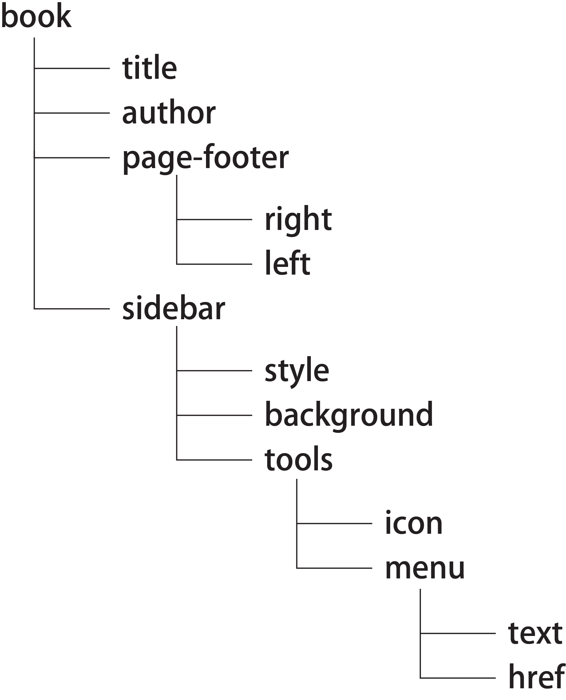
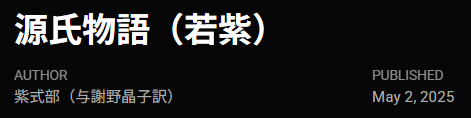
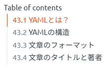
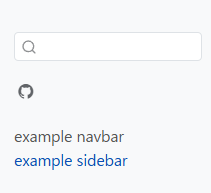
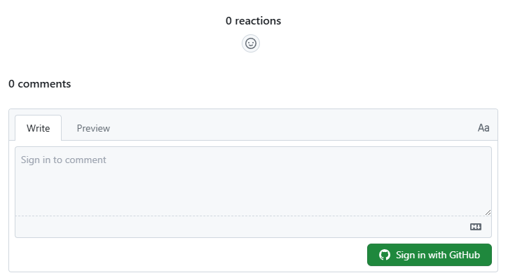
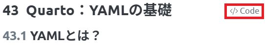

# Quarto：YAMLの基礎

```{r, echo = FALSE, message=FALSE}
library(tidyverse)
library(readxl)
```

## YAMLとは？

[R markdownの章](./chapter38.html)でも少し説明しましたが、R markdown・Quartoでは、文章全体に関する設定を、文頭の**YAML**という部分に記載します。YAMLは以下のように、`---`で囲まれた領域に記載し、その文章の`title`（題名）や`author`（著者）、`date`（作成日）や`output`（出力するファイル形式）などの設定を`:`（コロン）でつないで記載する形式のテキストを指します。

```{yaml, filename="YAMLの例"}
---
title: "Untitled"
author: "xjorv"
date: "2024-06-29"
output: html_document
---
```

Quartoでは、このYAMLが非常に拡張されており、YAMLを文頭に書くと文章がいつまでたっても始まらない、という場合があるほどに設定できる項目がたくさんあります。

R markdownを利用していた5年ほど前まではYAMLを文頭に書いていて問題はありませんでしたし、シンプルな文章を作成するだけであれば今でもQuartoの文頭にYAMLを記載しても問題ありません。

ただし、複雑な文章、例えばこのテキストのような**Quarto Books**を作成したいときや、ブログを作成するような場合、Reveal.jsなどを用いたプレゼンテーションを作成する場合や、インタラクティブなダッシュボードを作成するような場合には、YAMLを文頭に書くと非常に煩雑であり、読みにくくなってしまいます。

従って、Quartoを用いる場合には、YAMLは基本的に別ファイルとして作成する方がよいでしょう。QuartoのYAMLは**`_quarto.yml`**というファイルにまとめて書くことが出来ます。`_quarto.yml`には、`---`を書く必要はなく、YAMLを直接書いていくことができます。`_quarto.yml`を.qmdファイルと同じフォルダに保存しておけば、.qmdファイルをRenderする際に勝手に`_quarto.yml`を読み込み、文章の形式を整えてくれます。

  [このテキストの_quarto.yml](https://github.com/sb8001at-oss/Rnyuumon/blob/master/_quarto.yml)を見ていただければ、どのようにYAMLを`_quarto.yml`に書くのか、イメージしやすいと思います。

以下では、まず基礎となるYAMLの項目とその機能について説明し、その後別章でHTMLとQuarto Books（HTMLを出力）、Reveal.js（HTMLによるプレゼンテーションを出力）、[Dashboards](https://ja.wikipedia.org/wiki/%E3%83%87%E3%82%B8%E3%82%BF%E3%83%AB%E3%83%80%E3%83%83%E3%82%B7%E3%83%A5%E3%83%9C%E3%83%BC%E3%83%89)を作成する場合のYAMLについて順に説明していきます。

## YAMLの構造

YAMLは以下のように階層構造を取り、各階層の項目に値を設定することができます。

::: {.grid}

::: {.g-col-8}

```{yaml, filename="YAMLの構造"}
book:
  title: "R入門"
  author: "xjorv"
  page-footer:
    right: |
      <a href="https://quarto.org/">Quarto</a>を用いてこの本を作成しました
    left:
      - © xjorv, 2025

  sidebar:
    style: docked
    background: light
    tools: 
      - icon: github
        menu: 
          - text: ソースコード
            href: https://github.com/sb8001at-oss/Rnyuumon
```

:::

::: {.g-col-4}



:::

:::

YAMLでは、`要素: 値`の形で、その要素の値を設定します。また、`要素: `の次の行にインデント（前のスペース）を入れると、その要素の小項目を設定できます。例えば、上記のYAMLのうち、以下の`book`のYAMLでは、`title`、`author`を小項目として設定しています。

小項目の前に`-`を入れる場合と入れない場合がありますが、小項目を箇条書きとする場合に`-`を入れるのが元々の[YAMLのルール](https://yaml.org/spec/1.2.2/)となっています（Quartoでは直下の項目とセットで評価するときなどに追加します）。`|`はlinebreakを明示するときに用います。

```{yaml, filename="YAMLの構造：bookの小項目"}
book:
  title: "R入門"
  author: "xjorv"
```

## 文章のフォーマット

Quartoで作成できる文章のファイルには、以下のようなものがあります。

- HTML（Books、Websitesを含む）：Webブラウザで表示するファイル形式
- PDF：Adobeが管理している文章ファイル形式
- MS word：MicrosoftのWordファイル
- [Typst](https://typst.app/)：Latex的な組版ファイル形式
- [Open Document](https://ja.libreoffice.org/discover/what-is-opendocument/)：Open officeのWord的なファイル形式
- [ePub](https://ja.wikipedia.org/wiki/EPUB)：Web上で論文を表示する際に用いられるファイル形式
- [Reveal.js](https://revealjs.com/):HTMLで作成するプレゼンテーションファイル形式
- PowerPoint：MicrosoftのPowerPointファイル
- [Beamer](https://ja.overleaf.com/learn/latex/Beamer)：Latexでプレゼンテーションを作成するファイル形式
- Dashboards：HTML上でデータを表示するための形式

これらのファイル形式（`format`）は、YAMLで以下のように設定します。

````{yaml, filename="formatの設定"}
---
format: html
---
````

`format`で設定できるパラメータとファイル形式の関係は以下の通りです。

```{r, echo=FALSE, message=FALSE}
d <- read_excel("./data/Quarto_YAMLs.xlsx", sheet = 1)
knitr::kable(d)
```

また、やや複雑なのですが、HTMLのうちQuarto BooksとWebsites、Manuscriptsの3つに関しては`format`ではなく、`project`の下のカテゴリとして、`type`に設定する形となっています。

```{yaml, filename="projectの設定"}
---
project: 
  type: book
---
```

この`project: type:`以下に設定するパラメータは以下の3つです。Manuscriptsに関しては特に指定する理由がないので、実際に用いるのは`book`と`website`だけになると思います。

```{r, echo=FALSE, message=FALSE}
d <- read_excel("./data/Quarto_YAMLs.xlsx", sheet = 2)
knitr::kable(d)
```

QuartoをRenderする際には、Rendering Engine（Rの場合はknitr）が自動的にこの`format`、`project`を読み込み、設定したファイル形式で出力してくれます。

## 文章のタイトルと著者

Quartoは論文を執筆する際に用いられることを想定しているため、文章の情報（タイトル、著者など）を設定するためのYAMLがたくさん設定されています。以下に設定できるYAMLの要素と意味を示します。

```{r, echo=FALSE, message=FALSE}
d <- read_excel("./data/Quarto_YAMLs.xlsx", sheet = 3)
knitr::kable(d)
```

`author`などの項目は上記の`book`などの小項目として設定することもできますし、より上位の項目として設定しても特に問題ありません。`author`、`title`等を設定すると、文頭にタイトル、著者、要約等が記載されます。



[QuartoのFront Matter](https://quarto.org/docs/authoring/front-matter.html#authors-and-affiliations)のページに著者に関する設定方法が記載されていますので、より詳細な設定を行う場合には参考にして下さい。

## Table of contents (TOC)

Table of contents（TOC）とは、このページの右に表示されている、そのページの章立てを示すためのものです。項目をクリックすることでその項目の部分に移動することができます。このTOCについては、TOCを表示するかどうか、TOCの深さ（ヘッダーのうち、Header2（`## Header2`）までをTOCに表示するのか、Header 3（`### header 3`）まで表示するのか）、TOCを表示する位置、TOCのタイトル、TOCの折りたたみ（このテキストではHeader 3以降を折りたたんでいます）などをYAMLで設定します。



```{yaml, filename="Table of contentsの設定"}
format:
  html:
    toc: true # TOCを表示する
    toc-location: right # TOCを右に表示
    toc-title: "Quarto" # TOCの表紙は"Quarto"に
    toc-depth: 4 # TOCはHeader 4まで表示
    toc-expand: 2 # Header 2以降は折りたたむ
```

TOCに関するYAMLの設定項目を以下に示します。

```{r, echo=FALSE, message=FALSE}
d <- read_excel("./data/Quarto_YAMLs.xlsx", sheet = 4)
knitr::kable(d)
```

### セクションに番号をつける

TOCに加えて、TOCで表示される章の項目（セクション）に番号をつけるためのYAMLが、`number-sections`です。YAMLで`number-sections: true`を設定すると、このテキストのように表題に番号が自動的に付けられます。番号をつけたくないセクションには、ヘッダー表記の後に`{.unnumbered}`をつけます。この`{.unnumbered}`を付けたセクションには番号がつかず、飛ばして番号が付与されます。

```{yaml, filemane="セクションの番号の設定"}
---
format: 
  html: 
  toc: true
  number-sections: true
---
```


```{markdown, filename="セクションに番号をつけない"}
## 番号をつけたくないセクション {.unnumbered}
```


## ナビゲーション

ナビゲーションとは、このテキストでは左側に表示されている、そのHTMLの構造や章立てを示す部分のことです。QuartoからHTMLを出力する場合、このナビゲーションをページの上（`navbar`）と左側（`sidebar`）に表示させることができます。このテキストでは`navbar`を用いず、`sidebar`のみ用いていますが、逆に`navbar`だけを用いることもできます。navbarやsidebarは、以下の例のようにformatやprojectの名前のYAMLの小項目として設定し、さらにnavbarやsidebarの小項目として、そのナビゲーションの設定項目を指定していきます。

```{yaml, filename="navbar/sidebarの設定"}
book:
  navbar:
    search: true
  sidebar:
    style: "docked"
```

:::{.callout-tip collapse=true}
## YAMLの設定項目の位置

QuartoのYAMLでは、設定項目の上位・下位要素をどこに記載したらよいのかよくわからない場合が割とあります。YAMLの設定項目を指定しても思い通りの出力が得られない場合には、[QuartoのGuide](https://quarto.org/docs/guide/)に記載されているYAMLの例を真似てみたり、[Quartoのgithubレポジトリ内の`_quarto.yml`](https://github.com/quarto-dev/quarto-web/blob/main/_quarto.yml)を見てみたり、Quarto booksなどのgithubのレポジトリに保存されている`_quarto.yml`を確認し、真似てみるのが良いでしょう。
:::

### navbar

`navbar`で設定できる主な項目は以下の通りです。`navbar`の設定を.qmd内に`---`で囲まれたブロックに記載すると表示されないので、`_quarto.yml`に記載するようにしましょう。

```{r, echo=FALSE, message=FALSE}
d <- read_excel("./data/Quarto_YAMLs.xlsx", sheet = 5)
knitr::kable(d)
```

以下に`navbar`の設定の例を示します。`search: true`で右端の検索マーク、`tools`でgithubやtwitter（x）のリンク、`left: menu`で▼のリンクにYahooとGoogleを設定しています。リンクでは同じフォルダ内の`.qmd`ファイルを指定することもできます。

```{yaml, filename="YAML: navbarの設定の例"}
project: 
  type: website
  
title: "文章のタイトル"
    
website:
  navbar: 
    search: true
    background: "warning"
    title: false
    pinned: true
    tools:
      - icon: "github"
        href: "https://github.com/"
      - icon: "twitter"
        href: "https://x.com/"
        
    left:
      - text: "Quarto"
        href: "https://quarto.org/"
      - text: "links2"
        menu: 
          - text: "Yahoo Japan"
            href: "https://www.yahoo.co.jp/"
          - text: "Google"
            href: "https://www.google.co.jp/"
```


:::{.callout-tip collapse=true}
## searchの設定

`search`は、`.qmd`を保存したフォルダ（Projectを設定していればそのProjectのフォルダ）内に`search.json`というファイルを作成し、`search.json`から文書の単語を検索するような形で機能します。また、[Algolia](https://www.algolia.com/)という検索サービスを利用することもできます。`search`の設定の詳細については[Quartoのsearchのページ](https://quarto.org/docs/websites/website-search.html)を参考にして下さい。
:::

### sidebar

`sidebar`はこのテキストでも左側に表示されているナビゲーションで、`navbar`と同じようにリンク等を配置することができます。`sidebar`で指定できる設定項目は以下の表の通りです。

```{r, echo=FALSE, message=FALSE}
d <- read_excel("./data/Quarto_YAMLs.xlsx", sheet = 6)
knitr::kable(d)
```

以下に`sidebar`の設定の例を示します。このテキストでも`sidebar`を利用しているので、[`_quarto.yml`](https://github.com/sb8001at-oss/Rnyuumon/blob/master/_quarto.yml)を見ていただければ参考になると思います。

```{yaml, filename="sidebarの設定の例"}
project: 
  type: website
    
website:
  sidebar: 
    search: true
    style: docked
    background: light
    tools: 
      - icon: github
        menu: 
          - text: ソースコード
            href: https://github.com/
    contents:
      - example_navbar.qmd # titleはこの.qmd内でYAMLとして設定する
      - example_sidebar.qmd
```



### フッター（footer）

フッターは文書の最後に表示されるテキストやリンクのことです。コピーライトや利用しているツール名、、ソースコードへのリンクや、企業であれば企業ページへのリンク、規約に関するリンクなどを置くことが一般的だと思います。フッターは以下のような形で`page-footer`の項目に設定します。

```{yaml, filename="footerの設定"}
website:
  page-footer:
    right: |
      <a href="https://quarto.org/">Quarto</a>を用いてこの本を作成しました
    left:
      - © xjorv, 2025
```


この他のナビゲーション等については、[QuartoのGuide](https://quarto.org/docs/reference/projects/websites.html)を参考にして下さい。

## chunk optionをYAMLで設定する

[前の章](./chapter40_2.html)で説明したchunk optionは，各chunkに設定するだけでなく，YAMLとして設定することもできます．YAMLとしてchunk optionを設定すると，その文章のすべてのchunkに指定したchunk optionが適用されます．

```{markdown, filename="YAMLでchunk optionを指定する"}
---
execute:
    eval: false # すべてのchunkでコードを実行しない
    warning: false # すべてのchunkでwarningを表示しない
    cache: true # すべてのchunkでcacheを適用する

format:
    html: # formatはpdfやwordでも可
        code-fold: true # すべてのchunkコードを折りたたむ（HTMLは対応）
        fig-width: 8 # グラフ等の幅の指定
        fig-height: 6 # グラフ等の高さの指定
---
```

詳細については，Quartoの[Excecution Options](https://quarto.org/docs/computations/execution-options.html)を参照してください．

## HTMLに特有のYAMLの設定

### HTMLの要素をすべてHTMLに含める（Self contained）

QuartoでHTMLをRenderすると、HTMLだけでなく、別途フォルダが出力されます。このフォルダには、HTML内の画像や、JavaScriptなどのHTMLの要素が含まれています。HTMLはこのフォルダ内のファイルを読み込んで表示する仕組みになっているため、HTMLだけを他人と共有するとうまく開かないファイルになってしまいます。

このような、HTMLの要素をHTMLにすべて埋め込んでしまうための設定がSelf contained HTMLというものです。このSelf contained HTMLでは、Renderで出力されるファイルがHTMLのみになり、画像やその他の要素はHTMLにすべて埋め込まれます。この形のHTMLであれば、HTMLだけを他人に送ってもうまく開いてもらうことができます。

Self contained HTMLを出力する場合、以下のようにYAMLに`embed-resources: true`を設定します。

```{yaml, filename="self-contained"}
format:
  html:
    embed-resources: true
```

### theme

QuartoでHTMLをRenderする場合、ウェブサイト全体のデザイン・色調（theme）は[Bootswatch](https://bootswatch.com/)のthemeに従います。特に指定しない場合、themeは[default](https://bootswatch.com/default/)に設定されます。

themeを別のものに変更する場合、以下のようにYAMLを設定します。

```{yaml, filename="themeの設定"}
format:
  html:
    theme: united
```

上記のように設定すると、HTMLは[united](https://bootswatch.com/united/)のデザインに従います。また、以下のようにYAMLを設定すると、明るいモード（light mode）と暗いモード（dark mode）をそれぞれ設定し、[トグルボタン](https://en.wikipedia.org/wiki/Toggle_switch_(widget))でデザインを変更できるようにもできます。

```{yaml, filename="themeの設定"}
format:
  html:
    theme: 
      light: united
      dark: cyborg
```

このテキストでは、sidebarの上にトグルボタンがあり、light modeは[united](https://bootswatch.com/united/)、dark modeは[cyborg](https://bootswatch.com/cyborg/)で表示するようにしています。HTMLのデザインに関しては、Bootswatchのデザインをカスタマイズしたり、自分で[scss](https://sass-lang.com/)を準備してデザインを変更することもできます。詳しくは[QuartoのHTML Theming](https://quarto.org/docs/output-formats/html-themes.html)を参考にしてください。

#### themeにより図の色を変える

上記の通り、`theme`を用いるとlight modeとdark modeを切り替えることが出来ます。ただし、chunkを実行し、表示した図（ggplot2のグラフなど）はlight modeでもdark modeでも同じ明るさ、つまりデフォルトの白バックのグラフとして表示されます。このグラフの表示を明るさのモードによって変更したい場合には、以下のようにchunk optionとして`renderings: [light, dark]`を設定します。下記のグラフのように、`renderings: [light, dark]`を用いると明るさのモードによって表示する図自体を変えることもできます。

```{r, filename="明るさのモードに従い図の色を変える"}
#| renderings: [light, dark]
par(bg = "#FFFFFF", fg = "#000000")
plot(cars, main = "light mode") # light modeで表示

par(bg = "#000000", fg = "#FFFFFF", col.axis = "#FFFFFF", col.main = "#FFFFFF")
plot(cars$speed, -cars$dist, main = "dark mode") # dark modeで表示
```

### アナウンス

WebsiteやQuarto Booksにおいて、特別に表示して注意喚起したい場合には、アナウンスの設定を行うことができます。アナウンスは`website: announcement:`以下に詳細を記載する形で設定します。

```{yaml, filename="アナウンスの設定"}
---
website:
  announcement: 
    content: "**Webページの始めに変更などのニュースを表示する**" 
---
```


:::{.callout-tip collapse=true}
## Quartoのrendering：RstudioとCLIを用いる方法

QuartoのRenderは、Rstudioではテキストエディタの上の「Render」ボタンを用いて実行できます。


ただし、一部のYAMLの機能（例えば上記のアナウンス）は、このボタンを押す方法では表示されない場合があります（`knitr` ver. 1.50では表示されませんでした）。このボタンを用いてうまく出力が表示されない場合には、[Quarto CLI](https://quarto.org/docs/get-started/)を用いたレンダリングを試すとよいでしょう。

Rstudioでは、左下の「Console」のタブの横に、「Terminal」のタブがあります。この「Terminal」はProjectを開いた状態であれば、Projectのフォルダ（ディレクトリ）が指定された状態で表示されます。


この「Terminal」に上の図のように、`quarto render`と入力してエンターキーを押すと、Rstudioのボタンを用いなくてもRenderを実行できます。

```{markdown, filename="Quarto CLIでrenderを実行"}
quarto render
```

この方法がQuarto CLIを用いたRenderとなります。CLIを用いるため、[Quartoのページ](https://quarto.org/docs/get-started/)からあらかじめCLIをダウンロードし、インストールしておく必要があります。

Renderの方法によって出力が変わる場合があるため、困ったときは上記のCLIを用いてみるとよいでしょう。

:::

### コメントの入力欄の設定

QuartoでWebsite、Quarto booksを利用する場合には、読者のコメント欄を準備することもできます。コメント欄の表示はYAMLで設定し、ページの一番下、フッターの上に以下のようなコメント欄が表示されます。



YAMLでのコメント欄の追加には、3つのサービスを利用することができます。

- [Hypothesis](https://web.hypothes.is/): 文章の部分ごとにコメントを残すことができるWebサービス
- [Utterances](https://utteranc.es/): githubのissuesを利用したコメント入力システム
- [Giscus](https://giscus.app/ja): githubのDiscussionsを利用したコメント入力システム

コメント欄を追加する場合、以下のようにcomments:の項目をYAMLに追加します。

```{yaml, filename="Hypothesisを利用する"}
website:
  comments: 
    hypothesis:
      theme: clean
      openSidebar: false
```

```{yaml, filename="Utterancesを利用する"}
website:
  comments: 
    utterances:
      repo: sb8001at-oss/Rnyuumon.io
```

```{yaml, filename="Giscusを利用する"}
website:
  comments:
    giscus:
      repo: sb8001at-oss/Rnyuumon.io
```

いずれもあらかじめGithubでの設定が必要であったり（Utterances、Giscus）、コメントにログインが必要だったり（3つすべて、Hypothesisは独自のログインシステム、UtterancesやGiscusはGithubのアカウント）するため、簡単に利用できるものとは言い難いですが、静的なWebページでデータベースの管理を必要とせずにコメントを残すことができます。

### lightbox

[lightbox](https://ja.wikipedia.org/wiki/Lightbox)はMarkdownとレイアウトの章で説明した通り、Web上に表示された図をクリックすることで拡大して表示することができるようにする、JavaScriptで作成された機能の一つです。図をクリックすることで、イメージが拡大され、ブラウザ全面に図が表示されるようになります。lightboxは図・画像ごとに設定することができますが、YAMLでlightboxを設定することで、文章内のすべての図・画像に適用することができます。`lightbox`の設定には、`true`、`false`、`auto`の3つがあり、`true`か`auto`に設定することで図が拡大されるようになります。`true`と`auto`の違いは、図のすべてに適用するか（`true`）、一部の図には適用しないようにできるか（`auto`）です。

```{yaml, filename="lightboxの設定"}
lightbox: auto
```

### コードの表示・コードツール

YAMLでは、Rのchunkを実行したときの表示方法の設定、コードツールの設定を行うことができます。コードツールとは、ソースコードの表示など、コードに関する機能を指します。

#### chunkの表示に関するYAML

chunkの機能に関連するYAMLの項目には、chunk optionと一部機能が重複しているものもありますが、YAMLで設定すればひとつづつのchunkにoptionを設定することなく、すべてのchunkに機能を適用することができます。chunkの機能に関連するツールには、以下のようなものがあります。

```{r, echo=FALSE, message=FALSE}
d <- read_excel("./data/Quarto_YAMLs.xlsx", sheet = 7)
knitr::kable(d)
```

これらのコードツールに関するいずれのYAMLの要素も、`format: html:`の下に設定します。

```{yaml, filename="codeに関するYAMLの設定"}
format:
  html:
    code-tools: true
    code-link: true
    code-block-bg: true
    code-block-border-left: "#31BAE9"
```


例えば、`code-link: true`を設定すると、コード内の関数にリンクをつけてくれます。このリンクは[rdrr.io](https://rdrr.io/)の関数のヘルプに繋がっており、関数をクリックすることで関数の意味を確認することができます。

ただし、この`code-link`には`downlit`[@downlit_bib]と`xml2`[@xml2_bib]の2つのライブラリが必要な上、base Rの関数ぐらいにしかリンクがつきません。また、`knitr`以外のレンダリングエンジン（`jupyter`など）を用いる場合、つまりR以外の言語を用いる場合には利用できません。おまけぐらいに考えておくとよいでしょう。

```{r, filename="code-linkの設定", eval=FALSE}
class(iris) # classにリンクがついている
```

#### コードツール

コードツールとは、このテキストのタイトルの右上にある、『</> code』という部分のことを指します。この部分をクリックすると、そのページのソース（.qmdに記載されたコード・文）を表示することができます。



```{yaml, filename="コードツールの設定"}
format:
  html: 
    code-tools: true
```

この他に、`code-fold: true`を設定していた場合にはソースコードを全部折りたたむ・展開する設定をこのコードツールに盛り込むこともできます。

## YAMLに定数を設定する

YAMLでは、定数を設定しておき、Quartoのchunk内で呼び出すことができます。Rでは基本的に定数を定義することはできませんが、QuartoのYAMLを利用すると定数の設定が可能です。定数は`params: 定数名: value`という形で設定し、呼び出すときには`params$定数名`という形でリストのように呼び出します。

```{yaml, filename="定数の設定"}
---
params:
  alpha: 0.5
---
```

```{r, echo=FALSE}
params <- list()
params$alpha <- 0.5
```

  
```{r, filename="定数の呼び出し"}
params$alpha
# params$alpha <- 1 代入するとエラーが出て、Renderできない
```
