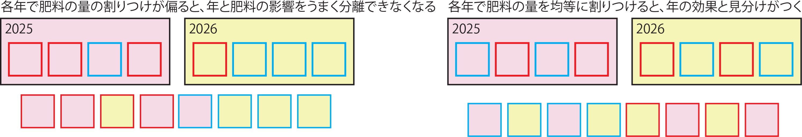

# 実験計画法

**実験計画法（Design of Experiments）**とは、何らかの実験を行う際に、[29章で説明した分散分析](chapter29.qmd#分散分析)や[30章で説明した一般線形モデル](chapter30.qmd#一般線形モデル)を用いて、うまく傾き・切片を求めるための実験を組むための方法論です。

分散分析や一般線形モデルでは、各説明変数の主効果（傾き）や切片の他に、説明変数間の交互作用（Interaction）を求めます。しかし、説明変数が増えると、[一般線形モデル](chapter30.qmd#一般線形モデル)についての説明に述べた通り、交互作用がたくさん生まれることになります。また、実験をたくさん行うには、時間やお金がかかります。できるだけ行う実験の数を減らしつつ、主効果・交互作用をうまく求めたい場合、実験計画法が役に立ちます。

```{r, echo=FALSE, message=FALSE}
library(tidyverse)
set.seed(0)
```

:::{.callout-tip collapse=true}
## フィッシャーの3原則

実験計画法を説明する前に、実験を計画する際に守るべき基本のルール、**フィッシャーの3原則**について簡単に説明します。フィッシャーの3原則とは、「反復」・「無作為化」・「局所管理」の3つで、この3つを守って実験を行うことで分散分析に必要となるデータを適切に取得することができます。

### 反復（replication）

反復とはその名の通り、繰り返すことです。同じセットの実験を繰り返すことで、求まる平均値・標準偏差や回帰の傾き・切片などは真の値に近づいていきます。真の値に近づいていく様子は[12章で標準誤差の意味](chapter12.qmd#ベクターの基礎演算と基礎統計量)と共に簡単に説明しています。


### 無作為化（randomization）

無作為化は**ランダム化**とも呼ばれます。

実験では、評価したい項目（目的変数）に影響があるかもしれないけれども、うまく実験に組み込めない要素というものがあります。例えば、肥料が作物の収量に与える影響を評価するときに、土壌の深さや灌漑水路からの距離などの要素は実験の主な目的（肥料と収量の関係）には直接関わりがありませんが、収量には影響を与えるかもしれません。このように、実験の主な目的とは関わらないけれども実験の結果に影響を及ぼしうる要素のことを、**共変量（covariates）**と呼ぶことがあります。共変量の評価を実験の計画に組み込むことは難しいため、その効果を正確に評価するのは困難です。例えば、土壌の深さや灌漑水路からの距離はその測定や評価が難しく、実験でコントロールすることができません。

肥料（例えば肥料が多い・少ない時）の収量への影響を調べる時に、このような共変量が肥料の多い方、少ない方に偏ってしまうと、肥料の影響で収量が変化したのか、それとも共変量の影響で収量が変化したのか、評価できなくなることがあります。ですので、肥料の多い作物の個体と少ない作物の個体で、共変量の偏りがないようにしないと実験がうまくいきません。

この、共変量の偏りを少なくするための方法が無作為化です。上記の例では、肥料を多く与える作物、少なく与える作物をなるべくランダムな位置に植えることで、窒素の多い方、少ない方で共変量は平均すると概ね均等になります。したがって、無作為化することで共変量の偏りを小さくすることができ、共変量による実験への影響を小さくすることができます。


### 局所管理（blocking）

局所管理とは、ひとまとめの実験の各セットには、実験に必要となるすべての要素を均等に分配することを指します。

すべての実験を同じ時間や空間で実施することができるとよいのですが、実験にかかる時間や土地の広さなどの制約のため、必ずしもそのような実験を組むことはできません。したがって、実験は数日・数年にわたって行ったり、土地の違う位置を用いて行う必要があります。上記の肥料の影響の実験を数年に分けて行ったり、違う位置で作物を育てた場合、年ごとの違いや土地の位置ごとの違いが結果に影響を及ぼす可能性があります。無作為化で説明したのと同様に、年ごとに肥料が多い、少ないと偏っていたり、土地の西に肥料が多い、東に肥料が少ないなどの傾向があると、肥料の効果のために収量が異なるのか、年・位置の違いのために収量が違うのか、見分けがつかなくなります。

この時間や位置の効果を小さくするために、ある時間、ある位置には、すべての実験の条件を同じ数だけ含めます。つまり、肥料の例であれば同じ時間に肥料を多く与えた作物と少なく与えた作物を同じ数だけ準備します。このように時間・空間ですべての条件を均等に分配して実験を行うことが局所管理です。



:::

## 説明変数の数と実験の計画

実験の結果は分散分析や回帰を用いて解析し、説明変数（実験でコントロールする条件）が目的変数（実験の結果）に与える影響を求めるために行います。説明変数と目的変数の関係を分散分析や回帰で求めるためには、その統計手法に適した形の実験を組む必要があります。

### 説明変数が1つの場合

肥料の量が作物の収量に与える影響について調べたいとしましょう。説明変数が一つ（肥料の量）なら、肥料の多い・少ない環境での作物の収量を評価すれば、肥料の量が収量に与える影響を評価することができます。説明変数が1つで、2条件だけなら、最小の実験の単位は2です。実験の単位が2なので、上記のフィッシャーの3原則：反復に従い実験を繰り返したとしても、それほどたくさんの実験を行うことにはなりません。条件を3条件、4条件にしても、それほど実験の数は必要ないでしょう。

また、統計手法としては[t検定](chapter29.qmd#t検定)や[一元分散分析]((chapter29.qmd#一元分散分析))、[単回帰](chapter30.qmd#線形回帰)などを用いることができます。

### 説明変数が2つ以上の場合

実験はシンプルである方が反復を行いやすく、結果の解釈も容易です。しかし、大抵の実験では、目的変数を一つに絞り切れません。例えば、上記の作物の収量であれば、肥料の量だけでなく、日照や水、土壌のpHや土壌の質、肥料の構成など、たくさんの因子の影響を受けます。

説明変数が2つや3つの場合であれば、[2元や3元の分散分析](chapter29.qmd#二元分散分析)で解析することができます。交互作用もそれほど多くありませんし、総当たりの実験を組んだとしても、それほど実験の数は増えないでしょう。

しかし、4つ以上の説明変数の影響を調べる場合、実験は複雑になり、たくさんの実験を行う必要が生じます。説明変数間の交互作用も複雑になり、その理解も難しくなります。ですので、できればあまりたくさんの説明変数を取り扱わず、目的変数（結果）に大きな影響がある説明変数だけを取り扱い、実験を行いたいところです。そのためには、たくさんの説明変数の中から、結果に大きな影響がある説明変数を選び出す必要があります。

このように、たくさんの説明変数の中から、真に目的変数に影響を与えるものを探す試行のことを、**スクリーニング**と呼びます。以下では、まずこのスクリーニングを対象として説明を進めていきます。

## スクリーニングにおける説明変数

作物の例でスクリーニングを考えてみましょう。目的変数は作物の収量（重さ）とします。説明変数は肥料の量、日照量、水の量、土壌のpH、土壌の粒の細かさなどです。

説明変数に対して目的変数が線形（直線的）に応答するかわからないため、可能であればそれぞれの説明変数は小さい・中ぐらい・大きいの3条件を用いて実験する方が望ましいです。ただし、実験の条件が増えると行う実験の数も増えます。ですので、スクリーニングでは説明変数の設定は大きい、小さいなどの2条件とします。

また、スクリーニングでは設定した2値の説明変数は**1と-1に正規化**します（正規化については[30章](chapter30.qmd#データの正規化)を参照）。肥料の例であれば、土地1 m^2^あたりに20 gと5 gの2条件で実験する場合、20 gを1、5 gを-1に置き換えます。このように正規化することで、後の演算を簡単にするとともに、多数の説明変数の間のパラメータ（傾き）を比較しやすくすることができます。

:::{.callout-tip collapse=true}
## 遺伝子のスクリーニング

生物学では、スクリーニングとは表現形に影響を与える遺伝子を探り出すことを指します。これは数千～数万個の遺伝子、つまり説明変数から、真に表現形（目的変数）に影響を与えるものを見つける、ということです。以下に説明する説明変数のスクリーニングとは方法は異なりますが、いずれもその目的は無数の説明変数から真に目的変数に影響を与えるものを見つけることです。
:::

:::{#tip-lm .callout-tip collapse=true}

## 一般線形モデルの演算

実験計画について説明する前に、実験計画を考えるための基本になる一般線形モデルの演算方法について簡単に説明しておきます。実験計画法のうちOptimal Designと呼ばれる手法には、この演算の一部を理解しておいた方がわかりやすいものがあります。

一般線形モデルは[30章](chapter30.qmd#一般線形モデル)で説明した通り、重回帰と分散分析を混ぜたような統計手法です。ですので、重回帰も多元の分散分析も同じ方法で演算できます。

まず、線形のモデルとして、以下の数式のようなものを考えます。

$x_1$、$x_2$、$x_3$はそれぞれ説明変数（上の例の肥料や水、日照量にあたるもの）、$b$は切片、$y$は目的変数（上の例では収量）、$a_1$、$a_2$、$a_3$はそれぞれの説明変数のパラメータです。ただし、データは正規分布に従いばらつくため、ばらつきを表す項（$u$）を加えます。$u$は平均値0の正規分布に従います。

$$ y = a_1x_1 + a_2x_2 + a_3x_3 + b + u $$

実験を行い、以下のような結果を得たとして、回帰のパラメータ（$a_1$、$a_2$、$a_3$）を求めることを考えてみます。以下の例では、8回実験して、$x_1$、$x_2$、$x_3$を各2条件（1と-1）で実験した時のyを表に示しています。

```{r, echo=FALSE, filename="仮定する各説明変数の関係"}
seed_weight <- 
  function(nutrient, water, light = 1){
    1.5 * nutrient + 1.1 * water - 0.3 * nutrient * water + 2.0 * light + rnorm(length(nutrient), 5, 1)
  }
```

```{r, message=FALSE, echo=FALSE, filename="線形モデルの例"}
set.seed(0)
x <- expand.grid(x1 = c(1, -1), x2 = c(1, -1), x3 = c(1, -1), b = 1)
y <- seed_weight(x$x1, x$x2, x$x3) |> round(2)
knitr::kable(cbind(y, x))
```

一般線形モデルでは、回帰を行列の式で表します。目的変数yを、yの回帰での推定値と$u_i$の和とした以下のような式で表現します。

$$ 
\begin{pmatrix}
  10.56 \\
  6.57\\
  9.03\\
  5.37\\
  5.71\\
  1.36\\
  2.77\\
  0.19
\end{pmatrix} = 
\begin{pmatrix}
   1 \cdot a_1 + 1 \cdot a_2 + 1 \cdot a_3 + 1 \cdot b \\
   -1 \cdot a_1 + 1 \cdot a_2 + 1 \cdot a_3 + 1 \cdot b \\
   1 \cdot a_1 -1 \cdot a_2 + 1 \cdot a_3 + 1 \cdot b \\
  -1 \cdot a_1 -1 \cdot a_2 + 1 \cdot a_3 + 1 \cdot b \\
   1 \cdot a_1 + 1 \cdot a_2 -1 \cdot a_3 + 1 \cdot b \\
   -1 \cdot a_1 + 1 \cdot a_2 -1 \cdot a_3 + 1 \cdot b \\
   1 \cdot a_1 -1 \cdot a_2 -1 \cdot a_3 + 1 \cdot b \\
   -1 \cdot a_1 -1 \cdot a_2 -1 \cdot a_3 + 1 \cdot b \\
\end{pmatrix} +
\begin{pmatrix}
   u_1 \\
   u_2 \\
   u_3 \\
   u_4 \\
   u_5 \\
   u_6 \\
   u_7 \\
   u_8
\end{pmatrix}
$$

ただ、このままでは説明変数とそのパラメータの取り扱いが分かりにくいので、通常は説明変数の行列とパラメータの行列を分けて、以下のような形で表します。

$$ 
\begin{pmatrix}
  10.56 \\
  6.57\\
  9.03\\
  5.37\\
  5.71\\
  1.36\\
  2.77\\
  0.19
\end{pmatrix} = 
\begin{pmatrix}
   1 & 1 & 1 & 1 \\
   -1 & 1 & 1 & 1\\
   1 & -1 & 1 & 1 \\
  -1 & -1 & 1 & 1 \\
   1 & 1 & -1 & 1 \\
   -1 & 1 & -1 & 1 \\
   1 & -1 & -1 & 1 \\
   -1 & -1 & -1 & 1 \\
\end{pmatrix} 
\begin{pmatrix}
   a_1 \\
   a_2 \\
   a_3 \\ 
   b
\end{pmatrix} +
\begin{pmatrix}
   u_1 \\
   u_2 \\
   u_3 \\
   u_4 \\
   u_5 \\
   u_6 \\
   u_7 \\
   u_8
\end{pmatrix}
$$

$u_i$は平均0、標準偏差$\sigma$の正規分布に従います。このとき、$u_1$～$u_n$はそれぞれ独立（相関を取ると相関係数が0）で、同じ分布（平均0、標準偏差$\sigma$の正規分布）を取ると仮定します。この仮定のことをi.i.d（Independent and Identically Distributed）と呼ぶことがあります。

$$
u_i \sim Normal(0, \sigma^2)
$$

上の式の目的変数の行列を$Y$、説明変数の行列を$X$、パラメータの行列を$\beta$、ばらつきの項を$u$と置き換えると、以下の式で表すことができます。

$$ Y = X \beta + u $$

$\beta$の真の値はわからないため、$\beta$の予測値（$\hat{\beta}$、ベータハット）を$\beta$の変わりに用いることにします。また、$X$は実験のデザインを表す行列なので、**デザイン行列**と呼ばれます。

残差（[30章のy方向の誤差を参照](chapter30.qmd#線形回帰)）は実際の目的変数の値（$Y$）と$\hat{\beta}$を用いた線形モデルで予測した値（$X\hat{\beta}$）の差なので、以下の式で表すことができます。

$$ Y - X\hat{\beta} $$

最小二乗法では、この残差の2乗和（残差平方和、$S_e$）を最小にする$\hat{\beta}$を求めます。単純に考えると$(Y-X\hat{\beta})^2$を最小にすればよいのですが、この式は行列なので、2乗にする場合には片方を転置（行と列を反転させること、Rでは[16章](chapter16.qmd#行列の演算)で説明した`t`関数で計算）することになります。ですので、以下の式で残差平方和$S_e$を表します。

$$ 
S_e = (Y - X\hat{\beta})^T\cdot(Y-X\hat{\beta})
$$

この式を展開すると以下の式となります。

$$
S_e = Y^TY - Y^TX\hat{\beta}-(X\hat{\beta})^TY + (X\hat{\beta})^TX\hat{\beta}
$$

$S_e$の式は分かりにくいのですが、真ん中の2つの項はうまくまとめることができます。

上で示した通り、$X$は8行4列、$Y$は8行1列、$\hat{\beta}$は4行1列の行列ですが、一般化して、$X$はn行m列、$Y$はn行1列、$\hat{\beta}$はm行1列としてみます。

$Y$はn行1列の行列、$X$はn行m列の行列、$\hat{\beta}$はm行1列の行列なので、$Y^TX\hat{\beta}$のうち、$Y^TX$は1行m列の行列、$Y^TX\hat{\beta}$は1行m列の行列とm行1列の行列の積で、数値（スカラー）になります。

また、 $(X\hat{\beta})^TY$のうち、$X\hat{\beta}$はn行1列、$(X\hat{\beta})^TY$は1行n列の行列とn行1列の行列の積で、$Y^TX\hat{\beta}$と同様に数値（スカラー）となります（また、$S_e$が数値なので、$S_e$の式のすべての項は数値になります）。数値は1行1列の行列なので、転置しても値は変わりません。

また、転置の性質（$(AB)^T=B^TA^T$）より、$(X\hat{\beta})^TY$を転置すると、$Y^TX\hat{\beta}$になります。

$((X\hat{\beta})^TY)^T = Y^TX\hat{\beta}$

ですので、$Y^TX\hat{\beta}$と$(X\hat{\beta})^TY$は転置すると一致し、共に数値なので等しくなります。

$$
Y^TX\hat{\beta} = (X\hat{\beta})^TY
$$

従って、残差平方和$S_e$は以下の式で表すことができます。

$$
S_e = Y^TY - 2(X\hat{\beta})^TY + (X\hat{\beta})^TX\hat{\beta}
$$

$S_e$を最小化する、つまり二乗誤差（残差平方和）を最小とする$\hat{\beta}$を求めるには、$S_e$を$\hat{\beta}$で偏微分し、微分値が0となる$\hat{\beta}$を求めればよいので、$S_e$を$\hat{\beta}$で偏微分します。

$S_e$を$\hat{\beta}$で偏微分（$\frac{\partial S_e}{\partial \hat{\beta}}$）する演算は、行列の微分となるため分かりにくいのですが、概ね通常の微分と同じように計算することができ、以下の式となります。

$$ \frac{\partial S_e}{\partial \hat{\beta}} = -2X^TY + 2X^TX\hat{\beta} $$

$\frac{\partial S_e}{\partial \hat{\beta}}=0$となる$\hat{\beta}$を求めるには、以下の式を$\hat{\beta}$について解くことになります。

$$ -2X^TY + 2X^TX\hat{\beta} = 0 $$

この方程式を解くと、$\hat{\beta}$は以下の式として求まることになります。

$$ \hat{\beta} = (X^TX)^{-1}X^TY $$

$(X^TX)^{-1}$は$X^TX$の逆行列です。逆行列と元の行列の積は単位行列になります（$AA^{-1}=I$）。[16章](chapter16.qmd#行列の演算)で説明した通り、逆行列の演算は`solve`関数、転置は`t`関数で演算できますので、上記の$\hat{\beta}$の演算は以下のスクリプトで実行できます。

```{r, filename="行列で線形モデルを解く"}
solve(t(x) %*% as.matrix(x)) %*% t(x) %*% y
```

演算結果は`lm`関数で回帰した場合と同じとなります。

```{r, filename="線形回帰の結果"}
lm(y ~ x$x1 + x$x2 + x$x3)
```

また、$\hat{\beta}$のばらつき（$\hat{\beta}$の分散共分散行列、$Cov(\hat{\beta})$）は以下の式で表されます。

$$
Cov(\hat{\beta}) = E|(\hat{\beta}-\beta)(\hat{\beta}-\beta)^T| = \sigma^2(X^TX)^{-1}
$$

このとき、$\sigma$は$u_i \sim Normal(0, \sigma^2)$であり、$\sigma$の真の値は分からないので、$\sigma^2$の推定値（$\hat{\sigma}^2$）を以下の式から演算します。$n$はデータ数、$k$はパラメータの数です。

$$
\hat{\sigma}^2 = \frac{1}{n-k}S_e
$$

### 交互作用

[29章](chapter29.qmd#交互作用)で説明した交互作用は、デザイン行列$X$に交互作用の列を追加したものになります。交互作用は説明変数同士の掛け算になります。

```{r, filename="交互作用のデザイン行列"}
x$x1x2 <- x$x1 * x$x2 # x1とx2の交互作用（x1 × x2）
x$x1x3 <- x$x1 * x$x3 # x1とx3の交互作用（x1 × x3）
x$x2x3 <- x$x2 * x$x3 # x2とx3の交互作用（x2 × x3）
x$x1x2x3 <- x$x1 * x$x2 * x$x3 # x1とx2とx3の交互作用（x1 × x2 × x3）

x <- cbind(x[, -4], b = x[, 4]) 
knitr::kable(x)
```

交互作用があっても、$(X^TX)^{-1}X^TY$で回帰の計算を行うことができます。

```{r, filename="交互作用ありの回帰を行列で解く"}
solve(t(x) %*% as.matrix(x)) %*% t(x) %*% y
```

結果は交互作用ありの線形回帰と一致します。

```{r, filename="交互作用ありの線形モデルの計算"}
lm(y ~ x$x1 * x$x2 * x$x3)
```

### 多項式回帰と多重共線性

多項式回帰は、説明変数の2乗や3乗を説明変数に加えた回帰の方法です。こちらも交互作用ありの回帰と同様にデザイン行列に説明変数の2乗や3乗の列を追加したものになります。

```{r, filename="多項式の行をデザイン行列に追加する"}
x <- x[, -4:-7]
x$x1x1 <- x$x1 ^ 2
x <- cbind(x[, -4], b = x[, 4])
knitr::kable(x)
```

ただし、x1の2乗の項が含まれているなら、線は2次関数のような曲線になりますが、x1は-1と1の2つの値しか取っていないため、このデータではyとx1の関係について、どのように曲がっているのかはわかりません。つまり、2点では多項式のパラメータは求まりそうにありません。

実際にこの多項式を入れた場合のデザイン行列を見ると、x1x1の列とbの列の値が同じになっています。このような場合には$(X^TX)^{-1}X^TY$が計算できなくなります。

```{r, error = TRUE, filename="行列演算がうまくいかない例"}
solve(t(x) %*% as.matrix(x)) %*% t(x) %*% y
```

$(X^TX)^{-1}X^TY$が計算できないのは、$X^TX$の逆行列が計算できなくなるためです。

```{r, error = TRUE, filename="説明変数が一致すると逆行列が計算できない"}
solve(t(x) %*% as.matrix(x))
```

実際に`lm`関数で計算しても、結果が求まりません。

```{r, error = TRUE, filename="回帰が求まらない例"}
lm(y = x$x1 + x$x2 + x$x3 + x$x1^2)
```

ですので、$X^TX$の逆行列が求まらない場合には、重回帰の演算ができなくなります。上記の場合のように、x1x1とbが同じ、つまり完全に相関している場合は、[30章](chapter30.qmd#説明変数がたくさんある場合の回帰)で説明した多重共線性の問題に相当します。また、x1x1とbの関係のように、説明変数や交互作用の間で列の値が同じになる関係のことを、エイリアス（aliase、別名関係）と呼びます。

:::

## 要因配置計画（factorial design）

説明変数が2つ以上の場合、例えば、作物の収量に影響を与えるものとして、肥料の量、水の量を調べる場合の実験について調べていきます。肥料の量を2条件（`nutrient`、1と-1）、水の量を2条件（`water`、1と-1）で実験を行い、以下のように収量（`weight`）を得たとします。

```{r, filename="データの準備", echo=FALSE}
d <- data.frame(
  nutrient = c(-1, 1, -1, 1),
  water = c(1, 1, -1, -1)
) |> 
  mutate(weight = seed_weight(nutrient, water))

knitr::kable(d)
```

上記の通り、肥料と水を2条件ずつで実験する場合、行う実験は「肥料の2条件×水の2条件」で4条件となります。つまり、総当たりの実験を行うことになります。

同様に、もう一つ説明変数、例えば日照量を加えるとすると、日照量を2条件（1と-1）追加した実験を行うことになります。この場合には、肥料、水、日照量に関して各2条件について総当たりの実験をすることになります。このように総当たりの実験を行う実験計画のことを、**要因配置計画（factorial design）**と呼びます。

要因配置計画のデータフレームを作成する時には、[16章](chapter16.qmd#組み合わせのデータフレームを作成する)で説明した`expand.grid`関数や[20章](chapter20.qmd#tidyrのその他の関数)で説明した`tidyr::expand`関数を用いるとよいでしょう。

```{r, filename="expand.grid関数で要因配置計画を設計"}
expand.grid(nutrient = c(1, -1), water = c(1, -1), light = c(1, -1))
```

### 要因配置計画と分散分析

要因配置計画を用いて実験を行い、結果を取得したら、どの説明変数がどの程度目的変数に影響するかを評価するために、[29章で説明した分散分析](chapter29.qmd#二元分散分析)や[30章で説明した重回帰](chapter30.qmd#重回帰)で解析します。Rでは多元の分散分析も重回帰も`lm`関数で計算することができます。要因配置計画では、それぞれの説明変数の効果（パラメータ、傾き）と、交互作用の効果を評価することができます。

```{r, filename="要因配置計画を分析する"}
lm(weight ~ nutrient * water, data = d)
```

### 要因配置計画からデータを減らす

とは言え、要因配置計画は総当たりですので、説明変数が増えると実験の数が増えていきます。スクリーニング実験では、説明変数が2つの時は2^2^で4、3つの時は2^3^で8の実験が必要となります。一般化すると、各説明変数に2条件を設定し、n個の説明変数を評価したい場合、2^n^の実験が必要となります。したがって、説明変数が増えると指数的に実験の数が増えていくことになります。実験には時間とお金がかかるため、できれば要因配置計画より少なめの実験で結果が得たいところです。

では、上に示した肥料と水の要因配置計画から、データを減らしてみましょう。まずは1つデータを削除した場合の`lm`関数の結果を見てみます。データを1つ削除すると、肥料（`nutrient`）と水（`water`）の主効果（傾き）、切片（`intercept`）は求まりますが、交互作用（`nutrient:water`）が求まらなくなります。

```{r, filename="要因配置計画からデータを減らしてみる"}
lm(weight ~ nutrient * water, data = d[1:3, ]) # 4行目を削除する
```

次に、2つのデータを削除してみます。2つ削除した場合には、以下のように肥料（nutrient）の主効果だけが求まる場合と、水（water）の主効果だけが求まる場合の2パターンが生じます。

:::{.panel-tabset}

## nutrientだけが求まる場合

```{r}
d[1:2, ] # 3、4行目を削除する
lm(weight ~ nutrient * water, data = d[1:2, ])
```

## waterだけが求まる場合

```{r}
d[c(2, 4), ] # 2、3行目を削除する
lm(weight ~ water * nutrient, data = d[c(1, 4), ])
```

:::

なぜデータを減らすと求まるパラメータが変わるのかは、データをグラフに示してみるとわかります。パラメータは傾き（横軸：nutrient）か、線のシフト（青と赤の線の幅：water）として計算されます。また、交互作用は青と赤の線の傾きの差です。

点（データ）が4つあると、傾きも線のシフトも、傾きの差も評価できます。点が3つになると、傾きと線のシフトは計算できますが、傾きの差は線が2本ないため評価できなくなります。点が2つになると、傾きかシフトのいずれかだけが計算できます。ですので、データが減れば求まるパラメータが変わっていくことになります。

```{r}
#| message: FALSE
#| echo: FALSE
#| layout-ncol: 2
#| layout-nrow: 2
ggplot(d, aes(x = nutrient, y = weight, color = factor(water))) + geom_point(size=3) + geom_line() + labs(title="4実験を行う場合")
ggplot(d[1:3, ], aes(x = nutrient, y = weight, color = factor(water))) + geom_point(size=3) + geom_line() + labs(title="3実験を行う場合")
ggplot(d[1:2, ], aes(x = nutrient, y = weight, color = factor(water))) + geom_point(size=3) + geom_line() + labs(title="2実験を行う場合1")
ggplot(d[c(2, 4), ], aes(x = nutrient, y = weight, color = factor(water))) + geom_point(size=3) + geom_line() + labs(title="2実験を行う場合2")
```

### パラメータの標準誤差の計算

4つのデータで4つのパラメータ（説明変数2つの傾き、交互作用1つ、切片1つ）を求めると、標準誤差が求まらなくなります。これは、下の演算の結果に示されている通り、残差の自由度が0になるからです。

```{r, filename="要員配置実験での標準誤差"}
lm(weight ~ nutrient * water, data = d) |> summary() # Std.Errorが求まらない（NaN）
```

要因配置計画でも、主効果のみを計算すると、交互作用に割り振る自由度がなくなり、自由度に余裕ができるので標準誤差が求まります。

```{r, filename="主効果のみ場合の標準誤差"}
lm(weight ~ nutrient + water, data = d) |> summary()
```

また、要因配置計画を2回繰り返すと交互作用を含めても標準誤差が求まるようになります。

```{r, filename="要因配置計画を2回繰り返す"}
d2 <- data.frame(
  nutrient = rep(c(0, 1, 0, 1), 2),
  water = rep(c(1, 1, 0, 0), 2)
) |> 
  mutate(weight = seed_weight(nutrient, water))

lm(weight ~ nutrient * water, data = d2) |> summary()
```

:::{.callout-tip collapse=true}
## 自由度と分散

上の一般線形モデルの計算に関するcallout（@tip-lm）で説明した通り、一般線形モデルの分散の推定値を示す$\hat{\sigma}^2$は以下の式で求まります。$n$はデータ数、$k$はパラメータの数です。

$$
\hat{\sigma}^2 = \frac{1}{n-k}S_e
$$

2つの説明変数に各2条件の要因配置計画の実験、4条件の実験を行ったとします。$n$は実験の数で4、$k$はパラメータ、つまり説明変数や交互作用の傾き、切片の数です。2つの説明変数の場合、各説明変数の傾きで2個、交互作用で1個、切片で1個ですので、パラメータ$k$は4です。上の式より、右辺の分母は自由度$n-k$、つまり0となるため、$\hat{\sigma}^2$は計算できなくなります。
:::

### データの数と結果の正確さ

実験数（データ）を増やせば、求まるパラメータ（傾き）は正確になっていきます。また、大きな交互作用がある場合には、要因配置計画からデータを減らすと主効果（説明変数）の正確な傾きは求まらなくなります。

```{r, echo=FALSE}
set.seed(0)
d3 <- data.frame(
  nutrient = rep(c(0, 1, 0, 1), 5),
  water = rep(c(1, 1, 0, 0), 5)
) |> 
  mutate(weight = seed_weight(nutrient, water))

df_param <- data.frame(
f_m2 = lm(weight ~ nutrient * water, data = d[1:2, ]) |> coef(),
f_m1 = lm(weight ~ nutrient * water, data = d[1:3, ]) |> coef(),
factorial = lm(weight ~ nutrient * water, data = d) |> coef(),
f_twice = lm(weight ~ nutrient * water, data = d2) |> coef(),  
f_threetimes = lm(weight ~ nutrient * water, data = d3) |> coef(),
true_value = c(5, 1.5, 1.1, -0.3)
)
colnames(df_param) <- c("2データの回帰", "3データの回帰", "要因配置計画", "要因配置計画×2", "要因配置計画×5", "真の値")
knitr::kable(df_param)
```

## 一部要因配置計画（fractional factorial design）

上記の通り、交互作用を含めたすべてのパラメータを計算する場合には、要因配置計画の実験が必要となります。ただし、交互作用を評価せず、説明変数の主効果だけを評価する場合には、実験を減らすことができます。とは言え、データを減らす場合には、要因配置計画からどの実験を削ることができるのかわからないと、実験を削ることはできません。

実験数を減らす方法の一つが**一部要因配置計画（fractional factorial design）**です。一部要因配置計画は、基本的にはスクリーニングのような1説明変数に2条件の実験に適用します。要因配置計画（総当たり）から実験を適切に減らすことで、少ない実験回数で分散分析で評価できるようにすることができる実験計画の手法です。

Rでは、[`FrF2`](https://cran.r-project.org/web/packages/FrF2/index.html)パッケージ[@FrF2_bib1; @FrF2_bib2]の`FrF2`関数を用いることで、一部要因配置計画の実験デザインを作成することができます。以下の例では、3つの説明変数（`nutrient`、`water`、`light`）を用いて、4実験の一部要因配置計画を`FrF2`関数で作成しています。`FrF2`関数の第1引数は実験数（`nruns`）、第2引数は説明変数の数（`nfactors`）、第3引数は説明変数の名前（`factor.names`）です。

```{r, filename="FrF2関数で一部要因配置計画"}
pacman::p_load(FrF2)

ffd <- FrF2(4, 3, c("nutrient", "water", "light")) # 実験数4、説明変数は3つ
ffd <- ffd |> map(as.character) |> map(as.numeric) |> as.data.frame() # factorを数値に変換
```

一部要因配置計画を分散分析に当てはめると、上の例（説明変数3つ、各2条件、実験数4）であれば交互作用が求まりませんが、各説明変数の主効果（傾き、パラメータ）は評価することができます。

```{r, filename="一部要因配置計画を分散分析する"}
y_ffd <- seed_weight(ffd$nutrient, ffd$water, ffd$light)

lm(y_ffd ~ ffd$nutrient * ffd$water * ffd$light)
```

説明変数が3つぐらいだと一部要因配置計画の恩恵は大きくないですが、説明変数がより多くなっていくと実験数をかなり少なくすることができるようになります。以下の例では、説明変数が8つの場合を示しています。各説明変数と2次の交互作用（説明変数2つずつの交互作用）のパラメータを求めたいだけであれば、要因配置計画（2^8^=256実験）を行う必要はなく、16実験で計算できます。

:::{.callout-tip collapse=true}

## 一部要因配置計画の実験数とパラメータの関係（説明変数8つの場合、結果が長いので折りたたんで表示）

:::{.panel-tabset}

## 実験数：128

5次の交互作用のパラメータまで求まる

```{r, filename="一部要因配置計画：説明変数が8つ、128実験の場合"}
e128 <- FrF2(128, 8)
lm(rep(1, 128) ~ e128$A * e128$B * e128$C * e128$D * e128$E * e128$F * e128$G * e128$H) |> 
  _$coef |> 
  as.data.frame() |> 
  na.omit() |> 
  rownames()
```

## 実験数：64

4次の交互作用のパラメータまで求まる

```{r, filename="一部要因配置計画：説明変数が8つ、64実験の場合"}
e64 <-FrF2(64, 8)
lm(rep(1, 64) ~ e64$A * e64$B * e64$C * e64$D * e64$E * e64$F * e64$G * e64$H) |> 
  _$coef |> 
  as.data.frame() |> 
  na.omit() |> 
  rownames()
```

## 実験数：32

3次の交互作用のパラメータまで求まる

```{r, filename="一部要因配置計画：説明変数が8つ、32実験の場合"}
e32 <-FrF2(32, 8)
lm(rep(1, 32) ~ e32$A * e32$B * e32$C * e32$D * e32$E * e32$F * e32$G * e32$H) |> 
  _$coef |> 
  as.data.frame() |> 
  na.omit() |> 
  rownames()
```

## 実験数：16

2次の交互作用のパラメータまで求まる

```{r, filename="一部要因配置計画：説明変数が8つ、16実験の場合"}
e16 <-FrF2(16, 8)
lm(rep(1, 16) ~ e16$A * e16$B * e16$C * e16$D * e16$E * e16$F * e16$G * e16$H) |> 
  _$coef |> 
  as.data.frame() |> 
  na.omit() |> 
  rownames()
```

## 実験数：8

実験数8だと一部要因配置計画の計算ができない。

```{r, filename="一部要因配置計画：説明変数が8つ、8実験の場合", error=TRUE}
FrF2(8, 8)
```

:::
:::


:::{.callout-tip collapse=true}
## 一部要因配置計画と直交表

一部要因配置計画（fractional factorial design）は直交表（orthogonal design）というものを用いて作成します。直交表はデザイン行列であり、2乗したとき（直交表のデザイン行列を$X$としたとき、$X^TX$）、対角成分以外が0となる特徴があります。

```{r, filename="直交表：2乗を計算する"}
# FrF2で一部要因配置計画のデザインを作成し、行列にする
#（FrF2で作成すると行列に切片項が含まれないため、切片の項（cbind(1)）を付け加えている）
(ffd_mat <- FrF2(4, 3) |> as.matrix()|> cbind(1) |> apply(1, as.numeric) |> t())
(ffd_mat2 <- FrF2(16, 8) |> as.matrix() |> cbind(1) |> apply(1, as.numeric) |> t())

# 2乗すると対角成分以外が0となる
t(ffd_mat) %*% ffd_mat 
t(ffd_mat2) %*% ffd_mat2
```

統計ソフトが発達していなかった時代はこの直交表を手と頭を使って作成して実験を行っていたわけですが、Rを含めた現代の統計ソフトには直交表を作成する手法が備わっています。

:::

### FrF2

`FrF2`についてもう少し詳しく見ていきます。`FrF2`関数には引数がたくさん設定されており、様々な方法で一部要因配置計画の計画を作成することができます。まずは`nruns`と`nfactors`の2つの引数について説明します。`nruns`は実験数、`nfactors`は説明変数の数であり、この2つを設定するのが最も基本的な`FrF2`関数の使い方となります。`nruns`は**4以上の2の指数（2^n^）**で設定する必要があります。

```{r, filename="FrF2関数：実験数と説明変数の数を設定する"}
FrF2(nruns = 8, nfactors = 4)  # 説明変数が4つ、実験数が8の一部要因配置計画
```

#### FrF2関数：要因配置計画を作成する

`nruns`と`nfactors`の2つの引数について、$nruns = 2^{nfactors}$の場合には要因配置計画（full factorial design）を作成することができます。また、$nruns > 2^{nfactors}$の場合には要因配置計画を繰り返す実験計画を作成することになります。

```{r, filename="FrF2：要員配置実験を作成する"}
FrF2(nruns = 8, nfactors = 3) # 説明変数が3つ、実験数が8の要因配置計画
FrF2(nruns = 16, nfactors = 3) # 説明変数が3つ、実験数が8の要因配置計画を2セット実施
```

#### FrF2関数：説明変数のレベルに名前を付ける

デフォルトでは各説明変数に設定される条件は1、-1の2つですが、`default.levels`引数を設定すると1、-1以外の条件を設定することもできます。ただし、`FrF2`関数では1つの説明変数について2条件以上を設定することは（以下に示す中間点を追加する場合を除き）できません。したがって、`default.levels`には長さ2のベクターを指定します。

```{r, filename="FrF2：条件を1、-1以外に設定する"}
FrF2(8, 3, default.levels = c("A", "B"))
```

#### FrF2関数：説明変数の名前を設定する

説明変数の名前を設定するための引数が`factor.names`です。`factor.names`は説明変数の数（`nfactors`）と同じ長さの文字列のベクターとして設定します。

```{r, filename="FrF2関数：factor.names引数で説明変数の名前を設定する"}
FrF2(4, 3, factor.names = c("nutrient", "water", "light"))
```

#### FrF2関数：formulaから計画を作成する

また、実験で求めたいパラメータ（主効果や交互作用の傾き）が決まっている時には、`estimable`に`formula`を設定することでも実験デザインを作成することができます。以下の例では、5つの主効果（A、B、C、D、E）に加えて、AB、BC、ACの交互作用のパラメータを求めるための一部要因配置計画の計画を作成する例を示しています。

```{r, filename="FrF2：求めたいパラメータのformulaから計画を作成する"}
FrF2(estimable = formula("~(A+B+C)^2+D+E"))
```

説明変数の数を指定しておき、すべての主効果を求めないデザインを採用することもできます。この時、引数に`clear=FALSE`を設定しておく必要があります。`clear`は主効果のパラメータをすべて求めるかどうかを定める引数で、`clear`のデフォルト値は`TRUE`、主効果をすべて求める設定となっています。`clear=FALSE`とすることで求まらない主効果を許容することができます。

```{r, error=TRUE, filename="主効果を求めない因子を加える"}
# 6つのnfactorを指定し、5つをestimableに加える
# clear=FALSEがないと演算できない
FrF2(nfactor = 6, estimable=formula("~(A+B+C)^2+D+E"), clear = FALSE) 
FrF2(nfactor = 6, estimable=formula("~(A+B+C)^2+D+E")) # エラー
```

#### FrF2関数：generatorsを利用する

また、`generators`引数を設定すると、評価したい交互作用を追加し評価するための計画を作成することができます。

```{r, filename="FrF2：generators引数"}
FrF2(16, generators = list(c(1, 2, 3))) # ABCの交互作用が求まるようにする（説明変数は5つ）
FrF2(16, 5, generators = "ABD") # ABDの交互作用を評価できるようにする
```

#### FrF2関数：実験計画に中間点を追加する

実験計画に中間の点（2条件が1、-1の時、0）を加えると、その説明変数に対する目的変数の応答が直線的か、曲線になっているかを評価できます。

`FrF2`関数では、`ncenter`引数を用いることで、中間点を加えることができます。`ncenter`には数値を設定し、設定した数だけ中間点のみの実験を追加します。

```{r, filename="FrF2：中間点を追加する"}
FrF2(8, 5, ncenter = 3)
```

また、すでに作成した`FrF2`関数の返り値を引数に取る、`add.center`関数でも中間点を設定することができます。

```{r, filename="FrF2：作成した計画に中間点を追加する"}
# 計画を作成した後でも中間点を設定できる
design_exp <- FrF2(8,5)
add.center(design_exp, 3) # 計画に中間点の実験を3つ追加する
```

#### FrF2関数：一部要因配置計画のresolution

一部要因配置計画には、resolution（分解能）というものがあり、resolutionにはクラスが3つ（class III、class IV、 class V）あります。resolutionが高くなると、以下の通り求まる交互作用のパラメータが多くなり、実験数が増えることになります。

- class III：すべての主効果のパラメータが求まる
- class IV：すべての主効果と2次の交互作用の一部のパラメータが求まる
- class V：すべての2次の交互作用のパラメータが求まる

`FrF2`関数では、`resolution`引数にresolutionのクラスを数値で指定することで、resolutionを指定した実験計画を得ることができます。`resulution`は`3`、`4`、`5`のいずれかの数値を取ります。`resolution`を指定する場合には実験数（`nruns`）は指定せず、説明変数の数（`nfactors`）と`resolution`のみを指定します。

```{r, filename="FrF2：resolutionを指定する"}
FrF2(nfactors = 7, resolution = 5) |> nrow() # resolution Vだと64実験
FrF2(nfactors = 7, resolution = 4) |> nrow() # resolution IVだと16実験
FrF2(nfactors = 7, resolution = 3) # resolution III（主効果のみ）だと8実験
```

#### FrF2関数：実験計画の評価

`FrF2`関数で実験計画を作成した後、実験計画の情報を取得する場合には`design.info`関数を用います。`design.info`関数は`FrF2`関数の返り値を引数に取ります。

```{r, filename="design.info関数で計画情報を得る"}
x <- FrF2(8, 5)
x |> design.info() |> head(3) # デザインの詳細を表示（出力が多いので3つだけ表示）
```

#### FrF2関数：行列への変換

`FrF2`関数の返り値はデータフレームですが、各列は因子（factor）になっています。そのまま行列に変換すると、文字列の行列が返ってきます。

```{r, filename="FrF2：返り値をas.matrix関数で行列に変換"}
FrF2(8, 3) |> as.matrix()
```

数値の行列に変換する場合には、`desnum`関数を用います。

```{r, filename="FrF2：desnum関数で数値の行列に変換"}
x <- FrF2(8, 7)
desnum(x) # matrixにする関数
desnum(x) |> class()
```

この行列はデザイン行列から切片項を除いたものになっています。一部要因配置計画のデザイン行列は直交（orthogonal）ですので、切片項の列を追加して$X^TX$の行列を演算すると、単位行列の整数倍になります。

```{r, filename="切片項を追加し、デザイン行列を得る"}
# 切片項を足せば単位行列の積になる（直交）
t(cbind(desnum(x), 1)) %*% cbind(desnum(x), 1)
```

### 回帰と結果の評価

`FrF2`には、実験計画を作成するだけではなく、実験計画に沿って実験を行った後、回帰の結果を評価するための関数も備わっています。まずは`lm`関数で回帰を行い、返り値をオブジェクトに代入しておきます。

```{r, filename="FrF2：実験計画を用いて回帰"}
y <- rnorm(8, 7, 0.5)
x <- FrF2(8, 7)

# 回帰のための行列を作成
xy <- cbind(desnum(x), y)

lm_xy <- lm(y ~ (.)^2, data = xy |> as.data.frame())
lm_xy
```

この回帰の結果（`lm_xy`）を`FrF2`の関数の引数にすることで、回帰の結果を評価することができます。

#### aliase

aliase（エイリアス、別名関係）とは、説明変数や交互作用のうち、計画の列が同じ値となるため分離ができないもの同士のことを指します。上の`lm_xy`におけるaliaseを調べる場合、`aliases`関数を用います。`aliases`関数の引数に`lm`関数の返り値（下の例では`lm_xy`）を取ると、aliaseの一覧を表示することができます。

以下の例では、`aliases(lm_xy)`の結果として「A = B:D = C:E = F:G」という表示が返ってきています。これは、説明変数Aと交互作用B:D、C:E、F:Gが分離不能なので、Aの主効果を求めると交互作用B:D、C:E、F:Gは求まらないこと、Aの主効果に交互作用B:D、C:E、F:Gのパラメータが含まれている可能性があることを示しています。

```{r, filename="aliase"}
aliases(lm_xy)
```

aliaseは`lm`関数の返り値を用いなくても、`FrF2`関数の返り値から評価することもできます。上記の通り、`design.info`関数を用いると実験計画の詳細を調べることができます。この`design.info`関数の返り値のうち、`aliased`という項目にはaliaseの情報が記載されており、上で示した`aliases`関数の返り値と同じものが記載されています。

```{r, filename="aliaseをFrF2関数の返り値から評価する"}
design.info(x)$aliased
```

#### 主効果・交互作用を評価する

`FrF2`には、主効果と交互作用を評価するためのグラフを作成する関数である、`MEPlot`関数と`IAPlot`関数が準備されています。

`MEPlot`は、各説明変数の2水準について値を示したグラフで、傾きの大きさがその説明変数の効果の大きさを反映します。また、`IAPlot`は2説明変数同士の結果を表示したもので、交互作用があれば赤と黒の線の傾きが異なります。`MEPlot`、`IAPlot`共にスクリーニングや交互作用の評価の必要性を調べるのに有用です。

```{r, filename="MEPlot・IAPlot関数"}
# 各説明変数の効果に関するプロット
MEPlot(lm_xy)

# 交互作用を示すためのプロット
IAPlot(lm_xy)
```

`DanielPlot`関数は、論文[@Daniel01111959]で説明されている、正規分布とパラメータを大きさ順にならべてプロットしたqqplotの一種です。説明変数に何の効果も無ければ、直線上に点が並びます。正規分布の代わりに半正規分布を用いたプロットにすることもでき（`half = TRUE`）、こちらの方が直線に点が乗っているかわかりやすくなります。説明変数に効果がある場合には、直線より右側に点が外れることになります。

回帰のコードに示した通り、目的変数`y`はただの正規乱数ですので、どの説明変数にも明確な効果がなく、すべての点が直線上に乗ります。

```{r, filename="Daniel Plot"}
# 直線に乗らない説明変数には有意な効果があると考える
DanielPlot(lm_xy)
DanielPlot(lm_xy, half = TRUE) # 半正規分布を用いる
```

説明変数から3つを選び、それぞれの効果を図に示すのが`cubePlot`です。選択した各説明変数間の関係と並行性を数値から評価することができます。

```{r, filename="cubePlot"}
# 3つの説明変数
cubePlot(lm_xy, "A", "B", "C")
```


## Optimal Design

説明変数がn個のとき、要因配置計画では2^n^、一部要因配置計画では2^n-k^（k<n）の実験を行うことになります。とはいえ、実験で必ず2の倍数で実験を行うかというと、そういうわけではないでしょう。時間や予算によっては2^n^の実験を実施することは難しくても、2^n-1^よりは多く実験ができそう、という場合もあります。実験を増やせば結果の精度が上がっていきますから、わざわざ一部要因配置計画に合わせて少なく実験をするのでは結果の精度を下げることになります。また、`FrF2`では各説明変数に2条件を仮定していましたが、3条件以上で実験を行い、説明変数への応答が直線的なのか、曲線的なのか評価したい場合もあるでしょう。

交互作用についても、ある交互作用は注意が必要で、別の交互作用についてはそれほど注意しなくて良い場合もあります。例えば、作物の収量と肥料・水・日射量の関係を見ると、水をたくさん与えれば肥料は流れ出て効果が小さくなる、つまり交互作用がありそうですが、水と日射量には明確な交互作用はなさそうです。ですので、実験では肥料と水の交互作用に注意が必要そう、と想像することができます。

しかし、一部要因配置計画よりはたくさん実験をできそうであっても、どのような実験の組み合わせであれば求めたい交互作用が求まり、より実験の精度を高くできるかをパッと想像できる人はあまりいないでしょう。

このように、要因配置計画や一部要因配置計画よりも柔軟性が高く、求めたい交互作用を適切に評価し、結果のばらつきをできるだけ小さく最適化することを目的とした実験計画法が**Optimal Design**です。日本語では最適計画と呼ばれるようです。

Optimal Designには、以下の通り非常にたくさんの種類があります。

- A-Optimal Design
- C-Optimal Design
- D-Optimal Design
- E-Optimal Design
- S-Optimal Design
- T-Optimal Design
- G-Optimal Design
- I-Optimal Design
- V-Optimal Design

また、Optimal Designには以下のような想定での実験デザインを考慮したものもあります。

- ブロック（局所管理）を想定したもの
- ブロックを想定しているけどブロックの条件を変更しにくい場合（例えば、溶鉱炉の温度を変更したいけど変更するとコストがかさむ場合）を想定したもの
- 各説明変数の和は決まっていて、説明変数の割合を変える場合（例えばホットケーキミックス500g中の小麦粉やベーキングパウダーなどの原材料の量を変える場合）を想定したもの
- 実験を追加で行うことを想定したもの

すべてを説明するとページがいくらあっても足りないため、このテキストでは**D-Optimal Design**と**I-Optimal Design**のみを簡単に説明します。Optimal Designについて詳しく知りたい方は文献[@Goos_Peter2011-06-28]を参照下さい。また、Optimal Designを含めた実験計画については[JMP](https://www.jmp.com/ja/home)の機能が充実しています。以下に説明する通りRでもOptimal Designを計画することはできますが、JMPではGUIを用いて実験計画を組むことができます。JMPは[SAS Institute.inc](https://www.sas.com/ja_jp/home.html)の製品ですので、利用にはお金はかかりますが、お金に余裕があれば試してみるのもよいでしょう。

### D-optimal Design

D-optimal Designは、一般線形モデルの演算（@tip-lm）で説明したデザイン行列の積（$X^TX$）の行列式（$|X^TX|$）を最大とするデザインを選択するOpitimal Designの方法の一つです。

各説明変数のパラメータ（傾き）のばらつき（分散・共分散行列、$Cov(\hat{\beta})$）はデザイン行列を用いて以下の式で表されます。

$$Cov(\hat{\beta}) = \hat{\sigma}^2(X^TX)^{-1}$$

このばらつきのうち、実験デザインで小さくできるのは$(X^TX)^{-1}$、$X^TX$の逆行列の部分になります。逆行列は行列式の逆数を行列にかけた形で表されるため（$A^{-1}=\frac{1}{|A|}\cdot \tilde{A}$）、$X^TX$の行列式（$|X^TX|$）が大きくなれば$(X^TX)^{-1}$を小さく、つまりばらつきを小さくすることができます。ですので、$|X^TX|$を最大化するデザイン行列$X$を選択するのがD-Optimal Designです。Dはdeterminant（行列式）のDです。

ばらつきが小さくなれば高い確度を持ってパラメータを推定できるので、D-Optimal Designは汎用的に使えるOptimal Designの一つとなります。

### I-Optimal Design

I-Optimal DesignはD-Optimal Designと同様にばらつきを小さくするデザイン行列を見つける方法ですが、最適化するのは$|X^TX|$ではなく、平均のばらつき（mean prediction variance）と呼ばれるものです。このmean prediction varianceはFraction of Design Space Plotと呼ばれるプロットの中央値を指します。以下にFraction of Design Space Plotを示します。

```{r, Fraction of Design Space Plot, echo=FALSE}
library(skpr)
cand <- expand.grid(nutrient = c(1, -1), water = c(1, -1), light = c(1, -1), depth = c(1, -1))
od_i <- gen_design(candidateset = cand, model = ~ nutrient + water + light + depth, trial = 10, optimality = "I")
plot_fds(od_i)
```

このグラフのFraction of Design Spaceが0.5の時のPrediction Variance（赤線が交わる点）を最小とするモデルを選択するのがI-Optimal Designです。I-Optimal Designは説明変数と目的変数の関係が多項式的（直線ではなく、曲線的）である場合に比較的適しているようです。

D-Optimal Design、I-Optimal Design共に最適なデザイン行列は乱数を使った繰り返し計算（Monte Carloアルゴリズム）で計算・作成されます。一部要因配置計画についてはコンピュータが発達する前から直交表を用いて作成されてきましたが、Opitimal Designではデザイン行列の作成に繰り返し計算を用いるため、デザインの作成にはコンピュータが必要です。

## RでOptimal Design：skpr

RでOptimal Designを作成する場合には、様々なライブラリを利用可能ですが、比較的簡単にOptimal Designを作成・評価できるライブラリとして、以下では**[`skpr`](https://tylermorganwall.github.io/skpr/)パッケージ**[@skpr_bib]を紹介します。

### 実験計画を作成する

`skpr`パッケージで実験計画を作成する場合、まずは`expand.grid`関数を用いて要因配置計画を作成します。`FrF2`のように各説明変数の条件を2条件とする必要はなく、3条件以上であってもOptimal Designを作成することができます。

```{r, filename="skpr：要因配置計画を作成する"}
library(skpr)
cand <- expand.grid(nutrient = c(1, 0, -1), water = c(1, -1), light = c(1, -1), depth = c(1, -1))
```

この`expand.grid`関数で作成したデータフレームを`gen_design`関数の引数にすることで、実験計画を作成することができます。`gen_design`関数にはデータフレームの他に、回帰のモデル（`model`）と実験数（`trial`）を設定します。

```{r, filename="skpr：gen_design関数"}
# 主効果だけ評価する場合、中間点は必要ないのでnutrient=0は採用されない
gen_design(cand, model =  ~ nutrient + water + light + depth, trial = 10)
```

`gen_design`関数のデフォルトのOptimalityはD-Optimalityですので、返り値はD-Optimal Designのデータフレームになります。また、モデルは以下のような形で設定することもできます。

```{r, filename="skpr：modelの設定"}
# 上と同じ（すべての主効果を含める）
gen_design(cand, model =  ~ ., trial = 10)

# 全部の説明変数に対して2次の交互作用を設定
gen_design(cand, model =  ~ (.)^2, trial = 12) 

# nutrientの2乗（多項式回帰）を設定：説明変数を3条件以上にする必要あり
gen_design(cand, model =  ~ . + I(nutrient^2), trial = 12) 
```

#### Optimalityの設定

Optimalityは`optimality`引数で設定することができます。`optimality`は文字列で設定し、`"D"`, `"I"`, `"A"`, `"ALIAS"`, `"G"`, `"T"`, `"E"`, `"CUSTOM"`のいずれかを選択します。これらのうち、`"ALIAS"`は近年の論文[@Jones2011]に記載された最適化の手法で、`"CUSTOM"`は自分で設定した最適化アルゴリズムを利用する方法です。以下では、I-Optimal Designの計画を作成しています。

```{r, filename="skpr：optimalityを選択する"}
# I-Optimal Designの計画を作成する
gen_design(candidateset = cand, model = ~ nutrient + water + light + depth, trial = 10, optimality = "I")
```

#### ブロックの設定

`gen_design`関数の引数に`blocksizes`を設定すると、ブロックを設定した実験を計画することができます。以下の例では、`blocksizes`を4、つまり4実験ずつのブロックを3つ作成し、12実験の計画としています。`add_blocking_column=TRUE`を設定すると、ブロックの列を追加することができます。

```{r, filename="blockを設定する"}
gen_design(cand, ~., 12, blocksizes=4, add_blocking_column=TRUE)
```

#### Split-plot design

実験を計画する場合、説明変数はいつも自由に変更できる、というわけではありません。例えば、高温で溶かした素材を用いて製品を作成する場合、温度の影響を調べるために窯の温度をランダムに上げたり下げたりすると燃料のコストも時間もかかってしまいます。したがって、説明変数の一部はあまり頻繁に変更せず、実験を行った方がよい場合もあります。

このような場合に用いるのが**split-plot design**です。`skpr`はsplit-plot designにも対応しています。split-plot designでは、選択した変更しにくい説明変数をなるべく同じ値で繰り返すように実験を設計してくれます。

以下にsplit-plot designの作成方法を示します。split-plot designを作成する場合、まずは変更しにくい説明変数のみを`model`に設定した計画を`gen_design`関数で作成します。この計画のオブジェクトを再び`gen_design`関数の`splitplotdesign`引数に設定します。実験は一つ目の計画の`trials`の整数倍とします。Split-plot designの結果として、以下のように変えにくい変数（下の例では`nutrient`）の値に比較的変更が少ない実験を計画することができます。

```{r, filename="split-plot designの作成"}
# 変更しにくい説明変数のみをモデルに含めた計画を作成する
spdesign = 
  gen_design(
    cand, 
    model = ~nutrient,
    trials = 12, 
    repeats = 10)

# 上で示した計画をsplitplotdesign引数に設定する
gen_design(cand, ~., splitplotdesign = spdesign, trials = 24)
```

#### Shinyアプリで実験計画を作成する

`skpr`にはShinyアプリを起動するための関数（`skprGUI`）があり、この関数を用いるとブラウザ上でインタラクティブに実験計画を作成することもできます。

```{r, filename="Shinyアプリケーションを起動し実験計画を作成する", eval=FALSE}
skprGUI()
```


### gen_designの返り値と計画の評価

`gen_design`関数の返り値はデータフレームです。ただし、このデータフレームにはattributeが設定されています。`skpr`パッケージにはデザインを評価する関数がいくつか設定されていますが、これらの関数にはこのattributeが必要となります。

```{r, filename="skpr：デザインの返り値"}
od_d <- gen_design(cand, model =  ~ ., trial = 10)
od_i <- gen_design(cand, model =  ~ ., trial = 10, optimality = "I")

od_d |> class() # クラスはデータフレーム
od_d |> attributes() |> names() # attributeが設定されている
```

attributeは`get_attribute`関数でも取得することができます。

```{r, filename="get_attribute関数でattributeを取得する"}
get_attribute(od_d) |> names()
```

#### 最適化パラメータを評価する

Optimal Designでは、何らかの最適化パラメータを最大化・最小化するデザインを選択しています。この最適化パラメータを評価するための関数が`get_optimality`です。`get_optimality`関数の引数に`gen_design`関数の返り値を取ると、最適化パラメータが表示されます。最適化パラメータはD、I、A、G、T、E、Aliasの7つです。D-Optimal DesignではDを最大化、I-Optimal DesignではIを最小化しています。

```{r, filename="get_optimality関数"}
get_optimality(od_d) # D-OptimalではD（D efficiencyというパラメータ）が大きい
get_optimality(od_i) # I-optimalではI(average prediction variance)が小さい
```

#### Power（検出力）を計算する

実験計画において、[29章](chapter29.qmd#sec-power)で説明したPower（検出力）の評価は重要です。検出力が80%（場合によっては90%）以上となるよう実験数（例数）を設計するのがよいとされています。実験計画においても同様に検出力を80%以上とするため、`skpr`には検出力を計算するための関数（`eval_design`）も備わっています。`eval_design`関数はそれぞれのパラメータについてそれぞれPowerを計算します。

```{r, filename="Powerの計算"}
eval_design(od_d)
eval_design(od_i)
```

また、より精度の高いPowerを求める場合には、乱数計算（モンテカルロ法）を用いた関数（`eval_design_mc`）を用いることもできます。

```{r, filename="繰り返し計算でより正確なPowerを求める"}
eval_design_mc(od_d)
```

また、実験数（例数）とPowerの関係を調べるグラフを作成する場合には、`calculate_power_curves`関数を用います。`calculate_power_curves`関数の返り値はPowerを計算したデータフレームとグラフで、グラフの結果は`gen_design`関数の`trial`の設定の参考に用いることができます。

```{r, filename="Power curveを表示する"}
# trialが10～60まで10置きの場合のPowerを計算する
calculate_power_curves(
  trials = seq(10, 60, by = 10), 
  candidateset = cand, 
  model = ~ nutrient + water + light + depth)
```

#### Fraction of Design Space Plot

上に示した通り、I-Optimal Designでは平均のばらつき（mean prediction variance）を最小とするデザインを選択します。Fraction of Design Space Plotはこのmean prediction varianceを評価する場合に有用です。

`skpr`には、Fraction of Design Space Plotを表示するための関数、`plot_fds`関数があります。`plot_fds`関数の引数に`gen_design`の返り値を指定することでFraction of Design Space Plotが表示されます。`plot_fds`関数で描画される線の位置が低く、中央値が小さいほどI-Optimal Designではよいデザインとなります。

```{r, filename="Fraction of Design Space Plot"}
plot_fds(od_i)
```

#### 説明変数間の相関を評価する

説明変数間に相関があると、[30章](chapter30.qmd#説明変数がたくさんある場合の回帰)で説明した通り多重共線性の問題が起こりやすくなります。実験計画を作成した段階で相関があるかどうか評価することで、多重共線性が避けられるかどうかを評価できます。

`plot_correlations`関数はこの説明変数同士の相関を評価するための関数です。`gen_design`関数の返り値を`plot_correlations`関数の引数に取ることで、交互作用を含めた説明変数同士の相関をヒートマップとして示すことができます。

```{r, filename="plot_correlation関数"}
plot_correlations(od_d)

# 要因配置計画では説明変数同士の相関は0となる
gen_design(
  candidateset = cand, 
  model = ~ nutrient * water * light * depth, trial = 16
  ) |> 
  plot_correlations()
```

## mixture experiment

説明変数全体の量は決まっていて、説明変数の割合を変える場合（例えばホットケーキミックス500g中の小麦粉やベーキングパウダーなどの原材料の量の割合を変える場合）の実験のことを**mixture experiment**と呼びます。mixture experimentでは、各説明変数の和が常に1となるよう実験計画が作成されます。

mixture experimentの実験計画には`skpr`は対応していないので、別のライブラリ（[`mixexp`](https://cran.r-project.org/web/packages/mixexp/index.html)[@mixexp_bib]、[`AlgDesign`](https://cran.r-project.org/web/packages/AlgDesign/index.html)[@AlgDesign_bib]）を用います。

### mixexpパッケージ

`mixexp`はmixture experimentの実験計画作成のためのライブラリです。このライブラリではOptimal Designではなく、Simplex-Lattice Design [@Scheffé1958]に従い計画を作成します。

`mixexp`での実験計画の作成はシンプルで、2つの関数を用います。一つは説明変数の数だけ設定する`SCD`関数、もう一つは説明変数の数と各説明変数の条件の数を指定する`SLD`関数です。`SCD`関数では各説明変数の条件の数を6とすることになります。

```{r, filename="mixexpパッケージ：SCD関数とSLD関数"}
library(mixexp)
SCD(5) |> head() # 5説明変数の実験（各説明変数6段階）
SLD(5, 5) |> head() # 5説明変数、各説明変数5段階の実験
```

`mixexp`には実験計画を図で示してくれる、`DesignPoints`関数があります。`SCD`・`SLD`関数の返り値を`DesignPoints`関数の引数に取ると、実験計画に設定した量を三角形の図上の点（三角グラフ）で示してくれます。

```{r, filename="DesignPoints関数"}
SCD(3) |> DesignPoints()

# 説明変数は3つまでしか表示できない
SCD(5)[, c(1, 2, 3)] |> DesignPoints() 
```

### AlgDesignパッケージ

`AlgDesign`は`skpr`と同様にOptimal Designの実験計画を作成するためのライブラリです。`AlgDesign`にはmixture experimentの実験計画を作成するための関数である、`gen.mixture`関数があります。`gen.mixture`は`mixexp`の`SLD`とほぼ同じ使い方の、説明変数の数と各説明変数の条件の数を指定して用いる関数です。

```{r, filename="AlgDesign：gen.mixture関数"}
library(AlgDesign)
gen.mixture(5,5) |> head() # 5説明変数、各説明変数5段階の実験 
```

