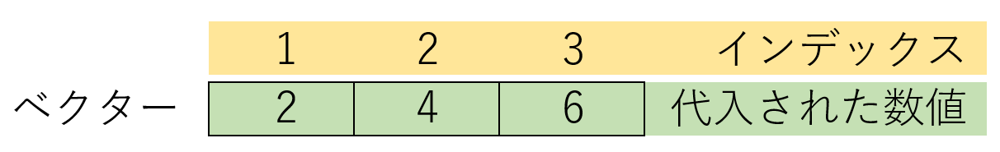

# 複数の要素を含むオブジェクト・クラス

```{r, setup, include=FALSE, echo=FALSE}
knitr::opts_chunk$set(
  collapse = TRUE
)
```

ここまでは、オブジェクトが一つだけの場合のデータ型や、変数について見てきました。しかし、統計で取り扱うのは、複数の数値や記録です。数値や記録がたくさんある場合には、数値や記録を一つづつ別々に取り扱うのは非効率です。多くのプログラミング言語では、このような複数の数値や記録を取り扱う専用のクラスを備えています。Rでは、複数の記録を取り扱うクラスとして、**ベクター（vector）**、**リスト（list）**、**データフレーム（data.frame）**、**行列（matrix）**の4つが用いられます。以下にこの4つについて簡単に説明します。それぞれのクラスについてはさらに別章で詳しく説明します。

## ベクター（vector）

Rで最も基本的なオブジェクトは、**ベクター（vector）**です。ベクターは同じ型を持つオブジェクトの集まりで、1次元の、つまり縦横の構造がないデータとして取り扱われます。ベクターは`c`関数（`c`はcombine、「結合する」の意味）で作成することができます。

ベクターは同じ型を持つデータの集まりです。ですので、ベクターの要素に文字列が交じると、自動的にすべての要素が文字列になる、という特徴があります。

```{r, filename="ベクターの作成"}
vec_n <- c(1, 2, 3, 4) # 数値のベクター
vec_c <- c("dog", "cat", "pig", "horse") # 文字列のベクター
vec_temp <- c(1, 2, 3, "dog") # 文字列が交じると文字列のベクターになる

vec_n

vec_c

vec_temp
```

Rでは数値1つや文字列1つの要素も、ベクターとして取り扱われます。ですので、Rのオブジェクトの最小単位はベクターとなります。要素が1つであれば、`c`関数でつなぎ合わせる必要はありません。

```{r, filenames="要素が1つだけのベクター"}
1 # 数字1つでもベクター

"Hello world" # 文字列1つでもベクター
```


:::{.callout-tip collapse="true"}

## 本文でのvectorの表記について

vectorはベクトルと表記されることもあります。この文書では、Rのオブジェクトをベクター、方向と大きさを持つ量のことをベクトルと表記することとします。

:::

### ベクターに要素を追加する

ベクターに要素を追加するために、`append`関数というものが用意されています。しかし、上記の`c`関数でもベクターに要素を追加することができます。

`append`関数では位置を特定して要素を追加することもできます。

```{r, filename="ベクターに要素を追加する"}
append(vec_n, 5) # 上の数値ベクターに5を追加

c(vec_n, 5) # 上と同じ

append(vec_n, 5, after = 3) # 3つ目の要素の後に5を追加
```

### ベクターの要素を取り出す

ベクターの要素を取り出すときには、**インデックス**というものを用います。インデックスとは、ベクターなどの複数の値を取り扱うオブジェクトにおいて、値のある位置を示す数値のことです。インデックスはベクターの変数の後に、四角カッコ（`[ ]`）に数値を入れることで指定することができます。Rではインデックスは1から始まります。



```{r, filename="ベクターの要素をインデックスで取り出す"}
vec <- c(4, 3, 2, 1) # 数値のベクターを作成する
vec[1] # インデックス1には4が入っている

vec[3] # インデックス3には2が入っている
```

:::{.callout-tip collapse="true"}

## 他言語でのインデックス

多くのプログラミング言語では、インデックスは0から始まります。インデックスが1から始まるプログラミング言語はまれです。

:::

### ベクターの要素の置き換え

ベクターの要素を置き換えるときには、置き換えたいベクターのインデックスを指定し、数値などを代入します。この時、数値のベクターの要素を文字列に置き換えると、ベクター全体が文字列に置き換わるので注意して下さい。

```{r, filename="ベクターの要素を置き換える"}
vec # 数値のベクター

vec[3] <- 5 # インデックス3の数値を5に置き換える
vec # 3番めが2から5に置き換わる

vec[4] <- "dog" # インデックス4の数値を"dog"（文字列）に置き換える
vec # ベクターはすべて文字列になる
```

### ベクターの要素を取り除く

ベクターの要素を取り除くときには、**ベクターのインデックスをマイナス**で指定します。マイナスのインデックスで指定した要素は取り除かれ、ベクターの長さが短くなります。

```{r, filename="ベクターの要素を取り除く"}
vec
vec[-3] # インデックス3の要素（5）を取り除く
```

### ベクターの演算

ベクターは、そのまま演算に用いることができます。数値のベクターに数値を足せば、ベクターのすべての要素に数値が足されます。文字列のベクターに`paste`関数で文字を継ぎ足せば、すべての要素に文字が継ぎ足されます。

```{r, filename="ベクターを演算に用いる"}
vec_n # 数値のベクター
vec_n + 5 # 数値のベクターに5を足すと、すべての要素に5が足される

vec_c # 文字のベクター
paste("A", vec_c, "is an animal.") # 文字のベクターにpaste関数で文字をつなぎ合わせる
```

ベクターについては[15章](chapter15.qmd)でさらに詳しく説明します。


## 因子（factor）

**因子（factor）**はR以外のプログラミング言語にはないクラスの一つです。因子とは、**カテゴリ**を表すときに用いるクラスです。カテゴリとは、例えば男性/女性や、成人/未成年、喫煙者/非喫煙者などの、そのデータの性質を表す要素のことを指します。統計では、例えば男性と女性で分けて数値を集計する、といったシチュエーションがたくさんあります。このように、カテゴリごとの集計や統計を行いやすくするために準備されているクラスが因子です。因子は`factor`関数を用いて作成します。

```{r, filename="因子型（factor）"}
factor("male") # 男性を示す因子

class(factor("male")) # 因子のクラスはfactor
```

#### 因子のレベル（levels）

因子には、**レベル（levels）**というアトリビュートが付いています。因子はカテゴリを示すものですので、通常1つだけで用いることはありません（カテゴリが1つだけであれば、カテゴリ分けする必要がありません）。つまり、因子は複数の要素を持つベクターとして作成することになります。このときのベクター内の各カテゴリ（男性・女性など）のことをレベルと呼びます。因子については[14章](chapter14.qmd)で詳しく説明します。

## リスト（list）

統計の計算をしていると、複数の計算結果をまとめて取り扱いたい、という場合があります。ベクターは1次元のオブジェクトで、かつすべての要素のデータ型が同じですので、ベクターでは型や長さの違う、様々な結果を一度に取り扱うことはできません。このような、型の違うデータを一度に取り扱うときに用いられるのが、**リスト（list）**と呼ばれるオブジェクトです。リストは、様々なオブジェクトをまとめて一つにしたようなデータ構造を持ちます。リストを作成するときには、`list`関数を用います。

```{r, filename="リスト（list）の作成"}
vec1 <- c(1, 2, 3, 4) # 数値のベクター
vec2 <- c("dog", "cat", "pig", "horse") # 文字列のベクター
num <- 10 # 数値
char_temp <- "Hello world" # 文字列

list_temp <- list(vec1, vec2, num, char_temp) # 色々な要素をリストにまとめる
list_temp # まとめたリストを表示
```

### リストの要素を取り出す

リストの要素を取り出す場合には、ベクターと同様にインデックスを用います。ただし、リストのインデックスは多層化、ネストされているため、呼び出しはやや複雑です。リストの要素を取り出すときには、四角カッコを2重にして用います（`[[ ]]`）。`[[1]]`で呼び出すと、リストの1番目の要素を呼び出すことになります。ベクターと同様に**`[1]`で呼び出すと、リストの1番目の要素を、リストとして呼び出す**ことになり、要素までたどり着けません。

```{r, filename="リストの要素を取り出す"}
list_temp[[1]] # リストの1番目の要素を取り出す

list_temp[[2]] # 2番目の要素を取り出す

list_temp[1] # リストの1番目の要素を、リストとして取り出す

list_temp[[1]][1] # リストの1番目の要素（ベクター）の、1番目の要素を取り出す
```

リストについては、[16章](chapter16.qmd)で詳しく説明します。

## データフレーム（data.frame）

**データフレーム（data.frame）**はExcelの表のように、行と列を持ち、長方形の形に整形された表形式のオブジェクトです。データフレームはExcelの表のように取り扱うことができます。

データフレームは**縦方向（列）に同じデータ型**を持つ、ベクターの集合になっています。データフレームは横方向（行）には異なる型を持つことができますが、縦方向（列）には必ず同じ型を持つ必要があります。列はベクターですので、ベクターと同じように**数値の列の1つのデータを文字列に置き換えると、その列のデータが全て文字列に変換される**という特徴があります。

データフレームは`data.frame`関数を用いて作ることができます。データフレームを作成するときには、**「列名」=「列の要素」**という形でカッコの中に入力します。

```{r, filename="データフレームの作成"}
d <- data.frame( # データフレームを作成する（各列を同じ長さにする）
  number = c(1, 2, 3, 4), # 1列目は数値
  animal = c("dog", "cat", "pig", "horse"), # 2列目と3列目は動物と果物
  fruits = c("apple", "orange", "banana", "grape")
)

d # データフレームの表示
```

:::{.callout-tip collapse="true"}

## データフレームとリスト

データフレームは同じ長さのベクターをリストにしたものです。ですので、縦（列）はベクターとして同じ型を持ちます。データフレームはリストでもあるので、リストと同じように取り扱うこともできます。

:::

### データフレームの次元（dimension）と行数・列数

データフレームには、**次元（dimension）**という性質（アトリビュート、attribute）があります。この次元とは、行の数、列の数のことです。次元を取得する時には、`dim`関数を用います。また、行の数、列の数はそれぞれ`nrow`関数、`ncol`関数で取得することができます。

```{r, filename="データフレームの次元を取得する"}
dim(d) # 次元の取得（前が行の数、後ろが列の数）
nrow(d) # 行の数
ncol(d) # 列の数
```

### データフレームのインデックス

ベクターやリストと同じく、データフレームでもインデックスで要素を取り出すことができます。データフレームのインデックスは、**`[行, 列]`**という形で指定します。行も列も、1行目・1列目のインデックスが1となります。

データフレームでは、行だけ、列だけをインデックスとして指定することもできます。**行だけをインデックスとして指定した時（`[行, ]`の形で指定）には、その行がデータフレームとして取り出されます**。一方、**列だけを指定した時（`[, 列]`の形で指定）には、その列がベクターとして取り出されます**。データフレームを行と列で取り出した場合には異なるものが取り出されるので、特にデータフレームの行を取り出す際には注意が必要です。

```{r, filename="データフレームの要素を取り出す"}
d

d[2, 3] # 2行3列目のデータを取り出す

d[2, ] # 2行目を取り出す（データフレーム）

d[, 3] # 3列目を取り出す（ベクター）
```

データフレームの列は、列の名前を用いても取り出すことができます。列を取り出すときには、**\$（ドルマーク）に列名**を繋げて記述します。

```{r, filename="列を列名で呼び出す"}
d$number # 1列目の列名はnumber

d$animal # 2列目の列名はanimal

d$fruits # 3列目の列名はfruits
```

### データフレームの要素の置き換え

データフレームの要素の置き換えは、ベクターと同じように、置き換えたい場所のインデックスを指定して、値を代入する形で行います。この時、その置き換える列の型と代入するデータの型が異なると、列の型がすべて置き換わることがあるので注意が必要です。

```{r, filename="データフレームの要素を置き換える"}
d[2, 3] <- "peach" # 2行3列目の要素をpeachに置き換える
d # 2行3列目がpeachに置き換わる

d[2, 1] <- "tomato" # 2行1列目をtomato（文字列）に置き換える
d # 2行1列目がtomatoに置き換わる

mode(d[, 1]) # 1列目が文字列に置き換わる
```

### データフレームの行・列の削除

データフレームの行や列を削除する場合には、ベクターと同じように、インデックスをマイナスで与えます。インデックスをマイナスで指定することで、そのインデックスの行・列を取り除くことができます。ただし、データフレームの1つの要素だけを削除することはできません（指定した行・列がまるごと削除されます）。1つの要素だけを取り除く場合には、その要素のインデックスに対して`NA`を代入するとよいでしょう。

```{r, filename="データフレームの行・列を削除する"}
d # 元々のデータフレームは4行3列

d[-1, ] # 1行目を削除

d[, -1] # 1列目を削除

d[-2, -3] # 2行目と3列目を削除

d[2, 3] <- NA # 1要素だけを取り除くときは、NAを代入する
```

## 行列（matrix）

**行列（matrix）**は、線形代数（高校数学での行列計算）に用いるものです。行列は基本的には一つの型の要素からなる、行と列のあるオブジェクトです。行列はデータフレームとよく似ていますが、データフレームが列方向のベクターのリストであるのに対し、行列は次元（dimension）を持つベクターに近いものとなります。

Rで行列を作成するときには、`matrix`関数を用います。`matrix`関数では、カッコの中に、ベクター、行数、列数を指定する数値を与えます。

```{r, filename="行列を作成する"}
# 2行3列の行列
mat <- matrix(c(1,2,3,4,5,6), nrow = 2, ncol = 3) # nrowは行数、ncolは列数
mat
```

### 行列の次元とインデックス

行列の次元とインデックスは、データフレームとほぼ同じように取り扱うことができます。行列の行・列に名前をつけることもできます。従って、列を取り出すときに列名を利用することもできます。取り出したものはいずれもベクターになります。要素・行・列の削除もデータフレームと同じ方法で行います。

```{r, filename="行列の要素の取り出し"}
mat[1, 1] # 1行1列目の要素

mat[1, ] # 1行目の要素（ベクター）

mat[, 1] # 1列目の要素（ベクター）

dim(mat) # matのdimensionを表示

nrow(mat) # matの行数を表示

ncol(mat) # matの列数を表示
```

### 行列の演算

データフレームとは異なり、数値の行列は演算に用いることができます。行列（線形代数）の計算のために、Rには行列積、外積、クロネッカー積に対応する演算子が準備されています。

```{r, echo=FALSE}
d <- data.frame(
  operator = c("%*%", "%o%", "%x%"),
  meaning = c("行列の積", "外積", "クロネッカー積")
)

colnames(d) <- c("行列の演算子", "演算子の意味")
knitr::kable(d, caption="表4：Rで使える行列の演算子")
```

```{r, filename="行列の演算"}
mat2 <- matrix(c(1, 2, 3, 4, 5, 6), nrow=3, ncol=2)

mat %*% mat2 # 行列の積

mat %o% mat2 # 外積

mat %x% mat2 # クロネッカー積
```

### 3次元以上のオブジェクト：array

行列はベクターに次元を2つ（行と列）与えたものですが、3次元以上の次元を与えることもできます。このような3次元以上のデータを取り扱う場合には、arrayというオブジェクトを使用します。arrayは`array`関数で作成することができ、各次元の数（行数、列数に当たるもの）をベクターで与えます。統計やデータ解析で3次元以上のデータを取り扱うことは比較的まれです。

```{r, filename="arrayを作成する"}
array(c(1, 2, 3, 4, 5, 6, 7, 8), dim = c(2, 2, 2)) # 2行2列2シートの行列
```

## その他のオブジェクト

Rに基本的に備わっているオブジェクトとして、ベクター、リスト、データフレーム、行列の他に、**時系列（time series、ts）**というオブジェクトがあります。時系列とは、例えば株価や為替相場の時間変化のような、時間とともに定期的に記録されたデータのことを指します。時系列はクラスとして設定されており、中身はベクターです。

```{r, filename="時系列データ（ts）"}
co2[1:10] # 1959年からのCO2濃度の推移

class(co2) # クラスはts

typeof(co2) # 型はdouble
```

