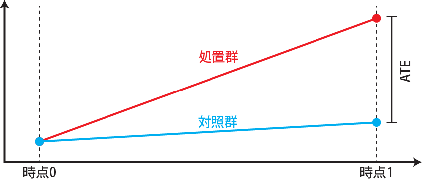
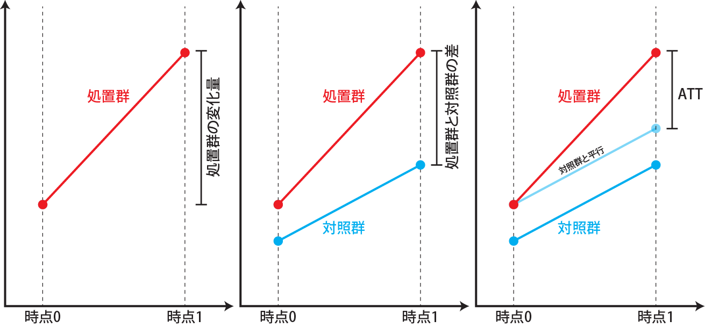
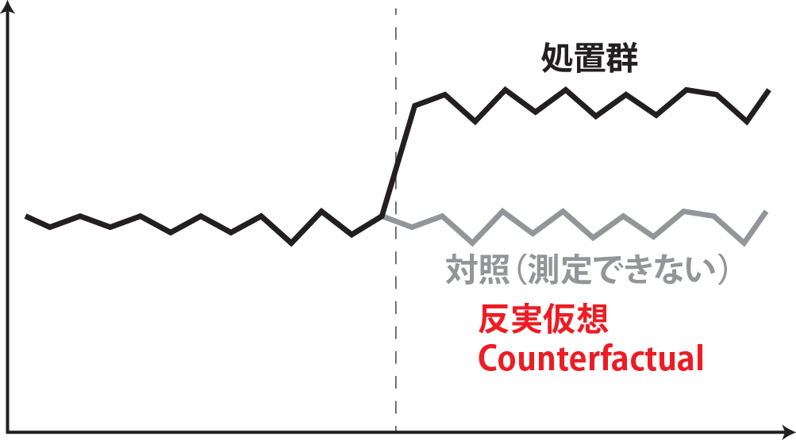
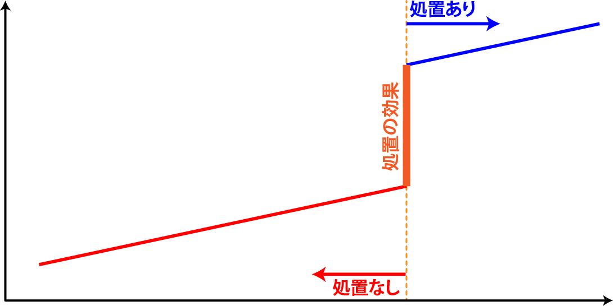
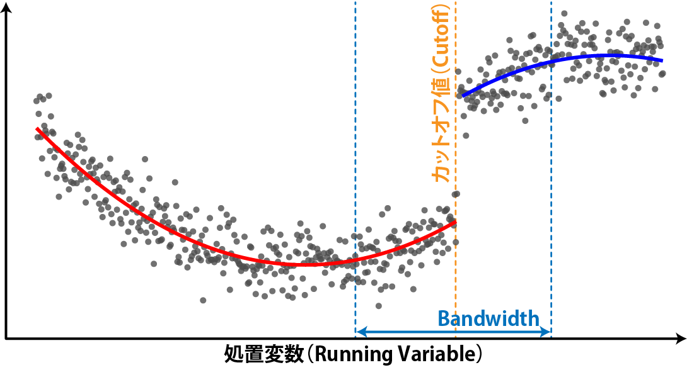

# 因果推論：差分の差分法と回帰不連続デザイン

```{r, echo=FALSE, message=FALSE, warnings=FALSE}
library(tidyverse)
set.seed(0)
```

この章では、以下の図の因果推論の手法のうち、**差分の差分法**、**CausalImpact**、**回帰不連続デザイン**の3つについて紹介していきます。


## 差分の差分法（Difference-in-Differences、DID）

治験などのRCTでは、ヒトが生まれた瞬間から試験を開始することは（当たり前ですが）できません。ですので、成長したヒト（成人）に評価したい薬（処置群）とプラセボ（有効成分の入っていない薬、対照群）を飲み始めてもらいます。その後一定の期間が経った後に、処置群と対照群の差、つまり処置によって健康状態が改善したかどうかを評価します。ですので、治験などの多くの実験では処置前と処置後の時点間の結果の差を評価していることになります。このように時点間で結果を評価する場合、初期値が一致しており、無作為化が実施されていることが重要です。初期値が一致し、無作為化により共変量の偏りが無ければ、処置後の結果の差をATEであるとして評価することができます。



一方で、観察研究にも時点間の結果の評価を含むものがあります。例えば、大阪と愛知で2020～2025年のGDPの成長と政策の影響を調べる場合を考えてみます。この場合、2020年時点でのGDPを完全に一致させることはできません。ですので、例えば2020年の両都道府県のGDPと2025年の両都道府県のGDPのデータがあり、大阪だけが特定の政策を取っていたとしても、2025年における両都市のGDPの差がその政策によるもので、「ATEである」とすることはできません。

  上記のような時点ごとのデータを取ったデータのことを**パネルデータ**と呼びます。初期値が違うパネルデータでは、**差分の差分法（Difference in Differences、DID）**を用いる場合があります。差分の差分法は経時的なデータに適用し、ATTを求めるための手法の一つです。

差分の差分法では、あるものに処置を行った前後の変化を評価の対象とします。ただし、処置群の処置前後の値の差のみを評価すると、処置による効果と処置をしなかった場合（対照群）の変化の違いをうまく評価できません（下図左）。また、単純に処置群と対照群の処置後の差を取っても、初期値に差があるため、その差が処置の効果である、とはすることができません（下図中央）。そこで、差分の差分法では処置を行ったもの（処置群）と処置を行わなかったもの（対照群）の処置前後の値を比較することで、処置による効果（ATT、$E(r_1|Z=1)-E(r_0|Z=1)$）を求めます。

処置群と対照群では、初期値が違うので、初期値の分だけ対照群の結果を下図右のように平行移動させます。この平行移動した対称群を用いて、処置後の処置群と平行移動した対照群の結果の差分を取り、これをATTであるとします。差分（処置前の差の平行移動）の差分（処置後の差）を取って評価するので、差分の差分法と呼ばれます。



この時、対照群にも通常は時点間で差が生じます。この差は処置群で処置をしなかった場合の変化、つまり$E(r_0|Z=1)$であるとします。処置群で測定される時点間の差は処置群で処置を行った場合の変化、$E(r_1|Z=1)$なので、差分を取ればATTが評価できます。

この対照群における時点間の差を処置群で処置をしなかった場合の変化と同じとする、つまり、処置群で処置しなかったときの変化は対照群と同じ（平行移動している）とする仮定が正しいときのみ、DIDはATTを正しく評価できます。共変量に差があって、処置群と対照群で処置しなかったときの変化が異なる、つまり、平行移動ではない場合には、ATTを正しく評価することはできません。

### DIDの演算：データが一つづつの場合

DIDを適用する最も単純なパネルデータは、処置群の時点0、時点1、対照群の時点0、時点1の4つのデータがある場合です。このような場合には、DIDの演算は単純で、線形回帰を行い、交互作用のパラメータがATTとして求まります。以下の例では、ATTは3になります。

```{r, filename="差分の差分法（DID）", fig.height = 4}
d <- data.frame(
  t = c(0, 1, 0, 1),
  treat = c(1, 1, 0, 0), # 1が処置群、0が対照群
  y = c(10, 16, 9, 12)
)

d |> 
  ggplot(aes(x = t, y = y, color = factor(treat))) +
  geom_point(size = 2) +
  geom_line()+
  expand_limits(y = 0)
```


```{r, filename="交互作用としてでDIDを評価する"}
# 交互作用（t:treat）がATTに当たる
lm(y ~ t * treat, data = d)
```

### DIDの演算：データが複数ある場合

処置群と対照群にそれぞれ複数のデータがある場合には、30章で説明した[線形混合モデル](chapter30.qmd#線形混合モデル)で処置の効果を評価することができます。以下の例では、患者（`patient`）を処置群（`treat=1`）、対照群（`treat=0`）に割付したときの時点1（`period=1`）、時点2（`period=2`）での結果（`value`）のデータを準備しています。

```{r, filename="DIDのテストデータを作成する"}
#| code-fold: true

treat <- rep(c(0, 1), 200, 200)
patient <- rep(1:200, 2) |> factor()
patient_error <- rep(rnorm(200, 0, 2), 2)

# 値は処置前はtreat=1で－1、処置後は6となるため、処置の効果は7になる
period1 <- -1 * treat + 10 + rnorm(length(treat), 0, 2) + patient_error
period2 <- 6 * treat + 10 + rnorm(length(treat), 0, 2) + patient_error

data_did <- data.frame(treat, patient, period1, period2) |> 
  pivot_longer(3:4, names_to = "period", values_to = "value") |> 
  mutate(
    treat = treat |> factor(),
    period = if_else(period == "period1", 1, 2)
  )

# データの形をkableで表示
head(data_did) |> knitr::kable(caption = "仮想のDID用のデータ")
```


```{r, message=FALSE}
#| code-fold: true
#| layout-ncol: 2

# データをグラフで表示
data_did |> 
  ggplot(aes(x = period, y = value, color = treat, group = patient)) +
  geom_point(size = 2, alpha = 0.3) +
  geom_line(linewidth = 1, alpha = 0.3) +
  labs(title = "個々の値", x = "時期", y = "値") +
  expand_limits(y = 0)

# データの平均値・標準偏差をグラフで表示
data_did |> 
  group_by(treat, period) |> 
  summarise(m = mean(value), s = sd(value)) |> 
  ggplot(aes(x = period, y = m, ymax = m + s, ymin = m - s, color = treat)) +
  geom_pointrange(linewidth = 1, size = 1) +
  geom_line(linewidth = 1) +
  labs(title = "平均値±標準偏差", x = "時期", y = "値") +
  expand_limits(y = 0)
```

このデータでは、各患者（`patient`）は時点1と時点2の2度測定していて、関連性があります。したがって、`patient`をランダム効果（ランダム切片）とした線形混合モデルで処置の効果を評価します。30章に示した通り、線形混合モデルの演算は`lmerTest`パッケージ[@lmerTest_bib]の`lmer`関数を用いて計算できます。上記のデータが少ない場合の演算と同様に、処置の効果は交互作用（以下の例では`treat1:period`）として評価できます。また、時点1での差は下記の演算では`treat1`に吸収されている形になります。

```{r, filename="線形混合モデルでDIDを評価する"}
pacman::p_load(lmerTest)

lmer(value ~ treat * period + (1 | patient), data = data_did)
```

### Doubly Robust DID（2重ロバストなDID）

上記の単純なDIDでは、共変量の偏りについては考慮しておらず、DIDの前提である「対称群を平行移動すれば処置群で処置しなかった場合（$E(r_0|Z=1)$）に当たる」という仮定が成立していない可能性があります。また、初期値が違えば、割付が完全に無作為化されていない、つまり割付による偏りにより結果にバイアスが生じているはずです。このような場合には、[49章](chapter49.qmd)で説明した共変量の調整や傾向スコアを用いたIPW、この2つを用いてよりロバスト（頑健）な結果を得ることのできる二重ロバストの手法を利用することを検討したほうが良いでしょう。

この、IPWを利用したDID、2重ロバストなDID（Doubly Robust DID）に対応したパッケージが`DRDID`パッケージ[@DRDID_bib]です。`DRDID`パッケージの[参考文献](https://www.researchgate.net/publication/329792048_Doubly_Robust_Difference-in-Differences_Estimators)[@sant2020doubly]を読んでいただければわかると思いますが、統計的には相当複雑なモデルとなっており、「少し勉強すれば使える」ものではない手法になっています。元論文をよく読み、理解したうえで実際に使用されることをおすすめします。

`DRDID`パッケージの主な関数は、IPWをDIDに持ち込んだ`ipwdid`関数と2重ロバストなDIDである`drdid`関数の2つです。以下に`DRDID`パッケージのExampleに示されている解析の例を示します。データにはLalondeのNSWのデータ[@lalonde1986evaluating]を用いています。

```{r, filename="DRDID：データの準備"}
pacman::p_load(DRDID)

# nswのデータの読み込み
data(nsw_long)

# データのうち、就労経験がないCPSのデータを選択（experimentalを割付として用いる）
eval_lalonde_cps <- subset(nsw_long, nsw_long$treated == 0 | nsw_long$sample == 2)

# データが多いので（32834行）、5000行だけ取り出す
unit_random <- sample(unique(eval_lalonde_cps$id), 5000)
eval_lalonde_cps <- eval_lalonde_cps[eval_lalonde_cps$id %in% unit_random,]
```

`DRDID`パッケージでは、「IPWを用いたDID」と「2重ロバストのDID」の2つを計算することができます。IPWを用いたDIDでは`ipwdid`関数、2重ロバストのDIDでは`drdid`関数を用います。`ipwdid`関数と`drdid`関数の引数は全く同じです。

`ipwdid`、`drdid`関数では、目的変数は`yname`、割付群は`dname`、時間に関する変数を`tname`引数に指定します。また、データを取った個別の対象（`nsw`では個々のヒト）を`idname`引数に指定します。これら4つの引数には**列名を文字列で指定**します。

`xformla`引数にはモデルに加える共変量をformulaで指定します。また、データがパネルデータであれば`panel=TRUE`、パネルデータではなく、時点0と時点1で測定したものが独立（例えば、時点0だけで測定した人と時点1だけで測定した人のデータの場合）の場合には`panel=FALSE`を指定します。結果を見ると、ATTに有意差はなく、95%信頼区間は`ipwdid`の方がやや狭めに推定していることがわかります。

```{r, filename="DRDID：ipwdid関数"}
ipwdid(
  yname="re", # 目的変数 
  tname = "year", # 時間に関わる変数
  idname = "id", # 測定した個体のIDに対応する変数
  dname = "experimental", # 割付群を指定する変数
  xformla= ~ age+ educ+ black+ married+ nodegree+ hisp+ re74, # 調整する共変量
  data = eval_lalonde_cps, 
  panel = TRUE # パネルデータではない場合（時系列間で個体が異なる場合）はFALSEを指定
  )
```

```{r, filename="DRDID：drdid関数"}
drdid(
  yname="re", 
  tname = "year", 
  idname = "id", 
  dname = "experimental",
  xformla= ~ age+ educ+ black+ married+ nodegree+ hisp+ re74,
  data = eval_lalonde_cps, 
  panel = TRUE
  )
```

## CausalImpact

DIDは時間が関わるデータに当てはめるものですが、通常DIDは2つの時点、時点0（処置前）と時点1（処置後）のみに適用するものとなっています。[33章](chapter33.qmd)で説明した時系列データには、単純なDIDを当てはめることはできません。

この時系列データに対してDIDと同じような分析の手法を提供しているのが、**`CausalImpact`**パッケージ[@CausalImpact_bib]です。`CausalImpact`では、33章で少しだけ説明した[状態空間モデル](chapter33.qmd#状態空間モデル)とベイズ統計を用いて、ある時点で処置を行った処置群において、処置前処置後の時系列を比較し、処置の効果の大きさを求めることができます。

仮に、ある時点（時点50）に漁港Aから稚魚を放流したとします。漁港Aから十分に離れている場所には、放流の影響を受けない漁港Bと漁港Cがあったとします。この3つの漁港A、B、Cの漁獲高が時系列で求まるとしたとき、漁港Aでは稚魚の放流という処置の効果が漁獲高に現れ、漁港BやCには現れないことが期待できます。

それぞれの漁港A、B、Cにおける漁獲高が以下のようであった場合について考えてみます。

```{r, echo=FALSE}
set.seed(0)
```

```{r, filename="時点50で稚魚放流したことによる漁獲高の変化のシミュレーションモデル"}
# 稚魚の放流の効果
effect_release <- c(numeric(50), dnorm(seq(-5, 5, length=50)) * 6) |> as.ts()

fishportA <- (30 + arima.sim(model = list(order = c(1, 0, 0), ar = 0.5), n = 100, sd = 0.5))  + effect_release
fishportB <- (25 + arima.sim(model = list(order = c(1, 0, 0), ar = 0.5), n = 100, sd = 0.4))
fishportC <- (33 + arima.sim(model = list(order = c(1, 0, 0), ar = 0.5), n = 100, sd = 0.45))

paste("処置効果の累積値：", sum(effect_release) |> round(2)) # 稚魚放流の累積効果（30ぐらい）
```


```{r, filename="シミュレーションをグラフで表示する"}
#| code-fold: true

data.frame(t = 1:100, fishportA, fishportB, fishportC) |> 
  pivot_longer(2:4) |> 
  ggplot(aes(x = t, y = value, color = name)) +
  geom_line(linewidth = 1) +
  labs(x = "time", y = "amount of catch fishes", title = "各漁港の漁獲高")
```

上記のように、漁港A（`fishportA`）の時点51で稚魚を放流した場合、漁港Aの時点50までは処置をしていない対照群、時点51以降は処置群であるとします。漁港BとCは、通常の統計とは少し異なりますが、共変量として取り扱います。

`CausalImpact`では、まず処置をした群（上の例では漁港A）を1列目、共変量（上の例では漁港BとC）を2列目以降に配置した行列（`data`）を準備します。データは行列ではなく、`zoo`パッケージ[@zoo_bib]で提供されている`zoo`オブジェクトを用いることもできます。`zoo`オブジェクトは時系列を時系列のまま取り扱うことができる行列のようなものです。

```{r, filename="CausalImpact：処置群・対照群のデータの準備"}
pacman::p_load(CausalImpact)

# fishportAが効果を評価する群（1列目に配置）、fishportB、fishportCは共変量（2列目以降に配置）
data <- cbind(fishportA, fishportB, fishportC)
```

次に、処置を行う前と後の時期を2つの数値のベクターとして準備します。以下の例では、処置前（`pre.period`）が時点1～50、処置後（`post.period`）が時点51～100であることを示しています。`data`を`zoo`オブジェクトで指定した場合には、`pre.period`、`post.period`を日時データとして指定することもできます。

```{r, filename="CausalImpact：処置前、処置後の時点を指定"}
pre.period <- c(1, 50)
post.period <- c(51, 100)
```

この`data`、`pre.period`、`post.period`を`CausalImpact`関数に与えることで、処置後の処置の効果の評価を行います。`CausalImpact`関数の返り値を`plot`関数の引数に取ることで、対照群の時系列推移（original）、処置群における処置の効果（pointwise）、処置群における累積の処置効果（cumulative）をそれぞれ表示できます。

```{r, filename="CausalImpact：CausalImpact関数と処置の効果の表示"}
impact_release <- CausalImpact(data, pre.period, post.period)

plot(impact_release)
```

`CausalImpact`関数の返り値を`summary`関数の引数に取れば、処置後の平均の効果と累積効果を表示することができます。Absolute Effectが処置効果で、累積で32ぐらいとなり、始めに設定した処置効果の累積値（29.4）とほぼ同じになっています。また、`summary`関数の引数に`"report"`を加えると、（英語ですが）結果をレポートとして表示してくれます。

```{r, filename="CausalImpact：summary関数で要約を表示する"}
# 引数にreport=TRUEを取ると英文レポートとして
# 結果が表示される
summary(impact_release)
```

時系列には季節性がある場合があります。漁港ごとに休みの日があり、休みの日の漁獲量は減るとしましょう。この場合、漁獲量は以下のような季節性を持つことになります。このような季節性のあるデータにも`CausalImpact`は対応しています。

```{r, warning=FALSE, filename="CausalImpact：季節性のあるデータ"}
fishportAw <- fishportA * rep(c(1, 1, 1, 1, 1, 0.9, 0.7), 14)
fishportBw <- fishportB * rep(c(1, 1, 1, 1, 1, 0.9, 0.8), 14)
fishportCw <- fishportC * rep(c(1, 1, 1, 1, 1, 0.95, 0.85), 14)

data.frame(t = 1:100, fishportAw, fishportBw, fishportCw) |> 
  pivot_longer(2:4) |> 
  ggplot(aes(x = t, y = value, color = name)) +
  geom_line(linewidth = 1) +
  expand_limits(y = 0) +
  labs(x = "time", y = "amount of catch fishes", title = "各漁港の漁獲高（季節性あり）")
```

季節性のあるデータを用いる場合には、`CausalImpact`関数の`model.args`引数に季節性の情報を与えます。`model.args`引数はリストを取り、`nseasons`に季節性の周期（7日おきなら`7`）を指定します。また、`list`内に`season.dulation`を指定すると1つの季節性データに何点のデータがあるかを指定することもできます。例えば`list(nseasons=7, season.dulation=24)`と指定すると、24時間のデータが7日間間隔で存在するような季節性を表現することもできます。

ただし、季節性がある場合には、信用区間（credible interval）が広くなっています。処置の効果が小さかったり、時系列が短いと処置の効果の有意性を示せなくなります。

```{r, filename="CausalImpact：季節性を指定する"}
data <- cbind(fishportAw, fishportBw, fishportCw)
impact_release2 <- CausalImpact(data, pre.period, post.period, model.args = list(nseasons = 7))
plot(impact_release2)
```

以上の通り、`CausalImpact`は時系列における介入の効果を評価するのに有用です。ただし、例えば漁港の例では、漁港AとBで漁の仕方や漁の対象となる海産物が全く違い、漁獲量の変動が異なるなど、漁港AとBで異なるトレンドがあると、正確に結果を評価することができなくなります。また、漁港Aでの稚魚の放流が漁港Bの漁獲高に影響を与えてしまうようであれば、やはり漁港Bを共変量として用いることはできなくなります。

`CausalImpact`では処置前の時系列を対照として使っているのですが、処置前、処置後で処置の効果とは異なる理由（例えば放流直後に台風で漁獲量が減るなど）でトレンドが完全に異なってしまうような場合にも効果をうまく評価することはできません。評価の信頼性を高めるためには、何を共変量とするか、時系列が安定しているのか、トレンドはないか等、データをよく理解しておく必要があります。

:::{.callout-tip collapse="true"}
## CausalImpactの中身

`CausalImpact`の統計モデルについては、[文献](https://projecteuclid.org/journalArticle/Download?urlId=10.1214%2F14-AOAS788)[@brodersen2015inferring]を参照して下さい。`CausalImpact`パッケージ自体はシンプルで使いやすいのですが、背景の統計モデルはかなり複雑で、理解するのは難しいです。正直、文献を読んでも他の記事を読んでもいまいちわからないところがあります。

上に述べた通り、`CausalImpact`では処置前の時系列を対照とし、処置が無かった時の予測時系列と、処置後の実際の時系列を比較することでATTを求める手法となっています。この、処置が無かった時の予測時系列のことを、実際には起こらなかったことを推定していることから、**Counterfactual（反実仮想）**と呼びます。

ATTとATEの項でも簡単に説明しましたが、我々は処置をした群の処置の結果（$E(r_1)|Z=1$）と処置をしなかった群の処置しなかった場合の結果（$E(r_0)|Z=0$）しか測定できません。そこで、DIDや`CausalImpact`を使うことで、処置をした群で処置をしなかった場合の結果（$E(r_0)|Z=1$）、つまり反実仮想を推測し、ATT（$E(r_1)-E(r_0)|Z=1$）に当たるものを計算しています。この反実仮想では、「測定していないものを推測する」ということをしているため、反実仮想の評価は欠測の問題ととらえられる場合もあります。

{width=500}

共変量として何を選ぶべきかについては`CausalImpact`のreferenceにも文献にもはっきりとは述べられていませんが、Googleがウェブ広告の効果を評価するために作成したライブラリですので、おそらく広告とは関係のないサイトからのアクセス数などを共変量とするのだと思います。`CausalImpact`では共変量が無いと演算ができないので、評価したい対象と、少なくとももう一つ時系列のデータが必要です。共変量には「処置の影響を受けないもの」という制約があります。共変量を対照としているのかと思っていたのですがそういうわけでもなさそうで、共変量が何なのか理解するのが難しいです。

`CausalImpact`ではSpike-and-Slab priorという事前分布を用いています。Spike-and-Slab priorでは、モデルに組み込んだ方がよい対照は弱情報事前分布に影響し、組み込まない方がよい対照は結果に影響しなくなる、つまりモデル選択のような効果を持ちます。共変量にこのSpike-and-Slab priorが適用されているのかはちょっと読み解けませんでした。

Spike-and-Slab priorの理解には[この文献](https://www.kurims.kyoto-u.ac.jp/~kyodo/kokyuroku/contents/pdf/2018-08.pdf)[@田辺竜ノ介2017spike]や、[こちらの記事](https://wessel.ai/assets/write-ups/Bruinsma,%20Spike%20and%20Slab%20Priors.pdf)[@Bryubsna_spike]、[こちらのZennの記事（Spike-and-Slab 事前分布を理解する）](https://zenn.dev/tatamiya/scraps/9d14f3d1ee5a37)などが参考になります。

`CausalImpact`については[この記事（{CausalImpact}を使う上での注意点を簡単にまとめてみた）](https://tjo.hatenablog.com/entry/2019/09/10/080000)や[こちらの記事（\[R\] CausalImpact でできること, できないこと）](https://ill-identified.hatenablog.com/entry/2019/10/09/120000)も参考になります。簡単に使えるので簡単に使ってしまいそうですが、よく理解した上で実際のデータに適用したほうがよいでしょう。
:::

## 回帰不連続デザイン

線形回帰を行う場合には、通常は説明変数に対して目的変数が連続的に変化することを想定します。一方で、例えば労働時間の場合、年収が107万円（2025年時点）を超えると社会保険への加入が必要になるため、107万円を超える前では労働時間を減らし、超えると増やすような変化が起きていそうです。図で示すと以下の回帰のようにある点、例えば107万円を境として回帰の線が分断されて不連続となるような場合があります。

この、不連続な回帰を用いて処置（上の例では社会保険への加入）の影響の大きさを評価する手法が**回帰不連続デザイン**です。回帰不連続デザインでは、回帰が不連続となる点の前後の差を評価することで、その処置の効果、ATTを評価します。

```{r, warning=FALSE, filename="回帰不連続デザインのイメージ"}
#| code-fold: true

f <- function(x, z){
  0.5 * x + 20 * z + rnorm(length(x), 0, 3)
}

x <- seq(60, 130, by = 0.125)
z <- c(rep(0, 377), rep(1, 184))

d <- data.frame(
  y = f(x, z), x, z)

d |> 
  ggplot(aes(x = x, y = y))+
  geom_point(size = 2)+
  geom_function(
    fun = Vectorize(function(x){
    if(x < 107){
      return(0.5 * x)
    } else {
      return(NA)
    }}), color = "red", linewidth = 2) +
   geom_function(fun = Vectorize(function(x){
    if(x >= 107){
      return(0.5 * x + 20)
    } else {
      return(NA)
    }}), color = "blue", linewidth = 2)
```

{width=500}

上記のような、線形がある点で分断していても、傾きは変わっていないような、単純な不連続性の場合であれば、線形回帰を用いれば処置の効果の大きさは以下のような線形回帰で簡単に求めることができます。

```{r, filename="回帰不連続デザインを線形回帰で評価する"}
# yは目的変数、xは横軸、zは処置の有無（x<107でz=0、x＞=107でz=1）
lm(y ~ x + z, data = d)
```

仮に不連続性の点で傾きが異なる場合には、交互作用の項を加えれば処置の効果の大きさを評価することができます。ただし、傾きが変わる場合、x軸方向の傾きは不連続点以降で変わるため、少し交互作用項の与え方に工夫が必要になります。

```{r, warning=FALSE, filename="回帰不連続デザインのイメージ"}
#| code-fold: true

f <- function(x, z){
  0.5 * x + 20 * z + 1 * (x - 107) * z + rnorm(length(x), 0, 3)
}

x <- seq(60, 130, by = 0.125)
z <- c(rep(0, 377), rep(1, 184))

d <- data.frame(
  y = f(x, z), x, z)

d |> 
  ggplot(aes(x = x, y = y))+
  geom_point(size = 2)+
  geom_function(
    fun = Vectorize(function(x){
    if(x < 107){
      return(0.5 * x)
    } else {
      return(NA)
    }}), color = "red", linewidth = 2) +
   geom_function(fun = Vectorize(function(x){
    if(x >= 107){
      return(0.5 * x + (x - 107) + 20)
    } else {
      return(NA)
    }}), color = "blue", linewidth = 2)
```

交互作用項の演算では、$(x - c) * z$という形で、不連続点（`c`）をあらかじめ`x`から引いておく必要があります。

```{r, filename="回帰不連続デザイン：不連続点で傾きが異なる場合"}
d$xz <- d$x - 107 # x > 107の時の傾きの変化に対応する変数
lm(y ~ x + z + xz * z, data = d)
```

### 回帰不連続デザイン：より複雑な状況について

上記のように、x軸方向に直線的なトレンドが続けば、不連続点での変化、つまり処置の効果は簡単に評価できます。しかし、不連続点の前と後で必ずしもトレンドが一致するとは限りません。上記の年収の話であれば、107万円をぎりぎり超えない人は労働量を減らし、107万円を超えた人は労働量を増やすでしょうが、107万円よりもかなり年収が低ければ労働量を減らす必要はありません。また、年収が1000万円を超えるような人はそもそもこの年収107万円付近の人とは労働に対する行動が異なります。年収107万円を超えない人は不自然に多く、年収107万円を少しだけ超える人はほとんどいない、という場合もあるでしょう。

回帰不連続デザインでは、不連続点の値のことを**カットオフ値（Cutoff）**と呼びます。カットオフ値付近では、データの共変量はそれほど違わない、つまり無作為化に近い状態であると考えます。年収が106万円の人と108万円の人の行動にはそれほど大きな違いはないだろう、ということです。しかし、このカットオフ値から大きく外れた人、例えば年収5万円の人や年収1億円の人では、労働に関する行動は年収107万円の人とは大きく異なります。

ですので、明確にトレンドが直線的ではない場合、カットオフ値付近のデータのみを処置効果の評価に用いることで、共変量の影響を小さくすることができます。この評価に利用するカットオフ値付近のデータの幅のことを**Bandwidth**と呼びます。

Bandwidthが狭ければ共変量の影響は小さくなりますが、解析に使えるデータは少なくなり、処置の効果の検出力は下がります。一方でBandwidthを広くとると、解析に使えるデータは多くなりますが、共変量の影響は大きくなり、処置の効果にバイアスが生じます。

{width=500}

上記の年収の例ではカットオフ値（107万円）は政府によって定められており、人によって異なることはありません。一方で、カットオフ値自体に幅があることもあります。例えば、定年退職の年齢については、60歳以上と法律で定められていますが、実際の定年の年齢は企業によって60～65歳ぐらいと幅があります。ですので、年齢と年収の関係をグラフにすると、60歳ぐらいから徐々に減っていき、65歳ぐらいで不連続性が終わる、といった形になるでしょう。このような場合の回帰不連続デザインのことを、Fuzzy Discontinuation Design（ファジーな回帰不連続デザイン）と呼びます。

{width=500}

### rdrobustパッケージ

Rでカットオフ値付近で変動があったり、ファジーなカットオフ値を取るような複雑な回帰不連続デザインの演算を行う場合には、**`rdrobust`パッケージ**[@rdrobust_bib]を用います。`rdrobust`パッケージでは、局所多項式回帰（30章で説明した[LOESS](chapter30.qmd#loesslowess平滑化)）を用い、ファジーではない（Sharpな）カットオフ値、ファジーなカットオフ値の両方で処置の効果を評価できます。

`rdrobust`の主な関数は`rdbwselect`、`rdplot`、`rdrobust`関数の3つです。

以下の例では、下のグラフで示したデータを用いて回帰不連続デザインの処置効果を`rdrobust`パッケージで評価していきます。

```{r, warning=FALSE, message=FALSE, filename="回帰不連続デザイン：カットオフ値の前後で曲率が変わる場合"}
#| code-fold: true

f <- function(x, z){
  0.025 * (x-90)^2 + 20 * z - 0.05 * (x - 107)^2 * z + rnorm(length(x), 0, 3)
}

x <- seq(60, 130, by = 0.125)
z <- c(rep(0, 377), rep(1, 184))

d <- data.frame(
  y = f(x, z), x, z)

d |> 
  ggplot(aes(x = x, y = y))+
  geom_point(size = 2)+
  geom_function(
    fun = Vectorize(function(x){
      if(x < 107){
        return(0.025 * (x-90)^2)
      } else {
        return(NA)
      }}), color = "red", linewidth = 2) +
  geom_function(fun = Vectorize(function(x){
    if(x >= 107){
      return(0.025 * (x-90)^2 + 20 - 0.05 * (x - 107)^2)
    } else {
      return(NA)
    }}), color = "blue", linewidth = 2)
```

#### rdrobust：rdbwselect関数

まずは`rdbwselect`関数から簡単に説明します。`rdbwselect`はBandwidthを推定するための関数です。`rdbwselect`関数の返り値を`summary`関数の引数とすると推定したBandwidthを示してくれます。

`rdbwselect`関数は引数に目的変数のベクター（`y`）、処置変数（running variable、上の例の年収に当たるもの、`x`）、カットオフ値（`c`）の3つを指定します。以下の例では、Bandwidth（BW est.）は107を中心に±4.4程度であるという結果になっています。BW biasという別のものも表示されますが、こちらについては後ほど説明します。

```{r, filename="rdrobust：rdbwselect関数"}
pacman::p_load(rdrobust)

rdbwselect(y = d$y, x = d$x, c = 107) |> summary()
```

#### rdrobust：rdplot関数

`rdplot`関数は、回帰不連続デザインのデータをグラフで表示してくれる関数です。引数は`rdbwselect`関数と同じです。`rdplot`関数はカットオフ値の前後を局所多項式回帰で回帰して表示してくれます。

```{r, filename="rdrobust：rdplot関数"}
rdplot(y = d$y, x = d$x, c = 107)
```

#### rdrobust：rdrobust関数

次に、`rdrobust`関数について説明します。`rdrobust`関数の引数も`rdbwselect`関数や`rdplot`関数と同じで、目的変数`y`、処置変数`x`、カットオフ値`c`の3つです。`rdrobust`関数の返り値を`summary`関数の引数に取ると、回帰不連続デザインの演算結果を表示することができます。

以下の例では、観測結果（Number of Obs.）は376と185で、処置前（x < 107）に376、処置後（x >= 107）に185のデータがあることを示しています。このうち、Bandwidth（±4.4）の範囲にあるデータの数（Eff. Number of Obs.）はそれぞれ37、38です。

また、Order est.は処置効果を評価する時に用いた局所多項式回帰に関する係数を示しており、この場合は1、つまり直線で評価していることを示しています。BW est.はBandwidthです。処置効果（Point Estimate）は下の表に表示されており、このデータの場合は17.29、95%信頼区間に真の値（20）が含まれていますので、処置効果をおおむね正しく評価できていることがわかります。

```{r, filename="rdrobust：rdrobust関数"}
rdrobust(y = d$y, x = d$x, c = 107) |> summary()
```

`rdrobust`関数の引数に`all=TRUE`を追加すると、バイアス補正済みの処置効果を計算することができます。この「バイアス補正済み」の意味については理解が難しいのですが、処置効果のバイアスとバリアンス（真度と精度）のうち、精度を高めに評価する手法を用いた場合の結果のようです。少しBandwidthを広く推定し（BW bias）、データを多めに採用することで精度を高く、共変量の影響を大きく（バイアスを大きく）しているのだと思います。

```{r, filename="rdrobust：rdrobust関数"}
rdrobust(y = d$y, x = d$x, c = 107, all = TRUE) |> summary()
```

#### rdrobust：Fuzzy discontinuation designの演算

次に、以下のデータを用いてFuzzy discontinuation designでの処置効果の評価を行います。

```{r, warning=FALSE, message=FALSE, filename="回帰不連続デザイン：Fuzzy Discontinuation Design"}
#| code-fold: true

f <- function(x, z){
  0.025 * (x-90)^2 + 20 * z - 0.05 * (x - 107)^2 * z + rnorm(length(x), 0, 3)
}

x <- seq(60, 130, by = 0.125)

d <- NULL

for(i in 1:100){
  z <- c(rep(0, 340), rbinom(81, 1, prob = seq(0.1, 0.9, length=81)), rep(1, 140))

  d <- rbind(
    d,
    data.frame(y = f(x, z), x, z)
    )
}


d |> 
  ggplot(aes(x = x, y = y))+
  geom_point(size = 2, alpha=0.015)+
  geom_function(
    fun = Vectorize(function(x){
      if(x < 107){
        return(0.025 * (x-90)^2)
      } else {
        return(NA)
      }}), color = "red", linewidth = 2) +
  geom_function(fun = Vectorize(function(x){
    if(x >= 107){
      return(0.025 * (x-90)^2 + 20 - 0.05 * (x - 107)^2)
    } else {
      return(NA)
    }}), color = "blue", linewidth = 2)
```

Fuzzy Discontinuation Designのデータを用いる場合には、カットオフ値に加えて、処置への割付を`fuzzy`引数に指定します。`fuzzy`引数には各データの割付（処置：`1`、対照：`0`）を`1`と`0`のベクターで指定します。

ただし、上記のデータと以下の`rdrobust`関数の結果を見るとわかる通り、かなりデータが多くないと正確に処置効果を評価できないようですので、利用には注意が必要です。

```{r, filename="rdrobust関数：fuzzy discontinuation design"}
# warningは同じxに対して重複するデータがあることを示している
rdrobust(y = d$y, x = d$x, c = 107, fuzzy = d$z, all = TRUE) |> summary()
```

:::{.callout-tip collapse="true"}
## rdrobustの統計モデル

`rdrobust`の詳細については、[元論文](https://rdpackages.github.io/references/Calonico-Cattaneo-Titiunik_2014_Stata.pdf)[@calonico2014robust]や[Rパッケージの解説論文](https://rdpackages.github.io/references/Calonico-Cattaneo-Titiunik_2015_R.pdf)[@calonico2015rdrobust]に記載されていますが、相応に複雑で、正直数学の素人である私にはよくわかりませんでした。Rパッケージのヘルプや上記の解説論文を読んでもいまいち使いかたが分かりません。よくわからないなら論文などに利用するのは避けた方がよいでしょう。

どうしてもこのパッケージを用いたい方は、日本語の教科書に`rdrobust`の解説がありますので（例えば、[統計的因果推論の理論と実装 (Wonderful R)](https://www.amazon.co.jp/dp/4320112458)[@takahashi2022]）や[因果推論の計量経済学](https://www.amazon.co.jp/dp/B0DFXY2TCS)[@Kawaguchi_Sawada_2024]、目を通した後で元論文に挑戦してみるのがよいでしょう。
:::
