# 因果推論：因果のネットワーク

```{r, echo=FALSE, message=FALSE, warnings=FALSE}
library(tidyverse)
set.seed(0)
```


この章では、以下の図の因果推論の手法のうち、ネットワーク（グラフ）を利用する、**有向非巡回グラフ（DAG）**、**ベイジアンネットワーク**、**構造方程式モデリング**の3つについて紹介していきます。


## 有向非巡回グラフ（Directed Acyclic Graph、DAG）

[49章](chapter49.qmd)や[50章](chapter50.qmd)で述べてきた通り、説明変数（処置）と目的変数（結果）の因果関係を評価する場合、因果関係に関与しうる共変量や交絡を回帰で調整したり、処置（割付）に影響を及ぼす共変量を傾向スコアなどの手法で調整することが特に観察研究では重要となります。

一方で、共変量と一言で言っても、割付に影響を与えるもの、結果に影響を与えるもの、割付と結果の両方に影響を与えるもの、他の共変量に影響を与えることで割付や結果に間接的に影響を与えるものなど、様々なタイプのものがあります。

これらの共変量をどれも同じように調整すれば処置効果をうまく評価できる、というわけではありません。**共変量には調整した方がよいもの、調整しない方がよいものがあります**。調整した方がよいものは適切に調整し、調整しない方がよいものは調整しないようにしたほうがよいのですが、そのためにはどの共変量を調整すればよいのか判断する必要があります。

共変量の調整について判断する際に有用なツールが**有向非巡回グラフ（Directed Acyclic Graph、DAG）**です。DAGは[46章](chapter46.qmd)で説明したネットワークの一種で、いくつかのルールを定めて、共変量、説明変数、目的変数の間に想定される因果関係をネットワーク（グラフ）として表記したものです。

DAGはネットワークですので、ネットワークの要素は46章で説明したものと同じです。共変量、説明変数、目的変数に当たる**「点」はnode/vertex**、因果関係を示す**「線」はedge/link**と呼びます（DAGでは**arcs**と呼ぶこともあります）。また、DAGは「有向」非巡回グラフですので、有向（directed）のedgeのみで構成されます。**edgeの矢印は原因から結果の方向に向く**ことになります。


また、DAGは有向「非巡回」グラフですので、ネットワークの方向には上流と下流があり、下流から上流に戻ってくる（巡回する）方向にはedgeが生じません。

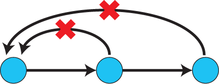

ここまでは単なるネットワーク（グラフ）なのですが、このグラフを評価して、調整するべき共変量・調整すべきでない共変量を見分けましょう、というのがDAGの要点となります。

### DAG：調整に関わるedgeの種類

想定される因果関係をDAGで表記したときには、共変量の数や種類にもよりますが、因果関係のネットワークが複雑になることもあります。以下にDAGの例を示します。

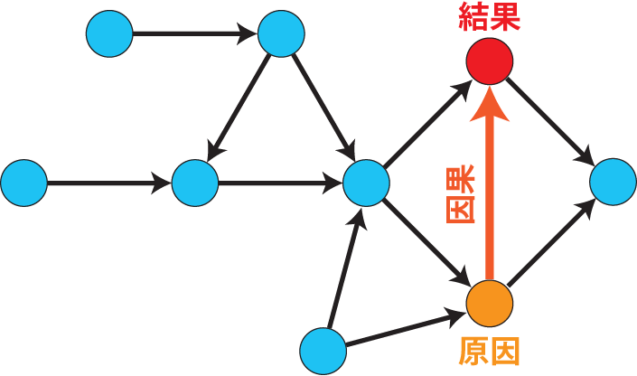{width=500}

上記の例で、原因と結果の間の関係（因果）を評価したいとします。しかし、原因と結果に影響を及ぼす因子（青丸、共変量）がたくさんあります。また、共変量同士にも関係はありますが、巡回している点はありません。

因果関係を整理し効果の大きさを評価する場合、このような複雑な因果関係を持つ共変量から、特に注意が必要となるnode、つまり調整すべき共変量を見つけ出す必要があります。まずは以下の3つの関係に注目します。

- **Chain（連鎖）**：因果関係が連続するnode
- **Fork（共通原因）**：因果関係が双方に向かうnode
- **Collider（共通結果）**：因果関係が集中するnode

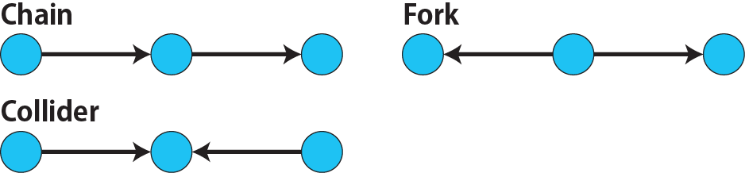

この3つに注目し、DAG上の因果関係を整理すれば、調整すべき共変量、調整すべきでない共変量をある程度見分けることができます。研究の前に共変量間の因果関係をDAGで整理しておけば、調整すべき共変量を適切に測定することができます。また、調整すべきでない共変量については、回帰や傾向スコアの計算に持ち込む必要がなくなるので、測定する必要がなくなります。したがって、DAGは研究を簡素化し、コストを小さくするのにも役立ちます。

したがって、観察研究などで因果推論の手法を用いる場合には、まず因果関係をDAGで整理してから計画するのがよく、データを取った後にもDAGで因果関係を整理して共変量の調整の必要性を検討したほうがよい、ということになります。以下では、Chain・Fork・Colliderの3つにおける調整の必要性について簡単に説明します。

#### DAG：Chain（連鎖）

**Chain（連鎖）**とは、因果関係が連続している状況のことです。以下の例のように、rが原因でxが結果となる因果と、xが原因でyが結果となる因果が繋がっているような状況のことをChainと呼びます。

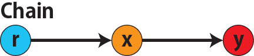

このChainにおいて、説明変数`x`と目的変数`y`の関係を評価する場合、共変量`r`で調整する必要はありません。つまり、**Chainにおいて、1つ上流の原因で調整した場合、2つ以上上流の共変量では調整する必要がありません**。

このChainでの共変量の調整について簡単にシミュレートしてみましょう。以下では、`x`は`r`の関数、`y`は`r`の関数で表すことができる状況で、`lm(y~x)`と`lm(y~x+r)`、`lm(y~x+r+I(r^2))`の3つ、つまり`x`のみの統計モデル（`x_model`）と`x`に`r`を加えたモデル（`xr_model`）、さらに`r`の2乗を加えたモデル（`xr_sq_model`）を比較したものです。いずれのモデルにおいても、`x`の傾き（効果）はほぼ4で、`r`をモデルに加えても加えなくても`x`の効果は正確に評価できていることがわかります。

```{r, filename="Chain：統計モデル間の比較"}
d <- NULL

for(i in 1:1000){
  r <- rnorm(161)
  x <- seq(0, 10, by = 0.0625) * r ^ 2 + 0.25 * r + 2 + rnorm(161, 0, 1)
  # xの傾き（coefficient）は4
  y <- 4 * x + 10 + rnorm(161, 0, 5)

  d <- 
    rbind(
      d,
      c(
        x_model = lm(y ~ x) |> _$coefficients |> _[2],
        xr_model = lm(y ~ x + r) |> _$coefficients |> _[2],
        xr_sq_model = lm(y ~ x + r + I(r ^ 2)) |> _$coefficients |> _[2]
      )
    )
}

d |> summary()
```

同様に、`y`が二項分布する場合についても`lm(y~x)`と`lm(y~x+r)`、つまり`x`のみの統計モデル（`x_model`）と`x`に`r`を加えたモデル（`xr_model`）を比較してみます。いずれのモデルにおいても、`x`の傾き（効果）はほぼ1で、やはり`r`をモデルに加えても加えなくても`x`の効果を正確に評価できていることがわかります。

```{r, warning = FALSE, filename="Chain：統計モデル間の比較（二項分布）"}
d <- NULL

for(i in 1:1000){
  logis <- function(x){1/(1+exp(-x))}
  r <- rnorm(161)
  x <- seq(0, 10, by = 0.0625) * r + 2 + rnorm(161, 0, 1)
  y <- rbinom(161, 1, logis(x))

  d <- 
  rbind(
    d,  
    c(
      x_model = glm(y ~ x, family = binomial) |> _$coefficients |> _[2],
      xr_model = glm(y ~ x + r, family = binomial) |> _$coefficients |> _[2]
    )
  )
}

d |> summary()
```

ですので、Chain（連鎖）の場合には、1つ前の説明変数をモデルに組み込んでいれば、2つ前の共変量をモデルに加えても加えなくても結果には大きな変化はありません。

ただし、証明したい因果がr→yの時、つまりChainの始点と終点の間の因果関係を知りたい場合には、中間のxで調整してしまうと因果関係がわからなくなってしまいます。したがって、始点と終点の間の因果関係を知りたい場合には中間の共変量で調整してはいけません。

#### DAG：Fork（共通原因）

**Fork（共通原因）**とは、そのnodeが複数の変数の原因となっているような場合のことです。典型的な例はこの章で説明した[交絡因子](chapter49.qmd#交絡（confounding）)です。

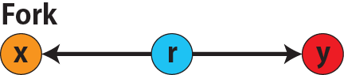

上で説明した通り、交絡があると因果関係を正しく評価できません。したがって、交絡因子がある場合、つまり**Forkの下流に説明変数と目的変数がある場合には、その共変量はモデルに組み込まないといけません**。

上記のChainと同様に、`r`がForkのnode、`x`を原因、`y`を結果とし、`x`と`y`の関係を`x`のみの統計モデル（`x_model`）と`x`に`r`を加えたモデル（`xr_model`）で比較してみます。`x_model`では、真の値（4）から大きく外れる結果が得られる時があるのに対し、`r`を加えたモデルではほぼ常に真の値に近い結果が得られていることがわかります。

```{r, warning=FALSE, filename="Fork：統計モデル間の比較"}
d <- NULL

for(i in 1:1000){
  r <- rnorm(161)
  x <- seq(0, 10, by = 0.0625) * r ^ 2 + 0.25 * r + 2 + rnorm(161, 0, 1)
  y <- 4 * x + 10 + 25 * r + rnorm(161, 0, 5)
  
  d <- 
    rbind(
      d, 
      c(
        x_model = lm(y ~ x) |> _$coefficients |> _[2],
        xr_model = lm(y ~ x + r) |> _$coefficients |> _[2]
      )
    )
}

d |> summary()
```

したがって、Forkの下流に説明変数と目的変数がある場合、つまり共変量が交絡因子になっている場合には、Forkをモデルに組み込まないとバイアスが大きくなる可能性があるため、Forkはモデルに組み込まないといけません。

#### DAG：Collider（共通結果）

**Collider（共通結果）**は、2つ以上の因子の結果となっており、どの因子の原因にもなっていない共変量のことです。説明変数と目的変数がColliderの上流にある場合、Colliderのnodeは説明変数（原因）にも目的変数（結果）にも影響を与えていません。

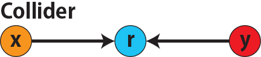

Colliderのnodeは因果関係の評価に影響を与えなさそうですが、**Colliderの上流に説明変数と目的変数がある場合には、Colliderの共変量をモデルに加えてはいけません**。

上記のChainと同様に、`r`がColliderのnode、`x`を原因、`y`を結果とし、`x`と`y`の関係を`x`のみの統計モデル（`x_model`）と`x`に`r`を加えたモデル（`xr_model`）で比較してみます。`x_model`では、概ね真の値（4）を評価できているに対し、`r`を加えたモデルではほぼ真の値を評価できていないことがわかります。

```{r, filename="Collider：統計モデル間の比較"}
d <- NULL

for(i in 1:1000){
  x <- seq(0, 10, by = 0.0625)
  y <- 4 * x + 10 + rnorm(161, 0, 5)
  r <- 5 * x + y + rnorm(161, 0, 5)
    
  d <- 
    rbind(
      d, 
      c(
        x_model = lm(y ~ x) |> _$coefficients |> _[2],
        xr_model = lm(y ~ x + r) |> _$coefficients |> _[2]
      )
    )
}

d |> summary()
```

ですので、Colliderの上流に説明変数と目的変数がある場合には、説明変数と目的変数の評価に大きなバイアスが生じるため、Colliderの共変量をモデルに加えてはいけません。

### DAG：dagittyパッケージ

ここまでDAGの基礎について述べてきましたが、上記の3つ（Chain、Fork、Collider）を複雑なDAGから見つけるのは大変ですし、より複雑な関係が共変量間にある場合、実際にその共変量を調整すべきか、すべきでないかよくわからない場合もあります。

このDAGの複雑な部分を整理し、どの共変量を調整すべきか明らかにしてくれる機能を持ったRのパッケージが[dagitty](https://www.dagitty.net/)[@dagitty_bib]です。`dagitty`を用いれば、ネットワークを表現する簡単な文字列を準備するだけで簡単にDAGを表示することができ、独立の関係にある共変量や、因果関係を示す際に調整が必要となる共変量をDAGから評価することができます。`dagitty`はRから利用するだけではなく、[Webアプリケーション](https://www.dagitty.net/dags.html)としてGUIで利用することもできます。

`dagitty`でDAGを作成する場合に用いる関数が`dagitty`関数です。`dagitty`関数は引数にDAGのネットワーク構造を指定する文字列を取ります。

`dagitty`関数の引数となる文字列では、`dag{}`というコマンドの`{}`の中にnodeとedgeの関係を表記していくことになります。このnodeとedgeの表記では、`A -> B`という形で表記するとnode Aが原因でnode Bが結果となるedgeを意味することになります。また、forkを表現する場合には、`A <- B -> C`という形で、両側に矢印が向くような文字列を入力します。DAGは「非巡回」ですので、下流から上流への矢印が生じないように注意してDAGを設定していきます。また、そのnode自身にedgeが向かうような「ループ」もDAGでは設定することはできません。

`dagitty`関数は`dag{}`のコマンドを返すだけの関数ですので、この返り値（以下の場合では`g1`）を用いてDAGを表示したり、共変量の関係を調べたりすることになります。

```{r, filename="dagitty関数"}
library(dagitty)

# dagコマンドの記載は37章で説明したGraphvizを基にしている
g1 <- dagitty(
  "dag {
    cdm <- age -> got
    distvct -> got
    tinc -> got
    any -> got
    tinc -> cdm
    hiv2004 -> cdm
    got -> cdm
  }")
```

#### dagitty：DAGの表示

次に、`dagitty`関数の返り値を用いてDAGを表示します。DAGの表示には、`graphLayout`関数と`plot`関数を用います。`dagitty`関数の返り値を`graphLayout`関数の引数に取った後、さらに`plot`関数の引数に取る必要があります。

```{r, filename="dagitty：graphLayout関数でグラフを表示する"}
set.seed(0)
g1 |> graphLayout() |> plot()
```

#### dagitty：共変量間の独立性を求める

DAGを評価し、共変量間の独立性を求めるための関数が`impliedConditionalIndependencies`関数です。`impliedConditionalIndependencies`関数は`dagitty`関数の返り値を引数に取ります。`impliedConditionalIndependencies`関数では、互いに独立の（相関が0で、因果関係がない）共変量AとBの場合には`A _||_ B`という表示が返ってきます。

また、条件付き独立は`A _||_ B | C`という形で示されます。この条件付き独立では、「Cが一致する場合、AとBは独立」である、要はCで調整するとAとBが独立であることを意味しています。

```{r, filename="impliedConditionalIndependencies関数で共変量の関係を表示する"}
g1 |> impliedConditionalIndependencies()
```

上記のChain、Fork、Colliderにおいてそれぞれ独立性を確認すると、以下のようになります。

```{r, filename="Chain、Fork、Colliderでの共変量の関係"}
# chain
dagitty("dag {A->B->C}") |> impliedConditionalIndependencies()

# Fork
dagitty("dag {A<-B->C}") |> impliedConditionalIndependencies()

# Collider
dagitty("dag {A->B<-C}") |> impliedConditionalIndependencies()
```

#### dagitty：調整すべき共変量を評価する

DAGから調整が必要な共変量の候補を抽出してくれる関数が`adjustmentSets`関数です。`adjustmentSets`関数の引数には`dagitty`関数の返り値、処置（説明変数）を指定する`exposure`引数、結果（目的変数）を指定する`outcome`引数、共変量の評価のルールに関わる引数である`effect`引数の4つを指定します。下の例では`effect="direct"`を指定しています。`effect="total"`を指定すると別の評価のルールでの共変量の候補を、`type="all"`を指定すると調整することができる共変量のすべてのセットを表示してくれます。

```{r, filename="adjustmentSets関数で共変量の関係を表示する"}
# effect = "direct"での結果（" single-door criterion"に従う方法）
adjustmentSets(g1, exposure = "got", outcome = "cdm", effect = "direct")

# effect = "total", type = "all"での結果（"back-door criterion"を改変したもの）
adjustmentSets(g1, "got", "cdm", type = "all", effect = "total")
```
:::{.callout-tip collapse="true"}
## effect = "direct"とeffect = "total"の違い

`adjustmentSets`関数のヘルプ（`?adjustmentSets`）に記載の通り、`effect = "direct"`では[@perković2015completegeneralizedadjustmentcriterion]、`effect = "total"`では[@Pearl2009_Causality_models_jp]（英語の原著は[@Pearl2009_Causality_models]）に従い調整すべき共変量を表示します。
:::

ただし、この結果で示される共変量は、「DAGで示した因果関係が正しい場合」に調整すべき共変量です。DAGで示した因果関係が間違っていれば、調整すべき共変量は変わります。`adjustmentSets`関数の結果の信頼性を高めるためには、共変量同士の因果関係を整理し、なるべく正確にDAGを作成することが重要となります。

## ベイジアンネットワーク

上記の通り、DAGを作成することで共変量を整理することができます。しかし、DAG自体には統計的にデータを処理する機能はありません。したがって、実際にデータを取った後、DAGだけではデータから因果関係の正しさを評価することはできません。

また、データをDAGに当てはめた場合に、各共変量がどの程度目的変数に影響を与えているのかを定量的に評価することもDAGだけではできません。

このような、データを取得した時にDAGの適切さや共変量の影響を大きさを定量的に評価するための手法の一つが、**ベイジアンネットワーク**です。ベイジアンネットワークでは、データを基にDAGの構造を推定することができます。また、推定したDAGの構造を用いたり、あらかじめDAGの構造を指定して、共変量間の統計的な関係を評価することができます。

### ベイジアンネットワーク：確率的な依存関係

ベイジアンネットワークでは、因果関係ではなく、**確率的な依存関係（Probabilistic Dependencies）**を評価します。上記の`dagitty`などを用いてDAGを作成する場合には、その作成者の知識や経験から「存在すると考えられる因果関係」を記載します。しかし、実際に因果性を評価するとなると、ここまで述べてきたように高いハードル（無作為化、共変量の調整など）があります。

ですので、DAGでBからAへの因果性を評価するために、CからBへの因果性を仮定すると、「CからBへの因果性」が真であることを説明しないといけません。DAGのedgeとして表現されているすべての因果性について評価するのは現実的でも論理的でもないので、ベイジアンネットワークでは因果関係ではなく、確率的な依存関係を評価します。この確率的な依存関係はベイジアンネットワークでは**条件付き確率**と**条件付き独立**で表現されます。

以下にDAGの形と条件付き確率の関係について簡単な例を示します。

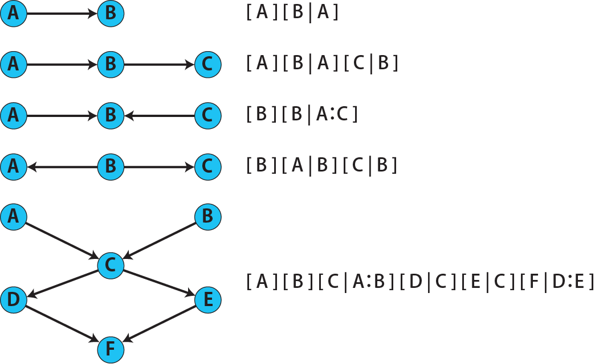{width=500}

Aが起こってAに依存したBが起こる場合（$A \rightarrow B$）、Aが起こる確率は$P(A)$、Bが起こる確率はAに依存するため$P(B|A)$と書けます。後者はAという条件の下でのBが起こる確率という意味です。Aが起こってBが起こる場合、確率の掛け算で全体の確率を示すことができるので、全体の確率は$P(A) \cdot P(B|A)$という掛け算で表すことができます。

上記の図では$P()$に当たるものを`[ ]`で表していますが、これは後ほど説明する`bnlearn`パッケージ[@bnlearn_bib; @bnlearn_bib2; @bnlearn_bib3; @bnlearn_bib4]で用いる表現方法です。

同様に$A \rightarrow B \rightarrow C$というChainでは、$P(A) \cdot P(B|A)$と、Cが起こる確率がBに依存していることを示す$P(C|B)$を掛け、全体としては$P(A) \cdot P(B|A) \cdot P(C|B)$という形で表すことになります。

また、$A \rightarrow B \leftarrow C$という形のForkでは、Bが起こる確率はAとCに依存するため、$P(B|A, C)$と表現します。`bnlearn`パッケージでは`[B | A:C]`という形で$P(B|A, C)$を表記します。

このルールに従うと、より複雑なネットワークでもその構造を条件付き確率の掛け算で表現することができます。この条件付き確率の連鎖を評価するのがベイジアンネットワークです。

### ベイジアンネットワーク：ネットワーク構造の推定

ベイジアンネットワークでは、あらかじめネットワーク、DAGを準備した上で上記の条件付き確率を計算することができますが、データからDAGの構造を推定することもできます。DAGの構造決定の手法には、大きく分けると**条件付き独立性の検定（conditional independence tests）**を用いて行うものと、DAGの**スコア**を評価して行うものの2種類があります。

#### 条件付き独立性の検定

条件付き独立性の検定は、共変量の下で2つの変量が独立かを評価するための検定手法です。

条件付き独立性の検定は、2つの変量が「独立である」を帰無仮説、「独立ではない」を対立仮説とした検定で、帰無仮説が棄却された場合には2つの変量間に確率的な依存関係がある、つまりnodeをedgeで繋ぐことが妥当であると判断されます。帰無仮説が棄却されなかった場合には2つの変量は独立かもしれないので、edgeでは繋がないこととします。この条件付き独立性の検定を因子間で評価することで、DAGの構造を決めましょう、というのがDAGの構造推定の基礎となります。

少しわかりにくいので、以下に簡単な例を説明します。

2つの変数$r$と$y$が独立であるかどうかを評価するとします。帰無仮説は「変数$x$の下で$r$と$y$が独立である」とします。帰無仮説を式で表すと以下のようになります。独立であれば$r$と$y$をDAG上では矢印で繋ぎません（$r \not\rightarrow y$）。

[$$r \perp y|x$$]{style="font-size: 200%;"} 


対立仮説は「変数$x$の下で$r$と$y$が独立ではない」、とします。対立仮説を式で表すと以下のようになります。対立仮説を採用した場合には、$r$と$y$をDAG上で矢印で繋ぎます（$r \rightarrow y$）。

[$$r \not\perp y|x$$]{style="font-size: 200%;"} 

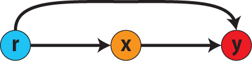

$r$、$x$、$y$の各変数についてデータが取れた時、このデータに対して条件付き独立性の検定を行い、DAGの矢印を繋ぐかどうかを推定していきます。

#### DAGのスコア

もう一つの方法は、DAGに**スコア**をつけ、そのスコアが最も優れているDAGを構造の推定結果として得る方法です。このスコアは[30章](chapter30.qmd#aicによるモデル選択)で説明したAICでのモデル選択に似たものです。AICによるモデル選択では、AICが最小となるモデルを採用しました。DAGの構造推定でも同様に、AICに当たるようなスコアが最小となる構造をDAGの推定結果とします。

### ベイジアンネットワーク：bnlearnパッケージ

Rでベイジアンネットワークの演算を行うためのライブラリが、上ですでに紹介した`bnlearn`パッケージ[@bnlearn_bib]です。`bnlearn`パッケージでは、

- DAGの構造を推定する
- DAGの構造を指定する
- 推定・指定したDAGにおける条件付き確率を演算する

といったことができます。`bnlearn`には他にもたくさんの機能がありますが、このテキストでは上記の3つについて演算の方法を簡単に紹介します。

#### bnlearn：DAGの構造を決定する

まずは`bnlearn`パッケージをインストールします。`bnlearn`で作成したDAGを表示するために、[Bioconductor](https://www.bioconductor.org/)で提供されている`graph`パッケージと`RgraphViz`パッケージを同時にインストールしておきます。

```{r, filename="bnlearnパッケージのインストール"}
pacman::p_load(bnlearn)
```

```{r, eval=FALSE}
pacman::p_load(BiocManager)
install(c("graph", "Rgraphviz"))
```

次に、サンプルデータを準備します。以下のスクリプトは`bnlearn`の[解析例](https://www.bnlearn.com/examples/fit/)に示されているものです。`learning.test`は`bnlearn`に登録されているデータセットで、6列のデータフレームです。各列にはA〜Fの名前がついており、すべての列が因子、つまりカテゴリカルデータとして登録されています。この各列をnodeの変数として用います。

```{r, filename="サンプルデータ（learning.test）"}
data(learning.test)
summary(learning.test)
```

:::{.callout-tip collapse="true"}
## ベイジアンネットワークに用いるデータ

ベイジアンネットワークでは、`learning.test`のようなカテゴリカルデータのみのデータ、正規分布する連続変数のみのデータ、カテゴリカルデータと正規分布する連続変数の混じったデータの順に解析が難しくなっていきます。このため、解析例としてまずはカテゴリカルデータのみのデータを用いることが多いようです。教科書などでもカテゴリカルデータのみのデータ、正規分布する連続変数のみのデータ、カテゴリカルデータと正規分布する連続変数の混じったデータの順で解析例が解説されていることがあります。

このテキストではカテゴリカルデータのみを対象として説明します。正規分布する連続変数、カテゴリカルデータ・連続変数の混じったデータに関する解析については、参考文献（[Rと事例で学ぶベイジアンネットワーク](https://www.amazon.co.jp/R%E3%81%A8%E4%BA%8B%E4%BE%8B%E3%81%A7%E5%AD%A6%E3%81%B6%E3%83%99%E3%82%A4%E3%82%B8%E3%82%A2%E3%83%B3%E3%83%8D%E3%83%83%E3%83%88%E3%83%AF%E3%83%BC%E3%82%AF%E3%80%94%E5%8E%9F%E8%91%97%E7%AC%AC2%E7%89%88%E3%80%95-Marco-Scutari/dp/4320114655)[@1971993809756830770]）などを参照ください。
:::

次に、上記の`learning.test`のデータを用いてDAGの構造を推定します。DAGの構造の推定には`iamb`関数を用います。この関数は引数にデータフレームを取り、ネットワーク構造の情報を含む`bn`クラスのオブジェクトを返します。

```{r, filename="データからDAGを推定する"}
# データからDAGを推定するアルゴリズム（Incremental Association）に対応した関数
# 他のアルゴリズムについてはhttps://www.bnlearn.com/documentation/man/structure.learning.html を参照
pdag <- iamb(learning.test)

# 返り値（pdag）のクラスは"bn"
class(pdag)

# DAG構造の情報が含まれる
pdag
```

この例では`iamb`関数（Incremental Association Algorithmを用いた手法）でDAGの構造を推定しています。`bnlearn`には`iamb`関数の他、多数の[構造決定のアルゴリズム](https://www.bnlearn.com/documentation/man/structure.learning.html)の関数が準備されています。

:::{.callout-tip collapse="true"}
## 構造決定のアルゴリズムとその種類について

構造決定のアルゴリズムには、上記の条件付き独立性の検定を用いるもの（Constraint-Based Learning Algorithms）、スコアを用いるもの（Score-Based Learning Algorithms）、検定とスコアを両方用いるもの（Hybrid Learning Algorithms）などがあります。

アルゴリズムによって正確性や演算時間は異なります。`bnlearn`で引用されている[プレゼンテーション](https://www.bnlearn.com/about/slides/slides-pgm18.pdf)では、データ数が少ない場合にはConstraint-Basedのアルゴリズムの正確性が高く、Score-Basedのアルゴリズムの演算が速いと記載されています。
:::

`bn`オブジェクトに登録されているDAGの構造を表示する場合には、`graphviz.plot`関数を用います。

```{r, filename="データからDAGを推定する", message=FALSE}
# 推定したDAGを表示（rgraphvizパッケージを利用）
library(Rgraphviz)
graphviz.plot(pdag)
```

上記の通り、`iamb`関数などを用いることで、データからDAGの構造を推定することができます。ただし、上記のAとBの間のedgeは矢印とはなっていません。DAGの構造推定では、このように方向が定まらないedgeが生じる場合があります。

DAGの構造推定では、非巡回となるようedgeの方向が定まるルールになっており、edgeがどちら向きでも巡回とならない場合には、方向が定まらなくなります。このように、一部のedgeが有向ではないDAGのことを**Partial Directed Acyclic Graph（PDAG）**と呼びます。

#### bnlearn：WhitelistとBlacklistを指定する

アルゴリズムを用いたDAGの構造推定では、推定前に持っている知識（例えば、CはDより時間的に後に起こることが明らかである場合や、以前の研究で因果関係がすでに示されている場合）は構造の評価に加わっていません。事前の知識から明らかにedgeで繋ぐべき・繋ぐべきでないedgeを指定できる場合、whitelist（繋ぐべきedge）、blacklist（繋ぐべきでないedge）をそれぞれ指定した上でDAGの構造を推定することができます。

DAGを推定する関数では、あらかじめedgeを繋ぐnode（`whitelist`）、edgeを繋がないnode（`blacklist`）をそれぞれ引数に設定することができます。この2つの引数を設定すれば、DAGの構造の推定に解析者が持っている事前の知識を加えて評価することができます。

`whitelist`、`blacklist`引数にはいずれもデータフレームを指定します。このデータフレームでは、列名が`from`と`to`の2列となるように設定します。

```{r, filename="あらかじめ繋ぐ・繋げないnodeを指定する"}
white_list <- data.frame(from = "D", to = "E") # D -> Eを設定
black_list <- data.frame(from = "B", to = "E") # B -> Eは設定しない

iamb(learning.test, whitelist = white_list, blacklist = black_list) |> graphviz.plot()
```

#### bnlearn：条件付き独立性の検定

条件付き独立性の検定を行うための関数が`ci.test`です。`ci.test`関数は個別のnode・edgeの独立性を評価する場合に利用できます。`x`と`y`が独立性を評価する変数を指定する引数、`z`が条件に当たる変数を指定する引数です。`data`引数にデータフレームを指定し、`x`、`y`、`z`の3つには文字列でデータフレームの列名を指定します。

以下の例では、`learning.test`データセットの各列の条件付き独立性を評価しており、$E$と$A$は$B$の条件下で独立であり、$E$と$F$は$B$の条件下で独立ではないという結果を得ています。したがって、$A \rightarrow E$のedgeはなく、$F \rightarrow E$のedgeは繋げられている形になります。

```{r, filename="bnlearn：条件付き独立性の検定"}
# EとAがBの条件下で独立であることを評価する
ci.test(x = "E", y = "A", z = "B", data = learning.test) 

# EとFがBの条件下で独立であることを評価する
ci.test(x = "E", y = "F", z = "B", data = learning.test) 
```

#### bnlearn：ネットワークのスコア

`bnlearn`ではネットワークのスコアを計算し、ネットワーク全体でデータがどの程度正確に評価できているのかを評価することができます。このスコアとして、ベイジアンネットワークでは**BIC（bayesian information criteria）**を用いるのが一般的です。BICは30章で説明した[AIC](Chapter30.qmd#aicによるモデル選択)と同じく尤度とパラメータの数からなる指標で、より小さいBICを持つDAGでは、よりうまくデータを説明できているとする指標となります。

Rでネットワークのスコアを評価するための関数が`score`関数です。`score`関数はDAGを示す変数`x`と各nodeに当たる変数のデータ`data`の2つを引数に取り、ネットワークのスコアを数値で返す関数です。ただし、このスコアは-2で割られているため、スコアが小さいものではなく、**スコアが大きいほどデータをうまく説明できるDAG**になっています。

```{r, filename="ネットワークのスコアを計算する：score関数"}
score(pdag, data = learning.test)
```

以下の例では、`iamb`関数で推定したDAGと、`iamb`関数に`whitelist`と`blacklist`を指定して推定したDAG、私が適当に作ったDAGの3つのスコアを比較しています。`iamb`関数で推定したDAGのスコアが最も大きく、データを最もうまく説明できていることがわかります。

```{r, filename="DAGのスコアを比較する：比較するDAGを準備する"}
pdag <- iamb(learning.test)
pdag <- set.arc(pdag, from = "A", to = "B")
pdag2 <- iamb(learning.test, whitelist = white_list, blacklist = black_list)
pdag2 <- set.arc(pdag2, from = "A", to = "B")
pdag3 <- model2network("[A][B][C|A:B][D|C][E|C][F|C:D:E]")
```

```{r}
#| layout-ncol: 3
#| code-fold: true

pdag |> bnlearn::graphviz.plot(main = "iambで推定したDAG")
pdag2 |> bnlearn::graphviz.plot(main = "whitelist・blacklistを指定したDAG")
pdag3 |> bnlearn::graphviz.plot(main = "適当な構造のDAG")
```

```{r, filename="DAGのスコアを比較する"}
c(
  score(pdag, learning.test),
  score(pdag2, learning.test),
  score(pdag3, learning.test)
)
```

DAGのスコア評価にはBICがよく用いられますが、他の計算手法を用いてスコアを演算する場合もあります。以下の例では、`type`引数を指定することで、BIC、AIC、BDE（Bayesian Dirichlet equivalent score）を計算しています。`bnlearn`ではこの3つの他にも数多くの演算方法でDAGのスコアを評価することができます。`bnlearn`で計算できるスコアの種類については[`bnlearn`のスコア計算の例](https://www.bnlearn.com/documentation/man/network.scores.html)を参照して下さい。

```{r, filename="様々なスコア計算の手法"}
score(pdag, learning.test, type = "bic") # BIC
score(pdag, learning.test, type = "aic") # AIC
score(pdag, learning.test, type = "bde") # Bayesian Dirichlet equivalent score (BDE)
```

また、`by.node=TRUE`を指定すると、各ノードごとのスコアを計算することができます。この各ノードのスコアを足し合わせるとDAG全体のスコアと同じになります。

```{r, filename="各ノードのスコアを計算する"}
score(pdag, learning.test, by.node = TRUE)

# 足し合わせると上記のBICのスコアと一致する
score(pdag, learning.test, by.node = TRUE) |> sum() 
```

#### bnlearn：DAGの構造を指定する

`bnlearn`では、DAGの構造を推定するだけではなく、後ほどの条件付き確率の演算に用いるためのDAGを作成し、そのDAGを前提として条件付き確率を推定することもできます。

DAGの指定には、46章で説明した[edge listから作成する方法](chapter46.qmd#edge listからグラフを作成する)、[adjacency matrixから作成する方法](chapter46.qmd#adjacency matrixからグラフを作成する)の他に、上で少し説明した`[B | A:C]`という形の条件付き確率の積でDAGを指定する方法の主に3つを用いることができます。この3つの方法について、簡単に説明していきます。

##### edge listから作成する方法

まずはedge listからDAGを作成する方法を説明します。

edge listやadjacency matrixでDAGを作成する場合、まずは空のグラフを作成します。空のグラフは`empty.graph`関数で作成します。`empty.graph`は文字列のベクターを引数に取り、そのベクターの要素がnodeとなるようなedgeなしのグラフを返します。

```{r, filename="空のグラフを作成する", fig.height=2}
e = empty.graph(LETTERS[1:6])
e |> graphviz.plot()
```

次に、edge listを作成します。edge listは、[46章](chapter46.qmd#edge listからグラフを作成する)で説明したものと全く同じです。1列目にfrom、2列目にtoとなるnodeを指定し、fromからtoに向かうedgeを表現します。

```{r, filename="edge listを作成する"}
el <- 
  matrix(
    c("A", "B", # A->Bのedgeを指定
      "B", "C", 
      "A", "C", 
      "C", "D",
      "D", "E",
      "E", "F",
      "D", "F"
      ),
    ncol = 2,
    byrow=TRUE # byrow引数を設定するとわかりやすい
  )

colnames(el) <- c("from", "to")

el
```

最後に`arcs`関数を用いて空のグラフにedge listを設定します。`arcs`関数は上で作成した空のグラフや、edge listに指定したのと同じnodeが設定されたグラフを引数に取ります。この`arcs`関数にedge listを代入することで、edge listに従ったedgeを作成することができます。

```{r, filename="edge listを設定する"}
arcs(e) <- el
e |> graphviz.plot()
```

##### adjacency matrixから作成する方法

次に、adjacency matrixからDAGを作成する方法を説明します。edge listと同様に、adjacency matrixについても[46章](chapter46.qmd#adjacency matrixからグラフを作成する)で説明しています。adjacency matrixは、行方向にfrom、列方向にtoのnodeを指定し、値が1であればedgeあり、0であればedgeなしを意味するような行列のことです。

DAGではループ（fromとtoが同じであるedge）や巡回は指定できないので、下三角行列の要素（対角成分の下側）は必ず0になります。また、DAGでは「同じ因果関係が2つ以上存在する」こともありませんので、行列の要素が1より大きい値をとることもありません。

```{r, filename="adjacency matrixを作成する"}
# 対角成分より下はすべて0でないといけない
ajm <- 
  matrix(
    c(0, 1, 0, 1, 0, 0, 
       0, 0, 1, 0, 1, 0, 
       0, 0, 0, 1, 0, 0, 
       0, 0, 0, 0, 1, 1, 
       0, 0, 0, 0, 0, 1, 
       0, 0, 0, 0, 0, 0
      ),
    ncol = 6,
    byrow=TRUE
  )

colnames(ajm) <- LETTERS[1:6]
rownames(ajm) <- LETTERS[1:6]

ajm # A行B列の1が、A->Bを意味する
```

adjacency matrixでedgeを指定する場合も、edge listの場合と同様に空のグラフをまず作成します。この空のグラフを`amat`関数の引数に取り、`amat`関数にadjacency matrixを代入することでedgeを指定することができます。

```{r, filename="adjacency matrixでedgeを指定する"}
amat(e) <- ajm
e |> graphviz.plot()
```

##### 条件付き確率の積から作成する方法

上に述べた通り、ベイジアンネットワークでは、条件付き確率の積でそのグラフの構造を表現することがあります。`bnlearn`パッケージでは、この条件付き確率の積を文字列で表現したmodel stringというものを用います。model stringは以下のように、`bn`のオブジェクトを`modelstring`関数の引数に取ることで表示させることができます。

```{r, filename="model stringを表示する"}
modelstring(e)
```

上記の例では、$A \rightarrow B$、$B \rightarrow C$などのedgeがグラフに設定されていることを示しています。上流に2つのnodeがある場合には、`"[D|A:C]"`という形で記載します。この`"[D|A:C]"`では、$A \rightarrow D$、$C \rightarrow D$の2つのedgeが存在することを示しています。

このmodel stringを用いてグラフを作成するための関数が、`model2network`関数です。`model2network`関数は文字列のmodel stringを引数に取ります。

```{r, filename="model2networkでmodel stringからDAGを作成する"}
model2network("[A][B][C|A:B][D|C][E|C][F|C:D:E]") |> graphviz.plot()
```

#### bnlearn：条件付き確率の評価

`bnlearn`では、DAGの構造を推定、もしくは指定した後、上記の条件付き確率を評価することができます。

条件付き確率の評価には`bn.fit`関数を用います。`bn.fit`関数は`score`関数と同様に、第一引数にDAGの構造を推定/指定した`bn`オブジェクト、第二引数にデータを指定したデータフレームを取ります。また、`method`引数には計算の方法を指定します。以下の例では、`method="mle"`、最尤法で確率の計算を行います。

```{r, filename="条件付き確率の推定"}
# pdag2dag：方向が無いedgeの方向を定める関数
dag = pdag2dag(pdag, ordering = c("A", "B", "C", "D", "E", "F"))
fit <- bn.fit(dag, learning.test, method = "mle")
```

`bn.fit`関数の返り値には、それそれのnodeに当たる変数における条件付き確率の計算結果が含まれています。以下では、変数のうちDに関する条件付き確率のみ表示しています。Dに関する条件付き確率は条件をCとした時、つまりDAGにおけるDの上流のnodeを条件とした確率として表示されます。

```{r, filename="推定結果の表示：ノードD"}
# Cの条件付き確率として表示される
fit$D
```

##### 演算した条件付き確率の表示

上記の通り、条件付き確率は`bn.fit`関数の返り値として表示させることができます。しかし、数値のみを見てDAGの構造と条件付き確率の関係を捉えるのは難しいです。`bnlearn`では、グラフ作成パッケージである`lattice`[@lattice_bib]を用いてグラフの構造と条件付き確率を視覚的に捉えやすくするための関数をいくつか備えています。

まずは`bn.fit.barchart`関数から紹介します。`bn.fit.barchart`関数は`bn.fit`関数で計算した条件付き確率を`lattice`の棒グラフで示してくれる関数です。棒グラフの上に記載されている変数が条件付き確率の条件、グラフは条件付き確率をそれぞれ示したものとなります。

```{r, filename="推定結果の表示：latticeで棒グラフを表示する"}
fit$D |> bn.fit.barchart()
```

また、`graphviz.chart`関数は上記の`bn.fit.barchart`関数と同様の条件付き確率に関する棒グラフをネットワークの構造を反映させた上で描画してくれる関数です。

```{r, fig.height = 7, filename="推定結果の表示：graphviz.chart関数"}
pacman::p_load("gRain")
graphviz.chart(fit, scale=c(1.1, 2))
```

`bn.fit`関数の結果である条件付き確率だけではネットワーク上のnode間の関係を捉えるのは難しいですが、`bn.fit.barchart`や`graphviz.chart`を駆使することで関係を視覚的に捉えることができます。

### bnlearn：その他の機能について

以上の通り、`bnlearn`の機能の基礎について簡単に述べてきましたが、上に紹介した手法は`bnlearn`のほんの一部について紹介したに過ぎません。`bnlearn`には、さらに以下のような演算に関する機能が備わっています。

このテキストですべてを説明することはできませんので、さらに詳しく`bnlearn`の機能を学びたい場合には、[文献](reference.qmd#因果推論)を参考にして下さい。

:::{.callout-tip collapse="true"}
## 条件付き確率とDAG

ベイジアンネットワークで評価の対象となるのは、主に条件付き確率と独立の2つとなります。以下に具体的な例を示して、ベイジアンネットワークで評価しているものについて説明していきます。

### 独立 {.unnumbered}

まずは、独立について簡単に説明します。独立については上で少し紹介しました。以下では、性別と年齢を使って独立について見ていきます。

性別が男女半々、年齢が49歳以下が4割、50歳以上が6割の集団があったとします。男性と女性で年齢の割合が同じ、つまり性別が年齢の構成に影響しない場合には、以下のように男性でも女性でも、49歳以下が4割、50歳以上が6割となります。

```{r, filename="年齢と性別が独立の場合の例"}
set.seed(0)

sex <- sample(
  rep(c("male", "female"), 5000),
  10000, replace = FALSE
) |> factor()

age <- sample(
  rep(c("under49", "over50"), c(4000, 6000)),
  10000, replace = FALSE
) |> factor()

table(data.frame(sex, age))
```

このように、性別が年齢の割合に影響を与えず、逆に年齢が性別の割合にも影響を与えない場合、性別と年齢は独立である、といいます。

性別と年齢が独立である場合、女性で50歳以上の人の割合は、女性である割合と、50歳以上の人の割合のかけ算で求まります。つまり、

女性で50歳以上の割合=女性の割合×50歳以上の割合

となります。数式で書くと、

$P(sex=female, age=over50)=P(sex=female)  \cdot P(age=over50)$

となります。Pは確率を、かっこの中身はそれぞれの条件（女性や50歳以上であること）を示します。

もう少し一般化し、$P(sex=female)$を$P(A)$、$P(age=over50)$を$P(B)$とします。

2つの変量$A$と$B$が独立のとき、$A$と$B$の同時確率$P(A,B)$は$P(A)$と$P(B)$の積で表されます。

$P(A,B)=P(A) \cdot P(B)$

この、「同時確率を個々の確率の積で表すことができる」というのが独立の定義になります。

2変量が独立の場合には、ベイジアンネットワークのDAGにおいてnodeの間にedgeは引かれません。

```{r, filename="性別と年齢が独立の場合のグラフ", fig.height=2}
data.frame(sex, age) |> iamb() |> graphviz.plot()
```

### 2変量が独立ではない場合 {.unnumbered}

次に、性別と年齢が独立ではない場合について考えます。上の例では性別に関わりなく年齢の割合は変わらない、独立の場合を仮定しました。しかし、女性は男性に比べ出生数が少なく、寿命が長いです。ですので、女性と男性で比べると、女性の方が若い人が少なく、高齢者は多くなります。

仮に、少し極端ですが、男性では49歳以下の割合が6割、50歳以上の割合が4割、女性では49歳以下の割合が4割、50歳以上の割合が6割であるとすると、10000人の性別と年齢の構成は以下で示した表のようになります。

```{r, filename="性別と年齢が独立ではない場合の例"}
age2 <-
  if_else(
    sex == "male",
    sample(rep(c("under49", "over50"), c(6000, 4000))),
    sample(rep(c("under49", "over50"), c(4000, 6000))),
  ) |> factor()

table(data.frame(sex, age2))
```

2変量が独立であるかどうかを評価する場合には、29章で説明した[カイ二乗検定の独立性の検定](chapter29.qmd#適合性の検定と独立性の検定)を用います。独立性の検定では、帰無仮説は「2つの変量は独立である」とします。性別と年齢をカイ二乗検定で評価すると、p値が0.05以下となり帰無仮説が棄却され、性別と年齢は独立ではないことがわかります。

```{r, filename="カイ二乗検定で独立性を評価する"}
chisq.test(table(data.frame(sex, age2)))
```

ここで男女を合わせた年齢の構成比は、49歳以下が5割、50歳以上が5割となります。ですので、独立の場合に示した50歳以上の割合である$P(age=over50)$は0.5となります。女性の割合$P(sex=female)$は0.5ですので、性別と年齢が独立であるとすると、女性で50歳以上の割合$P(sex=female, age=over50)$は

$$P(sex=female, age=over50)=P(sex=female) \cdot P(age=over50)=0.5 \cdot 0.5=0.25$$

となるはずです。しかし、$P(sex=female, age=over50)$は実際には0.25ではなく、0.3となります。つまり、独立の定義である$P(A,B)=P(A) \cdot P(B)$は成立せず、性別と年齢は独立ではないことがわかります。

全体のうち、女性で50歳以上の割合$P(sex=female, age=over50)$は、女性である割合$P(sex=female)$と、女性のうち50歳以上の割合$P(age=over50|sex=female)$の積で表すことができます。

$$P(sex=female, age=over50)=P(sex=female) \cdot P(age=over50|sex=female)$$

上記の独立の場合と同様に一般化すると、上の式の右辺は`bnlearn`でedgeをつないだときの以下の式と同じになります。

$$P(A) \cdot P(B|A)$$

上記のように性別と年齢が独立ではない場合、DAGの構造を推定すると性別と年齢はedgeで繋がることになります。

```{r, filename="性別と年齢が独立ではない場合のグラフ"}
data.frame(sex, age2) |> iamb() |> graphviz.plot()
```

上記の例では「女性で50歳以上」である割合について考えていましたが、「女性で50歳以上」と「50歳以上で女性」は同じ意味を持ちます。数式で書くと以下の式のようになります。データを見ただけでは性別が原因とも、年齢が原因とも言い難いわけです。

$$P(sex=female) \cdot P(age=over50|sex=female)=P(age=over50) \cdot P(sex=female|age=over50)$$

$P(sex=female)$を$P(A)$、$P(age=over50)$を$P(B)$として一般化すると、ベイズの定理と同じ式になります。

$$P(A) \cdot P(B|A)=P(B) \cdot P(A|B)$$

つまり、独立ではないことがわかったとしても、DAGでは$A \rightarrow B$と$B \rightarrow A$は見分けがつきません。ですので、上のDAGではedgeに方向がない、undirectedなPDAGになっています。

### 条件付き独立性の検定とedge {.unnumbered}

次に、条件付き独立性の検定が棄却される場合の例としてChainについて考えてみます。

上記の性別、年齢が独立ではない場合について、50歳以上の人は7割が共和党に、49歳以下の人は3割が共和党に投票したとしましょう。

この時、年齢は投票先とは独立ではありません。性別は年齢とは独立ではないため、性別によって投票先が異なるように見えます。

```{r, filename="Chainの条件付き確率の例"}
vote <-
  if_else(
    age2 == "over50",
    sample(rep(c("Republican", "Democratic"), c(7000, 3000))),
    sample(rep(c("Republican", "Democratic"), c(3000, 7000))),
  ) |> factor()

table(data.frame(sex, age2, vote))
```

上で説明したとおり、性別と年齢が独立ではなく、年齢と投票先が独立ではない場合には、この3変量の関係はChain、もしくは性別が年齢と投票先の両方と独立ではない、交絡の関係のいずれかとなります。

年齢の条件をつけたときに性別と投票先が独立であるかを評価する、条件付き独立性の検定を用いると、性別・年齢・投票先の関係がChainと交絡のいずれであるかを判定することができます。

まずは投票先や性別を条件としたときの条件付き独立性の検定を見ていきます。年齢と性別、年齢と投票先はいずれも、「独立である」という帰無仮説がが棄却され、条件付き独立ではないことがわかります。

```{r, filename="年齢と性別・年齢と投票先の条件付き独立の検定"}
ci.test(x = "age2", y = "sex", z = "vote", data = data.frame(sex, age2, vote))
ci.test(x = "age2", y = "vote", z = "sex", data = data.frame(sex, age2, vote))
```

一方で年齢を条件とした場合、帰無仮説は棄却されず、投票先と性別は独立ではないとは言えません。したがって、性別と投票先の間のedgeはなく、性別ー年齢ー投票先はChainの関係にあることがわかります。

```{r, filename="投票先と性別の条件付き独立の検定"}
ci.test(x = "vote", y = "sex", z = "age2", data = data.frame(sex, age2, vote))
```

このchainについてDAGの構造を推定すると、方向は出てきません。したがって、ChainにおいてDAGでの方向は上記のような条件付き確率では決定されません。

```{r, filename="Chainのグラフを作成する"}
data.frame(sex, age2, vote) |> 
  iamb() |>
  graphviz.plot()
```

#### edgeの方向を決定する {.unnumbered}

上記のうち、50歳以上の女性で共和党に投票した人の割合を数式で表記すると、

$$P(sex=female) \cdot P(age=over50|sex=female) \cdot P(vote=republican|age=over50)$$

となります。この式を一般化し、$P(sex=female)=P(A)$、$P(age=over50|sex=female)=P(B|A)$、$P(vote=republican|age=over50)=P(C|B)$とすると、

$$P(A) \cdot P(B|A) \cdot P(C|B)$$

この式をmodelstringからグラフにしてみると、以下のようになります。

```{r, filename="P(A)P(B|A)P(C|B)のグラフ"}
model2network("[A][B|A][C|B]") |> graphviz.plot()
```

一方、ベイズの定理より、$P(A) \cdot P(B|A)=P(B) \cdot P(A|B)$なので、

$$P(A) \cdot P(B|A) \cdot P(C|B) = P(B) \cdot P(A|B) \cdot P(C|B)$$

この式の右辺（$P(B) \cdot P(A|B) \cdot P(C|B)$）をmodelstringとしてグラフとすると、Forkになります。したがって、ChainとForkは条件付き確率では見分けがつきません。

```{r, filename="P(B)P(A|B)P(C|B)のグラフ"}
model2network("[B][A|B][C|B]") |> graphviz.plot()
```

同様に、ベイズの定理より$P(B) \cdot P(C|B)=P(C) \cdot P(B|C)$なので、

$$P(B) \cdot P(A|B) \cdot P(C|B) = P(C) \cdot P(B|C)\cdot P(A|B)$$

やはり右辺（$P(C) \cdot P(B|C)\cdot P(A|B)$）をmodelstringでグラフにすると以下のようになります。

```{r, filename="P(C)P(B|C)P(A|B)のグラフ"}
model2network("[C][B|C][A|B]") |> graphviz.plot()
```

ですので、上記の3つの例より、$A \rightarrow B \rightarrow C$、$A \leftarrow B \rightarrow C$、$C \rightarrow B \rightarrow A$は条件付き確率だけを見ていると見分けがつかないことになります。

では、Colliderはどうでしょうか？以下にColliderの例を示します。

```{r, filename="colliderのデータを作成する"}
d <- data.frame(sex, age) |> 
  mutate(
    sg = case_when(
      sex == "male" & age == "under49" ~ 1,
      sex == "female" & age == "under49" ~ 2,
      sex == "male" & age == "over50" ~ 3,
      sex == "female" & age == "over50" ~ 4,
    )
  )

v <- d$sg |> factor() |> table()

d$sg[d$sg == 1] <- rbinom(v[1], 1, 0.7)
d$sg[d$sg == 2] <- rbinom(v[2], 1, 0.4)
d$sg[d$sg == 3] <- rbinom(v[3], 1, 0.8)
d$sg[d$sg == 4] <- rbinom(v[4], 1, 0.5)

d$vote <- if_else(d$sg == 1, "Republican", "Democratic") |> factor()
d$sg <- NULL

d |> select(vote, age, sex) |> table()
```

```{r, filename="Colliderの場合のDAGの推定結果"}
d |> 
  select(sex, age, vote) |> 
  iamb() |>
  graphviz.plot()
```

Colliderのデータでは、`iamb`関数でDAGの構造を推定すると方向が決まったedgeが表示されます。全体の確率は、上の例と同様に一般化すると、以下のような式で表すことができます。

$$P(A) \cdot P(B) \cdot P(C|A, B)$$

この式はベイズの定理で変換しても、他の3つと一致させることができず、ChainやForkと同じとは見なすことはできません。ベイジアンネットワークではこのようなColliderを**v-structure**と呼び、[edgeの方向を決める時に重要である](https://ftp.cs.ucla.edu/tech-report/1991-reports/910020.pdf)とされています[@verma2022equivalence]。

まとめると、以下の図のように、3変数の関係ではv-structureだけが統計的には異質であり、したがって方向を決めるきっかけとして用いられます。

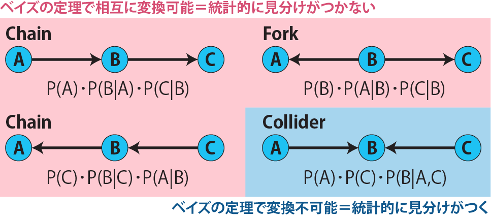

### v-structure以外のedgeの方向を決める {.unnumbered}

v-sturcture以外のedgeでは基本的に2変量の関係だけでは方向が定まりません。したがって、v-sturctureによって方向が定まったedgeの情報から、方向の決まっていないedgeの方向を決める必要があります。この方法のことを**[Meek's rule](https://www.cmu.edu/dietrich/philosophy/docs/tech-reports/61_Meek.pdf)**と呼ぶことがあるようです[@meek1995complete]。このMeek's ruleという名前は文献に示したレポートの著者から来ていますが、元々は[こちらの論文](https://arxiv.org/pdf/1303.5435)[@verma1992algorithm]に記載されていたルールになります。

ルールは以下の図に示す4つとなります。図に示した通り、いずれのルールもv-structureまたは巡回となることを避けると一意に方向が決まる形となっています。


上記のv-sturcture、Meek's ruleでも方向が決まらなかった場合、そのパスはundirected、方向が決まらないことになります。

### 方向が決まらない場合のbn.fitの演算 {.unnumbered}

方向が決まっていないedgeを持つDAG（PDAG）を`bn.fit`関数の引数に取ると、エラーが出て結果が表示されません。

```{r, error=TRUE, message=FALSE, warning=FALSE, filename="方向が決まらないedgeを含むとエラーが出る"}
bn.fit(
  data.frame(sex, age, vote) |> iamb() , 
  data.frame(sex, age, vote), 
  method = "mle")
```

したがって、`bn.fit`関数の引数にPDAGを指定したい場合には、あらかじめedgeの方向をすべて定めておく必要があります。

```{r, filename="edgeの方向を定めると演算できる"}
bn.fit(
  data.frame(sex, age, vote) |> 
    iamb(whitelist = data.frame(from = c("sex", "age"), to = c("age", "vote"))) , 
  data.frame(sex, age, vote),
  method = "mle")
```

:::

## 構造方程式モデリング（Structural equation modeling）

**構造方程式モデリング**（Structural Equation Modeling、SEM、共分散構造分析とも呼ばれる）はベイジアンネットワークと同様にネットワークを用いて変数同士の因果関係を評価する手法の一つです。

構造方程式モデリングでは変数同士の関係を取り扱い、データとして取得できる変数だけでなく、データとしては取得できない変数である、**潜在変数（latent variables）**をネットワークに組み込み、評価します。

潜在変数（latent variables）とは、我々が評価したいと思うことがあるけれども、実際に数値として評価することは難しいもののことを指します。例えば、やる気や元気、町の住みやすさや清潔度、治安などは各個人や各都市によって度合いが異なることは分かりますが、具体的に数値として測定することはできません。学校や会社でやる気がない人がいても、「やる気… たったの5か… ゴミめ…」[@dragonball_17_bib]とは評価できません。

構造方程式モデリングでは、実際に測定できる変数（測定結果）と共に、このやる気や元気などの潜在変数をネットワークに組み込むことで、潜在変数自体を評価するとともに、潜在変数とデータとして取得できる変数の間の関係を評価します。

潜在変数を評価する別の手法として、32章で説明した[因子分析](chapter32.qmd#因子分析)があります。因子分析の例では、学校の成績から「理系度」・「文系度」を評価する例を挙げましたが、「理系度」・「文系度」が潜在変数、学校の成績が測定可能な変数に当たります。構造方程式モデリングはこの因子分析に線形回帰を持ち込んだような統計手法となっています。

### 構造方程式モデリング：ネットワーク

構造方程式モデリングではDAGによく似た、巡回のない（Acyclic）ネットワークを用いて解析を行います。構造方程式モデリングのネットワークは以下の図のような構造をしています。

構造方程式モデリングでは、測定可能な変数を**顕在変数**、測定できない変数を**潜在変数**と呼びます。構造方程式モデリングでは顕在変数を長方形、潜在変数を楕円、エラー項（ばらつきの項）を枠をつけずに示します（以下の例では丸で示しています）。以下の図では、左側が矢印の上流、右側が下流で、エラー項だけが逆向きの矢印で示されています。この矢印はDAGと同様に因果関係を示しています。構造方程式モデリングではこのようなネットワークを**パスモデル（Path Models）**と呼びます。

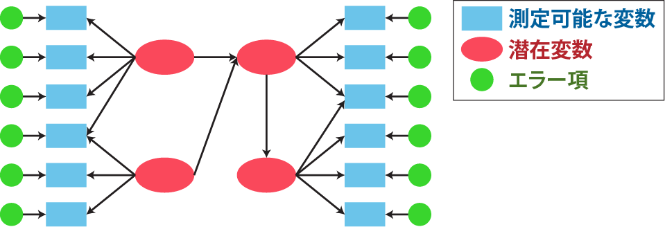

構造方程式モデリングではこのパス構造を用いて、原因となる各変数が結果となる変数に与える影響を、因子分析と同様に**因子負荷量（factor loading）**として評価します。因子負荷量が大きければその因果関係は強く、因子負荷量が小さければその因果関係は弱いと評価します。因子負荷量が極端に小さければ、その原因と結果の間の因果関係は疑わしい、つまりedgeで繋ぐのは妥当ではないかもしれないとします。

### 構造方程式モデリングの演算

構造方程式モデリングでは、潜在変数と顕在変数の因果関係のパスモデルを仮定し、この仮定したパスモデルにおける顕在変数の共分散行列を因果負荷量やエラー項を用いた数式として計算します。

顕在変数の共分散行列はデータからも演算できます。Rでは、以下のように数値のデータフレームを`var`関数の引数に取ると共分散行列を計算することができます。

```{r, filename="共分散行列の演算"}
# cov関数でも同じものが求まる
var(iris[, 1:4]) 
```

この2つの共分散行列、パスモデルから計算した共分散行列とデータから計算した共分散行列が一致するとすると、モデル上の因果負荷量やエラー項を計算することができます。因果負荷量やエラー項を評価することで、パスモデル内の因果関係を説明することができます。

:::{.callout-tip collapse="true"}
## 構造方程式モデリングにおける共分散行列の演算

構造方程式モデリングについては、[共分散構造分析: 構造方程式モデリング (入門編)](https://www.amazon.co.jp/dp/4254126581)、[共分散構造分析: 構造方程式モデリング (R編)](https://www.amazon.co.jp/dp/4489021801)や[神戸大学経済学部の分寺先生の講義資料](https://www2.kobe-u.ac.jp/~bunji/files/lecture/MVA/html/)に詳しく記載されています。ここでは計算の初歩だけを説明しますので、より詳しくは上記の資料をご参照ください。

構造方程式モデリングの矢印は線形、つまり数式では$y = \beta x + \epsilon$という形を仮定します。この式では$x$が原因側（矢印のもと）、$y$が結果側（矢印の先）になります。$\beta$と$\epsilon$はそれぞれ因子負荷量、エラー項を示します。

まずは簡単な例として、以下のようなモデルを考えてみます。国語、英語、社会のテストの成績（測定可能な変数）が文系科目の能力（潜在変数）による影響を受けている、とするモデルです。

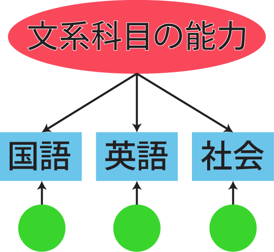{width=300}

テストの成績のデータとして以下の表のような、200人分のデータを準備します。

```{r, filename="テストの成績のデータ"}
#| code-fold: true
set.seed(0)
motivation_to_learn <- rnorm(200, 0, 1)
time_learning <- (motivation_to_learn * 18 + rnorm(200, 50, 10)) |> round(1)
payment_for_textbooks <- (motivation_to_learn * 6000 + rnorm(200, 10000, 20)) |> round(-2)
c_humanities <- motivation_to_learn * 0.5 + rnorm(200, 0, 0.3) # cはconstructのc
c_science <- motivation_to_learn * 0.7 + rnorm(200, 0, 0.5)
japanese <- c_humanities * 0.8 + rnorm(200, 0, 0.2)
english <- c_humanities * 0.65 + rnorm(200, 0, 0.3)
social <- c_humanities * 0.5 + c_science * 0.2 + rnorm(200, 0, 0.7)
science <- c_science * 0.75 + rnorm(200, 0, 0.3)
math <- c_science * 0.9 + rnorm(200, 0, 0.6)

d <- data.frame(motivation_to_learn, c_humanities, c_science, japanese, english, social, science, math, time_learning, payment_for_textbooks) |> scale() |> as.data.frame()
d_indicator <- d |> select(japanese, english, social, science, math)

f <- function(x){round(x * 12.5 + 60)}

d_indicator <- d_indicator |> mutate_all(f)
d_indicator <- cbind(d_indicator, time_learning, payment_for_textbooks)

d_indicator_simple <- d_indicator |> select(japanese, english, social)

knitr::kable(d_indicator_simple |> head(), col.names = c("国語", "英語", "社会"), caption = "10人分を表示")
```


準備したデータは正規化されていないため、以下のように`scale`関数で正規化します。正規化すると各科目のデータは平均0、分散1に変換されます。

```{r, filename="データを正規化する"}
d_indicator_simple_scaled <- d_indicator_simple |> scale()

d_indicator_simple_scaled |> 
  as_tibble() |> 
  pivot_longer(1:3) |> 
  group_by(name) |> 
  summarise(mean_score = mean(value) |> round(2), sd_score = sd(value))
```

この正規化した成績について、`var`関数を用いて共分散行列を計算します。

```{r, filename="顕在変数の共分散行列"}
var(d_indicator_simple_scaled)
```

顕在変数についてはいったん置いておいて、パスモデルについて考えていきます。構造方程式モデリングではパスモデルからこの共分散行列の数式モデルを作成します。また、因果関係に相当する部分は線形で示します。

上記の図より、文系科目の能力を$f$、各教科の成績をそれぞれ$x_{jpn}$、$x_{eng}$、$x_{soc}$とすると、文系科目の能力`f`と各科目の成績`x`の因果関係は以下のような式で表すことができます。

$$x_{jpn} = alpha_{jpn} \cdot f + \beta_{jpn} \cdot e$$
$$x_{eng} = alpha_{eng} \cdot f + \beta_{eng} \cdot e$$
$$x_{soc} = alpha_{soc} \cdot f + \beta_{soc} \cdot e$$

$\alpha$を因子負荷量と呼びます。$\beta \cdot e$はエラー項です。

この時、文系科目の能力$f$とエラー項$e$は平均0、分散1とします。また、$e$同士には相関がないと仮定します。

この条件で各科目の成績xの共分散行列を上記の3つの式から計算していきます。

まずは国語の成績$x_{jpn}$の分散を計算してみます。あらかじめ国語の成績を正規化しておくと、$x_{jpn}$は平均値0との差を意味しますので、$x_{jpn}$の2乗の平均値（$E(x_{jpn}^2)$）が分散となります。

$$E(x_{jpn}^2) =  E((\alpha_{jpn} \cdot f+\beta_{jpn} \cdot e)^2) =  \alpha_{jpn}^2 \cdot E(f^2) + 2\alpha_{jpn} \cdot \beta_{jpn} \cdot E(f \cdot e_{jpn})+ \beta_{jpn}^2 \cdot E(e_{jpn}^2)$$

ここで、$f$とエラー項$e$は平均0、分散1ですので、$E(f^2)$と$E(\sigma_{jpn}^2)$は分散の1となります。したがって、$x_{jpn}$の分散は以下のように$\alpha$と$\beta$だけで表すことができます。

$$ E(x_{jpn}^2) = \alpha_{jpn}^2 + \beta_{jpn}^2 $$

英語と社会の分散も同様にまとめることができます。

$$ E(x_{eng}^2) = \alpha_{eng}^2 + \beta_{eng}^2 $$
$$ E(x_{soc}^2) = \alpha_{soc}^2 + \beta_{soc}^2 $$

国語と英語の共変量（$E(x_{jpn} \cdot x_{eng})$）は

$$
\begin{align*} 
\displaylines{
E(x_{jpn} \cdot x_{eng}) \\
&=E((\alpha_{jpn} \cdot f + \beta_{jpn} \cdot e_{jpn})\cdot(\alpha_{eng} \cdot f + \beta_{eng} \cdot e_{eng}))\\
&=\alpha_{jpn} \cdot \alpha_{eng} \cdot E(f^2) + \alpha_{jpn} \cdot \beta_{eng} \cdot E(f \cdot e_{eng}) + \alpha_{eng} \cdot \beta_{jpn} \cdot E(f \cdot e_{jpn}) + \beta_{jpn} \cdot \beta_{eng} \cdot E(e_{jpn} \cdot e_{eng}) \\
&= \alpha_{jpn} \cdot \alpha_{eng}
}
\end{align*}
$$

という形で$\alpha_{jpn}$、$\alpha_{eng}$の積として簡単に表すことができます。国語と社会、英語と社会の共変量も同様に求めることができます。

$$E((\alpha_{jpn} \cdot f + \beta_{jpn} \cdot e_{jpn})\cdot(\alpha_{soc} \cdot f + \beta_{soc} \cdot e_{soc})) = \alpha_{jpn} \cdot \alpha_{soc}$$

$$E((\alpha_{eng} \cdot f + \beta_{eng} \cdot e_{eng})\cdot(\alpha_{soc} \cdot f + \beta_{soc} \cdot e_{soc})) = \alpha_{eng} \cdot \alpha_{soc}$$

したがって、パスモデルから計算できる顕在変数の共分散行列は以下のように表すことができます。

$$\begin{pmatrix}
   \alpha_{jpn}^2 + \beta_{jpn}^2 &
   \alpha_{jpn} \cdot \alpha_{eng} & 
   \alpha_{jpn} \cdot \alpha_{soc}\\
   \alpha_{eng} \cdot \alpha_{jpn} & 
   \alpha_{eng}^2 + \beta_{eng}^2 & 
   \alpha_{eng} \cdot \alpha_{soc} \\
   \alpha_{soc} \cdot \alpha_{jpn} & 
   \alpha_{soc} \cdot \alpha_{eng} & 
   \alpha_{soc}^2 + \beta_{soc}^2
\end{pmatrix}$$

このパスモデルから計算した顕在変数の共分散行列は上で`var`関数で示した共分散行列と同じものですので、等式で結ぶことができます。

$$ \begin{pmatrix}
   \alpha_{jpn}^2 + \beta_{jpn}^2 &
   \alpha_{jpn} \cdot \alpha_{eng} & 
   \alpha_{jpn} \cdot \alpha_{soc} \\
   \alpha_{eng} \cdot \alpha_{jpn} & 
   \alpha_{eng}^2 + \beta_{eng}^2 & 
   \alpha_{eng} \cdot \alpha_{soc} \\
   \alpha_{soc} \cdot \alpha_{jpn} & 
   \alpha_{soc} \cdot \alpha_{eng} & 
   \alpha_{soc}^2 + \beta_{soc}^2
\end{pmatrix}=\begin{pmatrix}1 & 0.729 & 0.446 \\0.729 & 1 & 0.372 \\0.446 & 0.372 & 1\end{pmatrix}$$

この等式では、行列の各要素が等しいことになりますので、パスモデルから計算した共分散行列における変数である$\alpha$や$\sigma$の方程式を以下のように作成することができます。

$$\alpha_{jpn}^2 + \beta_{jpn}^2=1$$
$$\alpha_{eng}^2 + \beta_{eng}^2=1$$
$$\alpha_{soc}^2 + \beta_{soc}^2=1$$
$$\alpha_{jpn} \cdot \alpha_{eng} = 0.729$$
$$\alpha_{jpn} \cdot \alpha_{soc} = 0.446$$
$$\alpha_{eng} \cdot \alpha_{jpn} = 0.372$$

この連立方程式を解くことで、$\alpha$や$\beta$を計算することができます。

このパスモデルから計算した顕在変数の共分散行列のことを**共分散構造**と呼びます。パスモデルがより複雑になっても、上記の場合と同様に共分散構造を求め、実際のデータの共分散行列と比較することができます。ただし、より複雑な共分散構造や演算を上記のような単純な連立方程式として求めるのは大変なので、行列と最尤法を用いた計算で解くことになります。
:::

### lavaanパッケージ

Rで構造方程式モデリングの計算を行うためのライブラリが`lavaan`パッケージ[@lavaan_bib1; @lavaan_bib2]です。`lavaan`パッケージではパスモデルを簡単なコードで作成することができ、顕在変数のデータと作成したパスモデルから因子負荷量を演算することができます。以下では、まず簡単なパスモデルを用いて因子負荷量の演算を行い、その後もう少し複雑なモデルについても説明します。

用いるデータは上のcalloutで用いた各科目のテストの成績です。国語、英語、社会の点数から文系教科の能力を評価するパスモデルについて評価していきます。

```{r, filename="lavaan：用いるデータ", message=FALSE}
head(d_indicator_simple)

GGally::ggpairs(d_indicator_simple)
```

#### lavaan：パスモデルの作成

構造方程式モデリングでは、まず因果関係を示したグラフであるパスモデルを作成し、作成したパスモデルに対して因子負荷量を演算します。したがって`lavaan`ではまずパスモデルを作成する必要があります。

パスモデルの作成はRのformulaに似た形で顕在変数・潜在変数の関係を示していきます。パスモデルの記載の方法（シンタックス）は以下の図の通りです。

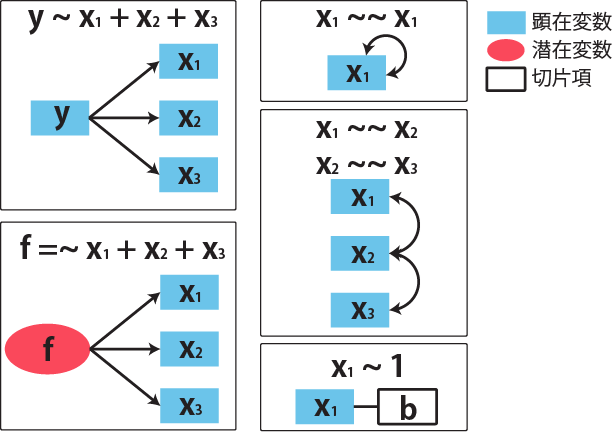

上記の図の$y \sim x_1 + x_2 + x_3$は顕在変数間の回帰を意味しており、$y$が目的変数、$x_1$～$x_3$が説明変数です。$f \sim x_1 + x_2 + x_3$は潜在変数`f`と顕在変数、$x_1$～$x_3$の関係を示します。したがって、顕在変数間の回帰は`~`で、潜在変数と顕在変数の関係は`=~`で表すことになります。$x_1 \sim \sim x_1$は$x_1$の分散、$x_1 \sim \sim x_2$は$x_1$と$x_2$の共分散を意味しています。

このシンタックスは文字列で設定し、`lavaan`の関数の引数とします。以下の例では、文系教科の能力（`humanities`）を潜在変数、国語（`japanese`）、英語（`english`）、社会（`social`）の点数を顕在変数としたパスモデルを作成しています。

```{r, filename="パスモデルの作成"}
pacman::p_load(lavaan)

# Rと同じくシャープから始まる行はコメント
Model_edc_simple <- 
  ' 
    # latent variables 
      c_humanities =~ japanese + english + social 
  '
```

#### lavaan：因子負荷量の演算

因子負荷量の演算には、`sem`関数を用います。`sem`関数は上記で作成したパスモデルと、顕在変数のデータを含むデータフレームを用います。

このとき、データは正規化しておくのが一般的です。正規化を行わなくても演算はできますが、因子負荷量が各顕在変数のスケールに依存してしまいます。例えば、国語と英語のテストで国語が難しく、英語が簡単であれば国語の因子負荷量が小さく、英語の因子負荷量が大きくなってしまい、どちらへの影響が大きいのか単純に比較することが難しくなります。データをあらかじめ平均0、標準偏差1に揃えておくことで、スケールの影響をなくして評価することができます。

データの正規化には、[30章](chapter30.qmd#データの正規化)で説明した`scale`関数を用います。`sem`関数は、パスモデルを第一引数に、正規化したデータを第二引数に取ります。

```{r, filename="因子負荷量の演算：sem関数"}
d_indicator_simple_scaled <- scale(d_indicator_simple) # データの正規化
fit_edc_simple <- sem(model = Model_edc_simple, data = d_indicator_simple_scaled)
```

因子負荷量は`coef`関数で呼び出すことができます。以下の例では`humaniites`と`japanese`の間の因子負荷量が表示されていませんが、`lavaan`では「始めに指定した顕在変数の因子負荷量を1にする」という制約をつけて演算を行う仕組みになっています。したがって、より複雑なパスモデルを用いた場合にも因子負荷量が1になるものが必ず現れます。

```{r, filename="因子負荷量の演算結果：coef関数"}
coef(fit_edc_simple)
```

また、各データ（データフレームの各行）に対応する潜在変数は`predict`関数で呼び出すことができます。

```{r, filename="潜在変数の推定結果：predict関数"}
predict(fit_edc_simple) |> head() # 6つだけ表示。クラスは行列 
```

#### パスモデルを表示する：lavaanPlot関数

上記のように因子負荷量を演算することはできますが、因子負荷量の演算はパスモデルに従ったものであり、パスモデルを見ないと因子負荷量がどのようにパスモデル上で配置されているのかいまいちよくわかりません。

このパスモデルと因子負荷量を同時に表示させる機能を提供しているのが`lavaanPlot`パッケージです。このライブラリで提供されている`lavaanPlot`関数は上記の`lavaan`の`sem`関数の演算結果を引数に取り、使用したパスモデルと因子負荷量を同時に表示してくれます。

```{r, filename="lavaanPlot関数でパスモデルと因子負荷量を表示する", eval=FALSE}
lavaanPlot::lavaanPlot(model = fit_edc_simple, coefs = TRUE) # coefs=Tを指定しないと因子負荷量が表示されない
```

{width=500}

#### より複雑なパスモデルでの演算

もう少し複雑なモデルについても演算してみます。以下の例では、上記の3つの教科に加えて、数学（`math`）と理科（`science`）のテストの結果、その学生の学習時間（`time_learning`）と教科書の購入額（`payment_for_textbook`）のデータがあるとします。また、文系科目の能力（`c_humanities`）に加えて理系科目の能力（`c_science`）と学習意欲（`motivation_to_learn`）を潜在変数として評価することとします。

```{r, filename="少し複雑なパスモデル：顕在変数のデータ"}
head(d_indicator)
```

学習意欲が高い生徒は学習時間が長く、教科書の購入にお金をかけているとします。また、文系科目・理系科目の能力は学習意欲に応じて高くなり、その結果としてテストの成績が良くなるとしましょう。

このような関係を`lavaan`のパスモデルとして表記したものが以下となります。潜在変数間の関係、以下の場合では`motivation_to_learn`、`c_humanities`と`c_science`の関係は回帰（regression）として`~`を用いて表現します。また、顕在変数間の関係を設定する場合にも同様に`~`を用いて表します。

```{r, filename="少し複雑なパスモデル：モデルの表記"}
Model_edc <- 
  ' 
    # latent variables 
      motivation_to_learn =~ time_learning + payment_for_textbooks
      c_humanities =~ japanese + english + social 
      c_science =~ science + math + social
    # regressions
      c_humanities + c_science ~ motivation_to_learn
  '
```

3教科のときと同様に顕在変数は`scale`関数で正規化します。`sem`関数に作成したパスモデルと顕在変数のデータを与えると因子負荷量を計算することができます。

```{r, filename="少し複雑なパスモデル：因子負荷量の演算"}
d_indicator_scaled <- scale(d_indicator)

fit_edc <- sem(model = Model_edc, data = d_indicator_scaled)
```

潜在変数も3教科の時と同様に`predict`関数で評価することができます。

```{r, filename="潜在変数の予測結果"}
predict(fit_edc) |> head()
```

結果を`lavaanPlot`関数で表示するとより複数なパスモデルでも因子負荷量を演算できていることがわかります。

```{r, filename="少し複雑なパスモデル：演算結果の表示"}
lavaanPlot::lavaanPlot(model = fit_edc, coefs = TRUE)
```

このように`lavaan`を用いることで複雑なパスモデルでも構造方程式モデリングを利用することができます。また、エラー項の分散や共分散を設定したモデルや、顕在変数間の回帰を加えたモデルも利用できます。また、ベイジアンネットワークのようにスコアを用いてパスモデルの妥当性を比較検討する手法も`lavaan`は備えています。

ただし、この構造方程式モデリングでは、演算できないパスモデルがあります。データの数に対してパスが多すぎたり、一つの潜在変数に対応する顕在変数が少なすぎたりすると演算できないモデルとなる場合があります。[参考文献](references.qmd#構造方程式モデリング)で学んだ上でどのようなパスモデルが評価可能であるのか検討し、自分のデータを評価するとよいでしょう。
