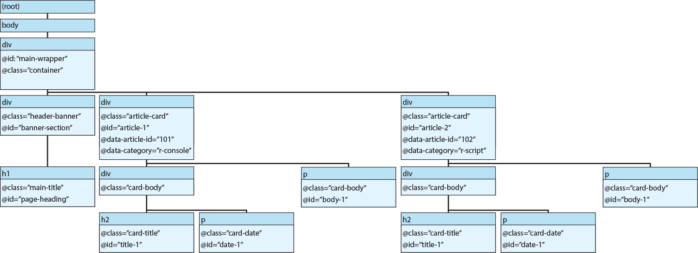

# Webスクレイピング

Web上から情報を集める時には、Googleなどで検索し、ホームページに移動して、欲しい情報をコピペで集めたりすることがあるかもしれません。しかし、集める情報が複数のページに渡って載っていることもあります。1つのページにデータが集まっていても、表などの形を取っておらず、データの収集・整理が難しい場合もあります。

そもそもブラウザ上でページを移動し、手でコピペをするのは大変です。ペーストする際にExcelなどに貼り付けてきちんと整形し、整えるのも面倒です。そこで、インターネットが利用され始めた初期の頃から、Webページにアクセスし、欲しい情報を取得、整形するプログラムが利用されています。このプログラムを使ってWeb上から情報を集めることを、**Webスクレイピング**と呼びます。

現在では、AIにお願いすればWeb上から情報を集めてくれることもあり、Webスクレイピングは昔ほど重要な技術ではなくなりつつあります。しかし、2026年現在では、[AIは従量課金制](https://forbesjapan.com/articles/detail/96932)になりつつあります。今後はまともなAIを使おうとするとお金がかかり、お金をかけないAIを使うと思い通りにデータを集めてくれないようになるかもしれません。したがって、ちょっとした情報収集には、AIではなくWebスクレイピングを用いた方がリーズナブルになり、再度Webスクレイピングに光が当たるようになるのかもしれません。

また、AIに情報を与える（プロンプトやNotebookLMのソースなど）ためには、スクレイピングを行うことが有用となることもあるかもしれません。

この章では、Webスクレイピングの基本的な手法を特に`rvest`[@rvest_bib]と`polite`[@polite_bib]の2つのパッケージを用いて説明していきます。

<!--
Genimiに作ってもらったHTMLの例

- <https://github.com/sb8001at-oss/html_example/blob/main/html_case1.html>
- <https://github.com/sb8001at-oss/html_example/blob/main/html_case2.html>
- <https://github.com/sb8001at-oss/html_example/blob/main/html_case3.html>
- <https://github.com/sb8001at-oss/html_example/blob/main/html_case4.html>
- <https://github.com/sb8001at-oss/html_example/blob/main/html_case5.html>
- <https://github.com/sb8001at-oss/html_example/blob/main/html_case6.html>
- <https://github.com/sb8001at-oss/html_example/blob/main/html_case7.html>
- <https://github.com/sb8001at-oss/html_example/blob/main/html_case8.html>
- <https://github.com/sb8001at-oss/html_example/blob/main/html_case9.html>
- <https://github.com/sb8001at-oss/html_example/blob/main/html_case10.html>

上記のHTMLをデプロイしたもの（Github Pagesで表示）

- <https://sb8001at-oss.github.io/html_example/html_case1>
- <https://sb8001at-oss.github.io/html_example/html_case2>
- <https://sb8001at-oss.github.io/html_example/html_case3>
- <https://sb8001at-oss.github.io/html_example/html_case4>
- <https://sb8001at-oss.github.io/html_example/html_case5>
- <https://sb8001at-oss.github.io/html_example/html_case6>
- <https://sb8001at-oss.github.io/html_example/html_case7>
- <https://sb8001at-oss.github.io/html_example/html_case8>
- <https://sb8001at-oss.github.io/html_example/html_case9>
- <https://sb8001at-oss.github.io/html_example/html_case10>
-->

まずは`rvest`、`polite`と、スクレイピングしたデータの取り扱いのために`tidyverse`をロードしておきます。

```{r, filename="ライブラリのロード"}
pacman::p_load(tidyverse, rvest, polite)
```

Webスクレイピングは、WebページからHTML（ブラウザ上での表示を指定するためのマークアップ言語）のテキストをダウンロードし、そのテキストを解析することで情報を収集する手法です。ただし、情報を収集するということは、著作権があるものを収集する可能性があるということになります。また、Webページに頻繁にアクセスすると、そのWebページを表示するためのWebサーバーに負担がかかります。過剰に負担がかかるとWebサーバーが落ちることもあります（[DoS攻撃](https://ja.wikipedia.org/wiki/DoS%E6%94%BB%E6%92%83)と呼ばれるものです）。Webページによっては、ページのスクレイピングを制限している場合もあります。

ですので、この章ではまず、私がGeminiにお願いして準備したページを利用してスクレイピングを行っていきます。以下に示すページから、情報を収集していきます。タブで示しているのがHTMLで、このHTMLをブラウザが読み取ってWebページの表示に整形しています。

:::{.panel-tabset}

## ページの表示

```{=html}
<iframe width="780" height="500" src="https://sb8001at-oss.github.io/html_example/html_case1" title="case1"></iframe>
```

## HTML

```{html, eval=FALSE, filename="HTMLの例（1）"}
<!DOCTYPE html>
<html lang="ja">
<head>
    <meta charset="UTF-8">
    <title>ケース1: 超シンプル（Rのインストール）</title>
</head>
<body>
    <h1>1 Rのインストール</h1>
    <p>Rプログラミングを始めるための最初のステップです。公式サイトから環境に合わせてダウンロードします。</p>
    <ul>
        <li>CRAN (Comprehensive R Archive Network) - 各種OS向けのバイナリ</li>
        <li>RStudio - 開発を効率化する統合開発環境 (IDE)</li>
        <li>Posit - RStudioの開発元企業</li>
    </ul>
    <a href="https://cran.r-project.org" id="home-link">CRAN公式サイトへ</a>
</body>
</html>
```

:::

## HTMLの構造

HTMLは階層構造を持つマークアップ言語で、階層やその文の意味を示すタグが文中に含まれています。HTMLの基本構造は以下のような形をしています。

```{html, eval=FALSE, filename="HTMLの構造"}
<!DOCTYPE html>
<html lang="ja">
<head>
    <meta charset="UTF-8">
    <title>ケース1: 超シンプル（Rのインストール）</title>
</head>
<body>
    <h1>1 Rのインストール</h1>
    <p>Rプログラミングを始めるための最初のステップです。公式サイトから環境に合わせてダウンロードします。</p>
    <a href="https://cran.r-project.org" id="home-link">CRAN公式サイトへ</a>
</body>
</html>
```

`<!DOCTYPE html>`はHTMLの頭に必ず記載される項目で、スクレイピングでは特に気にする必要がない項目です。

`<html>`は、ココからHTMLの文が始まるというタグ、**element**と呼ばれるものです。`<html>`から`</html>`までがそのelementの範囲となり、この間にWebページの内容を記載していきます。

elementには階層構造があります。`<html>`はelementの中で最も親に当たるもので、`<html>`以下には、まず`<head>`と`<body>`が設定されます。`<head>`で指定する部分にはそのページの設定、タイトルなどを記載します。基本的に`<head>`をスクレイピングすることはあまりないでしょう。

`<body>`は我々が見ているWebページの内容を記載していく部分を指定するためのelementです。この`<body>`以下にページの内容が示されています。スクレイピングするのは基本的にこの`<body>`から`</body>`までの間に記載されている内容になります。

さらに`<body>`以下には100以上のelementを設定することができます。代表的なelementについて以下の表に示します。その他のelementやその詳細に関しては[とほほのHTML入門](https://www.tohoho-web.com/html/index.htm)を参考にするとよいでしょう。

```{r, echo=FALSE, message=FALSE}
d <- readxl::read_excel("./data/chapter52_html_elements.xlsx")
knitr::kable(d, caption="代表的なelementの一覧")
```


また、[47章](chapter47.qmd#htmlの要素)で紹介した通り、`shiny::tags`に含まれる関数名がelementの名前となっています。

```{r, filename="shiny::tagsの関数名=element名"}
shiny::tags |> names() |> head(10)
```

個々のelementには、そのelementに関与するパラメータが設定されていることがあります。例えば、`<a>`には、`href`というリンクを指定するパラメータが設定されています。このような、element以下に設定するパラメータのことを属性、**attribute**と呼びます。

```{html}
<a href="https://cran.r-project.org">
```

attributeには、そのelement以下のスタイルに関わるもの（`class`、`style`、`title`など）、リンク先や画像ファイルの指定（`href`や`src`）、フォームの入力に関わるもの（`type`や`name`、`value`など）などがあります。

とりあえずこの2つ（element・attribute）を理解しておけば、Webスクレイピングを行うことができるでしょう。

## rvest

`rvest`パッケージはRでWebスクレイピングを行う際のデファクトスタンダードで、RでのWebスクレイピングにはほぼ必ず利用されるパッケージです。

`rvest`を用いれば、Webページの情報を簡単に取得することができます。`tidyverse`のパッケージ（`stringr`や`tibble`、`dplyr`・`tidyr`など）を同時に用いれば、取得したデータを簡単に整理することができます。

### HTMLをダウンロードする

`rvest`でスクレイピングを行う際には、まず始めにWebページからHTMLをダウンロードする必要があります。このHTMLをダウンロードするための関数が`read_html`関数です。`read_html`関数はスクレイピングしたいページのURLを引数に取ります。

```{r, filename="HTMLをダウンロードする：read_html関数"}
case1 <- read_html("https://sb8001at-oss.github.io/html_example/html_case1")
```

ダウンロードを繰り返さないようにするため、この`read_html`関数の返り値は変数に代入しておくとよいでしょう。

ダウンロードしたHTMLはxmlというファイル形式に変換されます。このxmlを代入した変数を利用してスクレイピングを行っていきます。

```{r, filename="ダウンロードしたオブジェクト"}
case1

# xmlが保存されている
class(case1)
```

### xmlをテキストに変換する

このxmlをテキストに変換する関数が`html_text2`関数です。上のxmlはどういう形をしているのか分かりにくいのですが、こちらのテキストに変換したものであればRで取り扱うのはそれほど難しくないでしょう。

```{r, filename="xmlをテキストに変換する"}
case1 |> html_text2()
```

とは言え、単に文字列に変換してしまうと、必要な部分だけではなく、不要な部分も文字列に含まれてしまいます。取得したい情報にルール、例えば上記のelementやattributeに特徴があれば、その情報だけを取得したほうが効率がよいでしょう。

ですので、`rvest`では特定のelementやattributeの要素だけを抽出する方法をいくつか備えています。

### elementで情報を抽出する

特定のelementに設定されている要素を抽出する場合には、`html_elements`と`html_element`関数を用います。以下の例では、`case1`にダウンロードしたHTMLから、`<head>`の要素がなくなり、`<body>`の要素だけが抽出されています。

```{r, filename="html_elements関数"}
case1 |> html_elements("body")
```

`<body>`の下位要素を取得する場合、`html_elements`関数をパイプで繋ぎます。

```{r, filename="elementを選択する"}
case1 |> html_elements("body") |> html_elements("h1")
```

`<body>`の下位ではなく、全体から`<h1>`の要素を抽出する場合には、直接`<h1>`を`html_elements`に指定しても問題ありません。

```{r, filename="直接h1を指定する"}
case1 |> html_elements("h1") 
```

#### html_elementsとhtml_elementの違い

elementを取得する関数には、`html_elements`と`html_element`の2つがあります。いずれも`read_html`の返り値にパイプで繋いで利用し、elementを文字列で指定します。2つの関数を比較すると、`html_elements`はxml_nodesetというものが要素1つで返ってきているのに対し、`html_element`ではhtml_nodeというものが要素3つで返ってきています。

```{r, filename="html_elementsとhtml_element"}
case1 |> html_elements("ul")
case1 |> html_element("ul")
```

返り値のクラスは`html_elements`はxml_nodesetで、`html_element`はxml_nodeです。

```{r, filename="返り値のクラス"}
case1 |> html_elements("ul") |> class()
case1 |> html_element("ul") |> class()
```

この2つをテキストに変換すると、同じものが返ってきます。

```{r, filename="テキストに変換した返り値を比較する"}
case1 |> html_elements("ul") |> html_text2()
case1 |> html_element("ul") |> html_text2()
```

`<ul>`では違いが分かりにくいため、別の例として`<p>`を取得する例を示してみます。上のcase1の例では`<p>`が1つしかなくてやや使いにくいため、別の例を準備します。

別の例の準備には、`minimal_html`関数を用います。この関数はテキストで記載したHTMLをxml形式に変換してくれる関数です。

```{r, filename="minimal_html"}
case_p <- minimal_html(
  "<p>パラグラフ1</p> \n
   <p>パラグラフ2</p>
  "
)
```

この`minimal_html`で作成したシンプルなHTMLで比較すると、`html_elements`では2つの`<p>`の要素が返ってきているのに対し、`html_element`では1つ目の`<p>`の要素だけが返ってきているのがわかります。

つまり、`html_element`を用いる場合には始めのelementの要素だけが返ってくる可能性があります。通常は`html_elements`でelementを選択するようにした方がよいでしょう。

```{r, filename="html_elementsとhtml_elementで返り値が違う場合"}
case_p |> html_elements("p") |> html_text2()
case_p |> html_element("p") |> html_text2()
```

### html_textとhtml_text2

`rvest`にはxmlをテキストに変換する関数である`html_text2`に加えて、`html_text`関数もあります。この2つはelementの要素が1つで、前後にスペースが入っていなければ全く同じものが返ってきます。

```{r, filename="html_textとhtml_text2"}
case1 |> html_elements("h1") |> html_text()
case1 |> html_elements("h1") |> html_text2()
```

ただし、`<ul>`のelementで選択すると、少し結果が変わります。`html_text`ではテキストにスペースが残るのに対し、`html_text2`ではテキストのスペースが削除されています。`stringr`の`str_trim`などでスペースを取り除くこともできますが、スクレイピングでは`html_text2`を使った方がシンプルでよいでしょう。

```{r, filename="スペースの結果が異なる"}
case1 |> html_elements("body") |> html_elements("ul") |> html_text() |> writeLines()
case1 |> html_elements("body") |> html_elements("ul") |> html_text2() |> writeLines()
```

### attributeで情報を抽出する

次に、attributeを用いて情報を抽出する方法について説明します。attributeを用いる場合、`html_attr`と`html_attrs`のいずれかを用います。`html_attr`は特定のelementに存在する1つのattributeの値を、`html_attrs`はすべてのattributeの値を取得する関数です。

`html_attrs`はxml以外の引数なしで用い、現在選択しているelementに含まれるすべてのattributeの値をベクターとして返します。

特定のelementに付属する特定のattributeの値を取得したい場合には、`html_attr`を用いた方がよいでしょう。

```{r, filename="html_attrとhtml_attrsの違い"}
# 特定のattributeの値だけ取得
case1 |>
  html_elements("meta") |> 
  html_attr("charset")

case1 |>
  html_elements("meta") |> 
  html_attrs() |> 
  unlist()
```

`html_attr`と`html_attrs`はいずれも文字列のベクターを返す関数です。ですので、xmlだけを引数に取る`html_text2`で文字列に変換しようとするとエラーが出ます。

```{r, error=TRUE, filename="html_attrの返り値"}
case1 |> 
  html_elements("a") |> 
  html_attr("href")

# エラー
case1 |> 
  html_elements("a") |> 
  html_attr("href") |> 
  html_text2()
```

### html_table

ページ上の表を抽出する際に使うのが`html_table`関数です。ページ上の表は、以下のように`<table>`を用いて記載されます。

:::{.panel-tabset}

## ページの表示

```{=html}
<iframe width="780" height="500" src="https://sb8001at-oss.github.io/html_example/html_case2" title="case2"></iframe>
```

## HTML

```{html, eval=FALSE, filename="HTMLの例（2）"}
<!DOCTYPE html>
<html lang="ja">
<head>
    <meta charset="UTF-8">
    <title>ケース2: テーブルデータ（オブジェクト）</title>
</head>
<body>
    <h1>3 オブジェクトの種類</h1>
    <table border="1" id="sales-table">
        <thead>
            <tr>
                <th>章番号</th>
                <th>概念名</th>
                <th>主な用途</th>
                <th>初心者難易度</th>
            </tr>
        </thead>
        <tbody>
            <tr>
                <td>3</td>
                <td>オブジェクト</td>
                <td>データの格納先</td>
                <td>低</td>
            </tr>
            <tr>
                <td>4</td>
                <td>変数</td>
                <td>値へのラベル付け</td>
                <td>低</td>
            </tr>
            <tr>
                <td>5</td>
                <td>クラス</td>
                <td>オブジェクトの型定義</td>
                <td>中</td>
            </tr>
        </tbody>
    </table>
</body>
</html>
```

:::

テーブルが一つであれば、xmlのオブジェクトを引数に取るだけでテーブルを`tibble`として取得することができます。

```{r, filename="html_table関数"}
case2 <- read_html("https://sb8001at-oss.github.io/html_example/html_case2")

case2 |> 
  html_table() |> 
  knitr::kable()
```

:::{.callout-tip collapse="true"}
## XPath

HTMLのページには、elements（タグ）の階層構造、elementsに付属するattribute（属性）が設定されています。

`rvest`では、このelementsの階層構造、attributeを利用してスクレイピングを行うために、`html_elements`関数はelements（CSS selector）だけでなく、**XPath**というものを引数に取れるようになっています。

では、以下のHTMLを用いてXPathを用いる方法について説明していきます。

:::{.panel-tabset}

## ページの表示

```{=html}
<iframe width="780" height="500" src="https://sb8001at-oss.github.io/html_example/html_case3" title="case3"></iframe>
```

## HTML

```{html, eval=FALSE, filename="HTMLの例（3）"}
<!DOCTYPE html>
<html lang="ja">
<head>
    <meta charset="UTF-8">
    <meta name="viewport" content="width=device-width, initial-scale=1.0">
    <title>3 Rを使ってみよう - CSS & Attribute Enhanced</title>

    <!-- styleは省略 -->
  
</head>
<body>

    <!-- メインコンテナ (id, class, data属性を付与) -->
    <div id="main-wrapper" class="container" data-page-type="tutorial">

        <!-- 大見出しブロック -->
        <div class="header-banner" id="banner-section">
            <h1 class="main-title" id="page-heading">3 Rを使ってみよう</h1>
        </div>

        <!-- 記事カード 1 -->
        <div class="article-card" id="article-1" data-article-id="101" data-category="r-console">
            <div class="card-header">
                <h2 class="card-title" id="title-1">【重要】コンソールでの実行</h2>
                <p class="card-date" id="date-1">2026-07-05</p>
            </div>
            <p class="card-body" id="body-1">
                Rを起動するとプロンプト（<span class="code-inline">&gt;</span>）が表示されます。ここに計算式を入力してEnterを押すことで実行されます。
            </p>
        </div>

        <!-- 記事カード 2 -->
        <div class="article-card" id="article-2" data-article-id="102" data-category="r-script">
            <div class="card-header">
                <h2 class="card-title" id="title-2">スクリプトの保存</h2>
                <p class="card-date" id="date-2">2026-07-04</p>
            </div>
            <p class="card-body" id="body-2">
                何度も使うコードはスクリプトファイル（<span class="code-inline">.R</span>）として保存しておくと、後から一括で再実行できます。
            </p>
        </div>

    </div>

</body>
</html>
```

## HTMLの構造



:::

XPathはHTMLのelements間の階層構造とattributeを用いてHTMLの特定の要素を特定するための記載方法の一つです。XPathでは、最も親の構造（Linuxのディレクトリと同様にrootと呼びます）の下にheadとbodyがあることを、以下のような文字列で示します。

```html
"head"
"body"
```

さらに下のelementsに関しては、更にスラッシュ（`/`）で繋いで表現します。

```html
"body/div/div"
"body/div/div/h1"
```

このXPathを`html_elements`で指定するとその要素を取り出すことができます。ただし、`html_elements`でXPathを指定するときには、rootを示す始めの`/`は不要です。

```{r, filename="XPathでelementsを指定する"}
case3 <- read_html("https://sb8001at-oss.github.io/html_example/html_case3")

case3 |> 
  html_elements(xpath = "body/div/div/h1") # 始めの/は取り除く
```

途中までのelementを省略するときには、`//`を用います。

```{r, filename="XPathでelementsを指定する"}
case3 |> 
  html_elements(xpath = "//div/h1")
```

`//`の後にelementを置くと、そのelementの要素をすべて選択することができます。

```{r, filename="//で途中をすべて省略する"}
case3 |> 
  html_elements(xpath = "//p") # html_elements("p")と同じ
```

上記のように`"//p"`で指定した場合は`html_elements("p")`と何も変わらないのですが、XPathではelementの後に`[]`を使ってattributeを指定することができます。attributeは`@`を頭に付けて、attributeの名前と値をHTMLの記載と同様に表記することで指定することができます。

```{r, filename="@でattributeを指定する"}
# エスケープを避けるために文字列内ではシングルクォーテーションを用いている
case3 |> 
  html_elements(xpath = "//p[@class='card-date']") 

case3 |> 
  html_elements(xpath = "//p[@class='card-body']")
```

上記の例ではattriuteとして`class`を指定していますが、`id`の場合にも同じように`@`を使って指定することができます。

```{r, filename="idを指定する"}
case3 |>  
  html_elements(xpath = "//p[@id='body-1']")
```

XPathを用いると、もっと複雑な条件を用いてattributeを指定することもできます。まずはcontainsについて説明します。conteinsはRの関数のように用いるもので、2つ引数を取ります。1つ目の引数はattribute、2つ目の引数はそのattributeの値に含まれる文字列を指定します。以下の例では、`id`に`"body"`という文字列を含むものを選択しています。

```{r, filename="containsで文字列を含むattributeを選択する"}
case3 |> 
  html_elements(xpath = "//p[contains(@id, 'body')]")
```

同様にcontainsを用いて、1つ目の引数にtext()を指定すると、その要素に特定の文字列が含まれている部分を指定することができます。

```{r, filename="containsで要素に含まれる文字列で選択する"}
case3 |> 
  html_elements(xpath = "//p[contains(text(), 'スクリプト')]")
```

```{r}
case3 |> 
  html_elements(xpath = "//div[position()=2]")

case3 |> 
  html_elements(xpath = "//div[position()=2]/p")
```

```{r}
case3 |> 
  html_elements(xpath = "//p[not(contains(text(), 'スクリプト'))]")
```

:::

### CSS selector

ココまで`html_elements`ではタグ（element）を文字列で指定することで、HTMLの要素を選択してきました。このタグは正確には**CSS selector**と呼ばれるものになります。

CSSは「Cascading Style Sheets」の略で、HTMLではheadタグ以下のstyleタグ内に記載したり、HTMLとは別ファイルとしてCSSファイルを準備することで、HTMLのデザインを指定するためのものです。CSS selectorはこのCSSに用いる属性（attribute）を用いることで特定のelementを指定する方法を提供しています。

CSS selectorを用いて特定のclassを指定するときには、そのclassの値（`class="value"`の`value`）の前に`.`をつけます。以下の例では、`class="card-body"`の要素を`".card-body"`という形で指定しています。

```{r, filename="CSS selector：classの値で指定する"}
case3 |> 
  html_elements(".card-body") # class="card-body"を選択
```

elementとclassの値を`.`で繋ぐと、pタグのうち、classが特定の値である要素を指定することができます。

```{r、filename="CSS selector：elementとattributeを繋ぐ"}
case3 |> 
  html_elements("p.card-body")
```

同様にidの値で要素を指定する場合には、idの値の前に`#`をつけます。

```{r, filename="idで選択する"}
case3 |> 
  html_elements("#body-1") # id="body-1"を選択
```

### その他の関数

`rvest`でよく利用する関数はここまでに説明した`read_html`、`html_elements`、`html_attr`、`html_text2`、`html_table`の5つだと思いますが、この他にもいくつかの関数が設定されています。これらの関数について簡単に紹介します。

#### html_encoding_guess関数

`html_encoding_guess`関数はHTMLのテキストのencodingを評価するための関数です。現在ではほぼすべてのHTMLがUTF-8になっているとは思いますので、それほど実用性はないかもしれません。

```{r, filename="html_encoding_guess関数"}
case1 |> 
  html_encoding_guess()
```

#### html_name・html_children関数

`html_name`関数はelementの名前を取得するための関数です。しかし、以下のようにelementsを選択してから名前を取得してもあまり意味はありません。

```{r, filename="html_name関数"}
case1 |> 
  html_elements("body") |> 
  html_name()
```

`html_children`関数はそのelementの下位のelementをすべて取得する関数です。この`html_children`関数の後で`html_name`関数を適用すると、そのelementの中に存在する下位のelementを調べることができます。

```{r, filename="html_children関数で下位のelementを取得する"}
case1 |> 
  html_elements("body") |> 
  html_children() |> 
  html_name()
```

:::{.callout-tip collapse="true"}
## read_html_live

`rvest`には、ウェブブラウザ（Chrome）に表示されたページ上で要素を選択しながらスクレイピングを行う、`read_html_live`関数というものがあります。この`read_html_live`は`chromote`パッケージ[@chromote_bib]を利用した関数で、`chromote`のR6オブジェクトを作成することでChromeのウインドウと連携してスクレイピングをすることができる、はずの関数です。

```{r, eval=FALSE, filename="read_html_liveでインタラクティブにスクレイピング"}
# chromoteがインストールされていない場合はchromoteがインストールされる
read_html_live("https://sb8001at-oss.github.io/html_example/html_case1")
```

しかし、現状`chromote`でR6オブジェクトを作成しようとすると、エラーが出ます。どうも`chromote`がアップデートされていない中でChromeだけどんどんアップデートされていて、セキュリティ的にアクセスできなくなっているようです。DockerでLinuxから使ってみてもなかなかうまく使うのが難しいです。`chromote`がうまく動くようになったら記載を追加したいと思います。

```{r, error=TRUE, filename="chromoteでエラーが出る"}
library(chromote)

chromote::chromote_info()

# R6オブジェクトを作成できない
b <- ChromoteSession$new()
```

:::

### 複数のページから情報を取得する

スクレイピングしたい情報が複数のWebページに渡って存在していて、URLの名前が一定のルールに従い決められている場合には、`for`文を用いて簡単に複数ページのスクレイピングを行うことができます。

ただし、以下の例を見ていただけるとわかる通り、この`for`文では約2秒間に10回ページにアクセスしています。この程度ではDoS攻撃とはされないと思いますが、サーバーに負荷をかけるため、良いスクレイピングであるとは言えません。

```{r, filename="for文でスクレイピング"}
t <- Sys.time()
for(i in 1:10){
  url <- paste0("https://sb8001at-oss.github.io/html_example/html_case", i)
  case <- read_html(url)
  case |> html_elements("h1") |> html_text2() |> print()
}
Sys.time() - t
```

このようなfor文でのスクレイピングを行うのであれば、**途中に`Sys.sleep`関数で少し（3～10秒）時間をおいて**、再度Webページにアクセスするようにした方が、Webサーバーへの負荷が少なく、DoS攻撃とも捉えられにくいでしょう。

```{r, eval=FALSE, filename="Sys.sleep関数でアクセスの時間間隔を取る"}
vec <- numeric(10)
for(i in 1:10){
  url <- paste0("https://sb8001at-oss.github.io/html_example/html_case", i)
  case <- read_html(url)
  case |> html_elements("h1") |> html_text2() |> print()
  Sys.sleep(3)
}
```

:::{.callout-tip collapse="true"}
## map関数でスクレイピング

スクレイピングしたいページのURLのリストが分かっているのであれば、[44章](chapter44.qmd)で紹介した`purrr::map`関数を用いてシンプルなスクリプトでスクレイピングを行うこともできます。`map`関数を用いると`for`文を用いるよりも速くスクレイピングが終わります。

```{r, filename="map関数でスクレイピング"}
url <- paste0("https://sb8001at-oss.github.io/html_example/html_case", 1:10)

t <- Sys.time()

map(url, read_html) |> 
  map(~html_elements(.x, "h1")) |> 
  map(~html_text2(.x)) |> 
  unlist()

Sys.time() - t
```

`for`文と`map`のどちらの方がWebサーバーにより多く負荷をかけるのか分かりにくいところですが、やはり少し時間をおいてアクセスする方がスクレイピングではよいのではないかと思います。

:::

## polite

上記の通り、`rvest`では複数のページからスクレイピングしようとすると、`Sys.sleep`関数を用いる必要があります。

また、Webページには**robots.txt**という、スクレイピング（正確には検索エンジンが行うクローリング、クローラーというプログラムが行うスクレイピングのこと）のルールを定めたテキストが設定されていることがあります。スクレイピングをする際にこのrobots.txtのルールに従わなければ、そのWebページの運営者に被害を与えてしまうかもしれません。

この他に、Webページにはポリシーが設定されている場合もあります。ポリシーはテキストで、そのページに関する権利や著作権、法的な対応等について定めたもので、Webページのユーザーはそのポリシーを遵守することが求められます。ポリシーを逸脱してスクレイピングを行うと、法的に問題になります。

ここまで説明してきた`rvest`では、`Sys.sleep`を用いることも、robots.txtやポリシーを確認することも必須ではなく、簡単に問題のあるスクレイピングができてしまいます。

これらの問題に対応するため、`rvest`のドキュメントでは、スクレイピングを行う際には`polite`パッケージを用いることが推奨されています。

`polite`はその名の通り、「礼儀正しい」スクレイピングを行うためのパッケージです。`rvest`に`Sys.sleep`の利用、robots.txtに従ったスクレイピングを必須とする機能を追加することで、Webページの管理者に対して「礼儀正しく」スクレイピングを行うことができます。

ただし、`polite`はWebページのポリシーまでは評価してくれるわけではないので、スクレイピング前にWebページのポリシーを確認し、法的に利用に問題がないか確認するようにしたほうがよいでしょう。

### bow関数

`polite`で`read_html`関数の代わりに用いるのが`bow`関数、`nod`関数、`scrape`関数です。`polite`ではこの3つの関数をセットにしてスクレイピングに用います。

`bow`関数は、スクレイピングするページの情報を取得し、「よい方法」でスクレイピングするための方法を指定するための関数です。`bow`関数の引数はスクレイピングするページのルートの（`https://example.com/`のような大本の）URLや、スクレイピングするページのURLです。`bow`関数には3つの働きがあります。

- robots.txtを確認し、スクレイピングが可能であるか確認する
- 前回のページへのアクセスから5秒経っていない場合には時間をおいてアクセスするようにする（アクセス間隔がrobots.txtに記載されている場合にはその設定に従う）
- robots.txtの内容をキャッシュし、次にアクセスする際にはキャッシュしたrobots.txtに従いスクレイピングの方法を設定する

したがって、`bow`は① Webページのルールに従う、② 時間を置いてアクセスする、③ 同じページを2度読み込まない ための設定を行います。

`bow`の返り値には、robots.txtの設定、アクセスする間隔、スクレイピング可能であるかどうかの情報が記載されています。

```{r, filename="bow関数：ルートのURLを指定"}
html_example <- bow("https://sb8001at-oss.github.io")
html_example
```

`bow`はルート以外のURLも引数に取ることができますが、複数のページからスクレイピングする場合には、ルートのURLを引数に取り、後ほど説明する`nod`関数でスクレイピングするためのページに移動したほうが良いでしょう。

```{r, filename="bow関数：スクレイピングするページのURLを指定"}
bow("https://sb8001at-oss.github.io/html_example/html_case")
```

この`bow`の返り値のオブジェクトにはrobots.txtが記録されています。

```{r, filename="robots.txtを表示する"}
html_example$robotstxt$text |> head() |> cat()
```

:::{.callout-tip collapse = "true"}
## robots.txt


:::

### nod関数

`bow`でルートのURLを指定する場合、実際にスクレイピングするのはルート以下の個別のWebページである場合が多いと思います。

`bow`でルートのURLを指定した後、この個別のWebページを指定するための関数が`nod`です。`nod`は「うなずく」、という意味の単語で、個別のWebページがrobots.txtの設定上スクレイピング可能であるかを確かめつつ、次に用いる`scrape`関数にスクレイピングするページのURLを渡す役割があります。

`nod`関数の引数は`bow`関数の返り値と、スクレイピングするページまでのURLアドレスの文字列です。

`polite`は`rvest`と一緒に用いることが想定されているパッケージですので、`rvest`と同じく、関数はすべてパイプ演算子でつなぐようになっています。

```{r, filename="nod関数でスクレイピングするURLを指定"}
case1 <- html_example |> nod("html_example/html_case1")
```

この`nod`関数の返り値にはスクレイピングするURLが記録されています。

```{r, filename="nodで指定したURL"}
case1$url
```

### scrape関数

実際にWebページをダウンロードする、`rvest`の`read_html`関数の役割を持つ関数が`scrape`です。`scrape`関数は`bow`、`nod`で設定した「礼儀正しい」方法でWebページをHTMLとしてダウンロードし、`rvest`で利用可能なxmlとして返す関数です。

```{r, filename="scrape関数でHTMLをダウンロードする"}
scrape(case1)
```

この`scrape`の返り値は`read_html`と同じくxmlなので、`scrape`以降は`rvest`の関数を用いてelement・attributeを選択し、情報を取得することができます。

```{r}
case1 |> scrape() |> html_elements("p") |> html_text2()
```

